# Climate Scientist work demonstration

This is an open-ended assessment in which i demonstrate:
- expertise of climate dynamics and subseasonal-to-seasonal (S2S) teleconnections
- proficiency with standard geospatial analysis toolsets
- creativity and ability to quickly prototype a solution

I start working with a 70-year sample dataset of several climate variables from the ERA5 reanalysis. The data are reprocessed to weekly resolution on a 1&deg; grid. My main goal is :
- choose a single geo coordinate (or aggregated region) in the dataset to predict
- choose a single variable to predict
- choose a forecast lead time between 2-52 weeks
- build a statistical, physical, or machine learning predictive model
- test and analyze its predictive performance by applying it to out of sample data


```python
# Some useful libraries available in this environment
import xarray as xr
import pandas as pd
import numpy as np
import xesmf as xe
import matplotlib.pyplot as plt
import tensorflow as tf
import sklearn as sk
import xskillscore as xs
import cartopy.crs as ccrs
import cartopy.feature as cfeature
from scipy import signal
from eofs.standard import Eof
from mpl_toolkits.basemap import Basemap
from scipy.stats import pearsonr

```


```python
# Open the sample dataset for this assignment from cloud storage
ds = xr.open_zarr('gs://salient-toy-data/sample_dataset')

```


```python
# Let's treat the variables as anomalies from historical averages:
anom = ds - ds.mean()

# Can we predict temperature anomalies in San Diego using sea level pressure in the gulf of california?
sd_temp = anom.temp.sel(lon = -117, lat = 33, method = 'nearest')
ca_mslp = anom.mslp.sel(lon = slice(-115, -105), lat = slice(24, 32)).mean(['lat','lon']).shift(time = -8).compute()


```


```python
# Eyeball test - are we on the right track?
plt.figure(figsize=[10, 5])
ax = plt.subplot(1,1,1)
plt.scatter(ca_mslp, sd_temp)
plt.xlabel('mslp 8 weeks')
plt.ylabel('temp c')

```


    Text(0, 0.5, 'temp c')


    
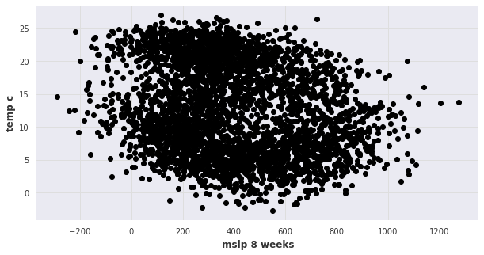
    


## Declaring variables and making them anamolies


```python
mslp = xr.open_zarr('gs://salient-toy-data/sample_dataset')['mslp']
temp = xr.open_zarr('gs://salient-toy-data/sample_dataset')['temp']
sst = xr.open_zarr('gs://salient-toy-data/sample_dataset')['sst']
```


```python
mslp = mslp - mslp.mean(dim='time')
temp = temp - temp.mean(dim='time')
sst = sst - sst.mean(dim='time')
```


```python
# Make the yearly and mean of the sample dataset

mslp_ya = mslp.resample(time='1YS').mean()
temp_ya = temp.resample(time='1YS').mean()
sst_ya = sst.resample(time='1YS').mean()

mslp_ma= mslp.resample(time='1MS').mean()
temp_ma = temp.resample(time='1MS').mean()

```


```python
# Converting the xarray dataarray to numpy array because of the eof analysis of xarray 
# throwing some error due to dask performance issue. It is going to take a while to convert.

mslp_ma_np = mslp_ma.to_numpy()
temp_ma_np = temp_ma.to_numpy()

mslp_ya_np = mslp_ya.to_numpy()
sst_ya_np = sst_ya.to_numpy()
```


```python
# Reading lat and lon 

lat = mslp_ma.coords['lat']
lat = lat.to_numpy()
lon = mslp_ma.coords['lon']
lon = lon.to_numpy()
```

### Masking the land surface for sst visualization


```python
from netCDF4 import Dataset as netcdf # netcdf4-python module


lmfile = 'lsmask.nc'
lmset  = netcdf(lmfile)
lsmask = lmset['mask'][0,:,:]

lsm = lsmask + 1
lsm[lsm<1.0] = np.nan
```


```python
sst_ya_np = sst_ya_np*lsm
```

## Finding the proper correlationship

In this part, we are going to find the spatial correlationship with the MSLP and Temperature and visualize it for the San diego location.


```python
# Declaring some initial variable required for calculation

nt,nlat,nlon = mslp_ma_np.shape


ngrd = nlat*nlon
nyr  = nt/12
```

### Remove seasonal cycle


```python
mslp_grd  = mslp_ma_np.reshape((12,int(nyr), ngrd), order='F').transpose((1,0,2))
mslp_clim = np.mean(mslp_grd, axis=0)
mslp_anom = (mslp_grd - mslp_clim).transpose((1,0,2)).reshape((nt, ngrd), order='F')

print(mslp_anom[:,1].shape)

temp_grd  = temp_ma_np.reshape((12,int(nyr), ngrd), order='F').transpose((1,0,2))
temp_clim = np.mean(temp_grd, axis=0)
temp_anom = (temp_grd - temp_clim).transpose((1,0,2)).reshape((nt, ngrd), order='F')

print(temp_anom[:,1].shape)
```

    (840,)
    (840,)


### Calculate correlationship


```python
corr = np.zeros((1, ngrd))
pval = np.zeros((1, ngrd))

for igrd in np.arange(ngrd):
    crr,pvalue = pearsonr(temp_anom[:,igrd], mslp_anom[:,igrd])
    corr[0,igrd] = crr
    pval[0,igrd] = pvalue
```


```python
corr = corr.reshape((nlat,nlon), order='F')
pval = pval.reshape((nlat,nlon), order='F')
```

 ### Visualize


```python
# Correlation visualize


fig = plt.figure(figsize=(20,12))


m = Basemap(llcrnrlon=-125.1,llcrnrlat=32.52,urcrnrlon=-114.1,urcrnrlat=42.2,\
            rsphere=(6378137.00,6356752.3142),\
            resolution='l',projection='cyl',\
            lat_0=36.38,lon_0=-119.63)


x, y = m(*np.meshgrid(lon,lat))


clevs = np.linspace(-1.0, 1.0, 21)

cs = m.contourf(x, y, corr.squeeze(), clevs, cmap=plt.cm.RdBu_r)
m.drawcoastlines()
m.drawcountries()
m.drawstates(linewidth=0.5, linestyle='solid', color='k', antialiased=1, ax=None, zorder=None)
san_diego_lat = 32.7; san_diego_lon=-117.12
x1,y1=m(san_diego_lon,san_diego_lat)
plt.plot(x1, y1, 'oy', markersize=10)
plt.text(x1,y1, ' San diego', fontsize=12,color='r');
cb = m.colorbar(cs)
cb.set_label('Correlation', fontsize=12)
ax.set_title('temperature and mslp correlation in california', fontsize=16)


```


    Text(0.5, 1.0, 'temperature and mslp correlation in california')


    
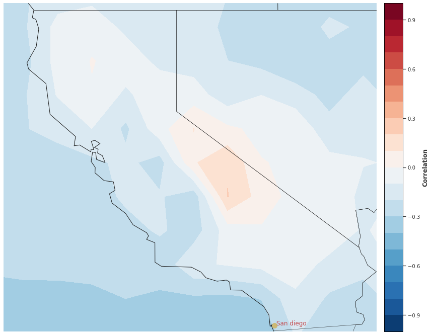
    


# EOF analysis of the Atmospheric Variables

Atmospheric teleconnection patterns influence the global climate through the atmospheric circulation Especially, the El Ni˜no–Southern Oscillation (ENSO) has a significant effect on humanity’s economic, social, and physical well-being. Many studies have been devoted to predict the extreme weather conditions of different regions of the globe in association with
the ENSO. We are examining the leading EOF of different atmospheric variable,SST in the following case. the following methodology is inspired from the following [blogs](https://podaac.jpl.nasa.gov/forum/viewtopic.php?f=5&t=337) and my previous [work](https://mdsoar.org/bitstream/handle/11603/16929/CT2019Team2.pdf?sequence=1&isAllowed=y).


```python

# Working with yearly average for better impact study


nt,nlat,nlon = sst_ya_np.shape    
sst_ya_np = sst_ya_np.reshape((nt,nlat*nlon), order='F')


```

### Detrending the varaible


```python
sst_ya_np = np.nan_to_num(sst_ya_np)
```


```python


sst_detrend = signal.detrend(sst_ya_np, axis=0, type='linear', bp=0)


sst_detrend = sst_detrend.reshape((nt,nlat,nlon), order='F')
print(sst_detrend.shape)

```

    (70, 180, 360)


### Create an EOF solver to do the EOF analysis


```python

wgts   = np.cos(np.deg2rad(mslp_ma.coords['lat'].values))
wgts   = wgts.reshape(len(wgts), 1)

solver = Eof(sst_detrend,weights=wgts)
```

### Retreive the leading EOFs


```python
eof1 = solver.eofs(neofs=10)
pc1  = solver.pcs(npcs=10, pcscaling=0)
varfrac = solver.varianceFraction()
lambdas = solver.eigenvalues()
```

### Visualize the leading EOFs and Primary Components (PC)


```python
parallels = np.arange(-90,90,30.)
meridians = np.arange(-180,180,30)

for i in range(0,3):
    fig = plt.figure(figsize=(12,9))
    plt.subplot(211)
    
    m = Basemap(projection='cyl', llcrnrlon=min(lon), llcrnrlat=min(lat), urcrnrlon=max(lon), urcrnrlat=max(lat))    
    x, y = m(*np.meshgrid(lon, lat))
    clevs = np.linspace(np.min(eof1[i,:,:].squeeze()), np.max(eof1[i,:,:].squeeze()), 21)
    cs = m.contourf(x, y, eof1[i,:,:].squeeze(), clevs, cmap=plt.cm.RdBu_r)
    m.drawcoastlines()  
    m.drawparallels(parallels, labels=[1,0,0,0])
    m.drawmeridians(meridians, labels=[1,0,0,1])

    cb = m.colorbar(cs, 'right', size='5%', pad='2%')
    cb.set_label('EOF', fontsize=12)
    plt.title('EOF ' + str(i+1), fontsize=16)

    plt.subplot(212)
    days = np.linspace(1979,2003,nt)
    plt.plot(days, pc1[:,i], linewidth=2)
    plt.axhline(0, color='k')
    plt.xlabel('Year')
    plt.ylabel('PC Amplitude')   
    plt.ylim(np.min(pc1.squeeze()), np.max(pc1.squeeze()))
```


    
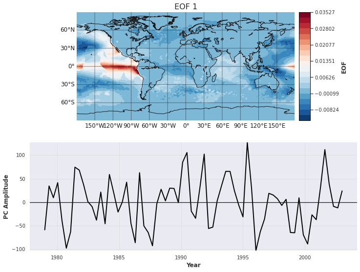
    


    
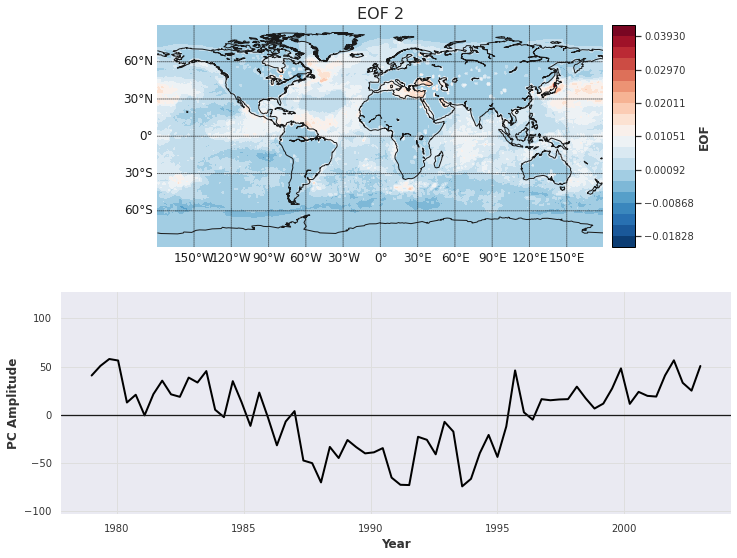
    


    
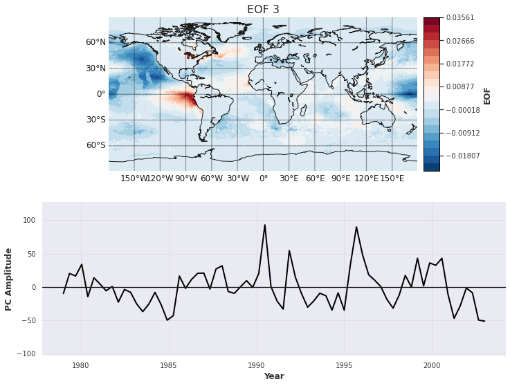
    


There are large peaks and troughs associated with well-known El Nino and La Nina events in EOF1 figure, as well as the ecclesiastical El Nino pattern.

###  Check variances explained by leading EOFs


```python
plt.figure(figsize=(11,6))
eof_num = range(1, 16)
plt.plot(eof_num, varfrac[0:15], linewidth=2)
plt.plot(eof_num, varfrac[0:15], linestyle='None', marker="o", color='r', markersize=8)
plt.axhline(0, color='k')
plt.xticks(range(1, 16))
plt.title('Fraction of the total variance represented by each EOF')
plt.xlabel('EOF #')
plt.ylabel('Variance Fraction')
plt.xlim(1, 15)
plt.ylim(np.min(varfrac), np.max(varfrac)+0.01)
```


    (2.551696755418895e-31, 0.2523061874286102)


    
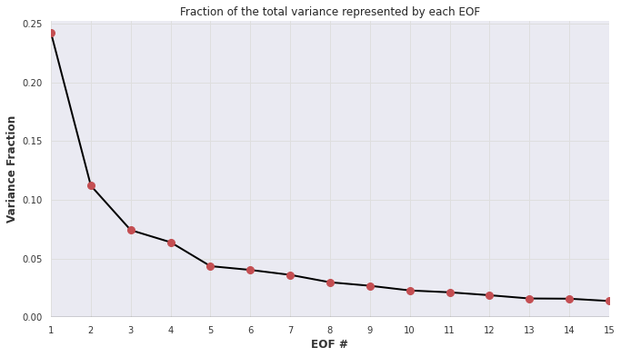
    


## Climatology Visualization

 Monthly/Yearly average for the atmospheric varabile in a global scale. We can change any atmospheric variable and plot it over any yearly/monthly/daily scale for the visualization and have a sense of the climatology and the impacts.


```python
# Monthly/Yearly/daily average for the atmospheric varabile in a global scale

anom_month = anom.groupby('time.month').sum()
anom_year = anom.groupby('time.year').sum()
anom_day = anom.groupby('time.day').sum()

anom_month.precip[0,:,:].plot(cmap='jet', vmax = 300,figsize =(10,5))
anom_year.sst[-1,:,:].plot(cmap='jet', vmax =100 ,figsize =(10,5))
anom_day.temp[-1,:,:].plot(cmap='jet', vmax =100 ,figsize =(10,5))
```


    <matplotlib.collections.QuadMesh at 0x7fb6dfe3bd60>


    
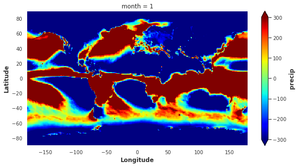
    


    
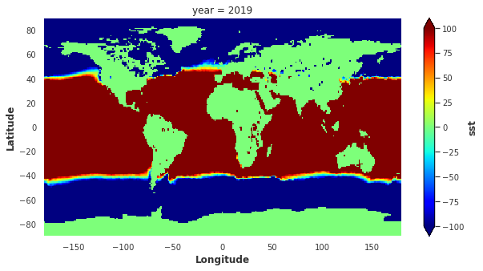
    


    
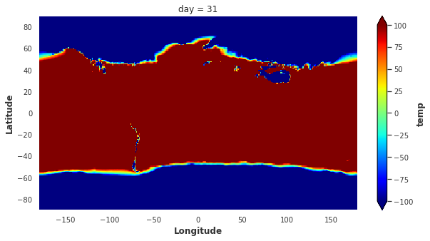
    


### Lets visualize it in a more organized way and see it in every month scale


```python
# Monthly data for the average values of the atmospheric variables.

import calendar

fig = plt.figure(figsize=[12,8], facecolor='w')
plt.subplots_adjust(bottom=0.15, top=0.96, left=0.04, right=0.99, 
                    wspace=0.2, hspace=0.27) 
nrows = 3
ncols = 4
for i in range(1, 13):
    plt.subplot(nrows, ncols, i)
    dataplot = anom_month.precip[i-1, :, :] 
    p = plt.pcolormesh(anom_month.precip.lon, anom_month.precip.lat, dataplot,
                   vmax = 400, vmin = 0, cmap = 'nipy_spectral_r',
                   ) 
    plt.xlim([-180,180])
    plt.ylim([-90,90])
    plt.title(calendar.month_name[dataplot.month.values], fontsize = 13, 
              fontweight = 'bold', color = 'b')
    plt.xticks(fontsize = 11)
    plt.yticks(fontsize = 11)
    if i % ncols == 1: # Add ylabel for the very left subplots
        plt.ylabel('Latitude', fontsize = 11, fontweight = 'bold')
    if i > ncols*(nrows-1): # Add xlabel for the bottom row subplots
        plt.xlabel('Longitude', fontsize = 11, fontweight = 'bold')

# Add a colorbar at the bottom:
cax = fig.add_axes([0.25, 0.06, 0.5, 0.018])
cb = plt.colorbar(cax=cax, orientation='horizontal', extend = 'max',)
cb.ax.tick_params(labelsize=11)
cb.set_label(label='Precipitation (mm)', color = 'k', size=14)


```


    
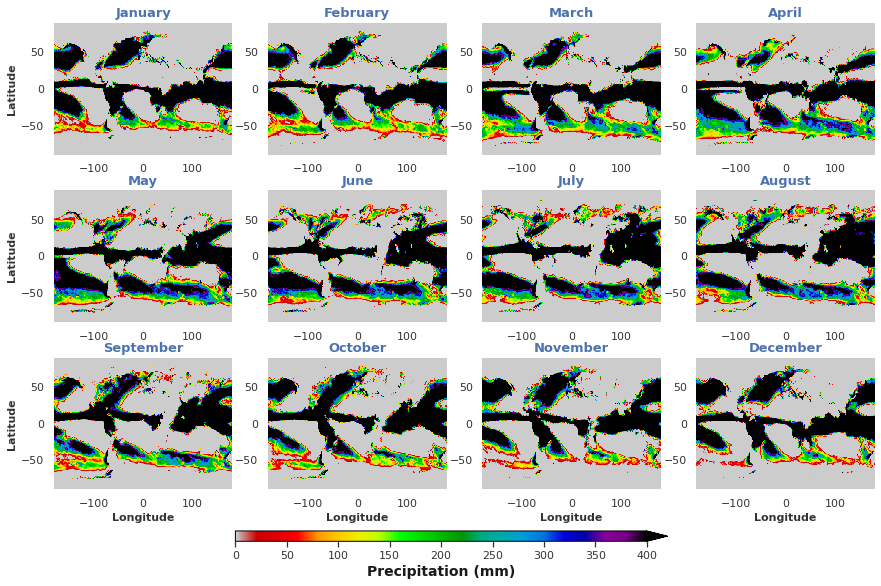
    


### Visualizing Climatology for a specific location (California)


```python
#California bounding box values (xmin,xmax, ymin,ymax)

top = 42.00951
bottom = 32.534156
left = -124.409591
right = -114.131211
```


```python
ds_sel = anom.isel(lon=(anom.lon >= left) & (anom.lon <= right),
                          lat=(anom.lat >= bottom) & (anom.lat <= top),
                          )
ds_sel_avg = ds_sel.mean(dim=['lat','lon'])
```


```python
fig = plt.figure(figsize=[8,5], facecolor='w')
for yr in range(2012,2017):
    da_yr = ds_sel_avg.isel(time = ds_sel.time.dt.year==yr).precip
    dataplot = abs(da_yr.cumsum())
    plt.plot(dataplot, linewidth=2, label = yr)
plt.legend(fontsize=13)
plt.grid()
plt.xticks(fontsize=12) 
plt.yticks(fontsize=12)
plt.ylabel('Precipitation (mm)', fontsize = 13, fontweight = 'bold')
plt.xlabel('Week of Year', fontsize = 13, fontweight = 'bold')
plt.xlim([0,52])
plt.title('Annual cumulative precipitation in California', fontsize=15)
plt.tight_layout()


fig = plt.figure(figsize=[8,5], facecolor='w')
for yr in range(2012,2017):
    da_yr = ds_sel_avg.isel(time = ds_sel.time.dt.year==yr).temp
    dataplot = da_yr.cumsum()
    plt.plot(dataplot, linewidth=2, label = yr)
plt.legend(fontsize=13)
plt.grid()
plt.xticks(fontsize=12) 
plt.yticks(fontsize=12)
plt.ylabel('Temperature (C)', fontsize = 13, fontweight = 'bold')
plt.xlabel('Week of Year', fontsize = 13, fontweight = 'bold')
plt.xlim([0,52])
plt.title('Annual cumulative tempearture in California', fontsize=15)
plt.tight_layout()

```


    

    


    
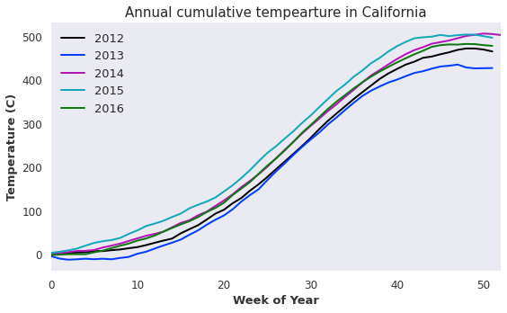
    


## Plot Global Monthly climatology

In this example, we are visualizing the monthly average temeprature climatology in a global scale.


```python
ntime,nrow,ncol = temp_ma_np.shape
tempym  = temp_ma_np.reshape((12,int(ntime/12), nrow,ncol),order='F') 
tempclm = tempym.mean(axis=1) 
tempclm.shape
```


    (12, 180, 360)


```python
lons,lats = np.meshgrid(lon, lat) 
```


```python
from matplotlib.pylab import rcParams
rcParams['figure.figsize'] = 15, 9

fig, axes = plt.subplots(3,4)
flat_axes = axes.reshape(-1)
m = Basemap(projection='cyl',llcrnrlon=min(lon), llcrnrlat=min(lat),
        urcrnrlon=max(lon), urcrnrlat=max(lat))

# coordinates transformation
x, y = m(lons, lats)

# string month names
month_lst = ['January', 'February', 'March', 'April', 'May', 'June', 'July',
              'August', 'September', 'October', 'November', 'December']

imon = -1
for ax in flat_axes:
    m.ax = ax
    imon = imon + 1 
    cssst = m.contourf(x,y,tempclm[imon], 20,cmap=plt.cm.RdBu_r)
    m.colorbar(cssst,"right", size="5%", pad='2%') 
    plt.title( month_lst[imon], fontsize=20) 
    m.drawcoastlines()

```


    
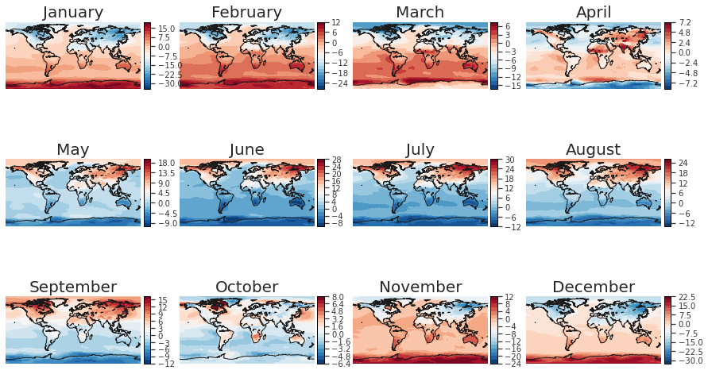
    


## Trend analysis of a given variable

In this following example, we are examing the temeprature changing rate and visualize it.


```python
nt, nlat, nlon = temp_ma_np.shape
ngrd = nlon*nlat
```


```python
temp_ma_np.shape
```


    (840, 180, 360)


```python
temp_grd = temp_ma_np.reshape((nt, ngrd), order='F')
x        = np.linspace(1,nt,nt)#.reshape((nt,1))
temp_rate = np.empty((ngrd,1))
temp_rate[:,:] = np.nan
```


```python
for i in range(ngrd): 
    y = temp_grd[:,i]   
    if(not np.ma.is_masked(y)):         
        z = np.polyfit(x, y, 1)
        temp_rate[i,0] = z[0]*120.0
        
        
temp_rate = temp_rate.reshape((nlat,nlon), order='F')

```


```python
parallels = np.arange(-90,90,30.)
meridians = np.arange(-180,180,30)

m = Basemap(projection='cyl', llcrnrlon=min(lon), llcrnrlat=min(lat),
        urcrnrlon=max(lon), urcrnrlat=max(lat))

x, y = m(*np.meshgrid(lon, lat))
clevs = np.linspace(-0.5, 0.5, 21)
cs = m.contourf(x, y, temp_rate.squeeze(), clevs, cmap=plt.cm.RdBu_r)
m.drawcoastlines()
m.drawparallels(parallels, labels=[1,0,0,0])
m.drawmeridians(meridians, labels=[1,0,0,1])

cb = m.colorbar(cs)
cb.set_label('Temperature Changing Rate ($^oC$/decade)', fontsize=12)
plt.title('Temperature Changing Rate ($^oC$/decade)', fontsize=16)
```


    Text(0.5, 1.0, 'Temperature Changing Rate ($^oC$/decade)')


    
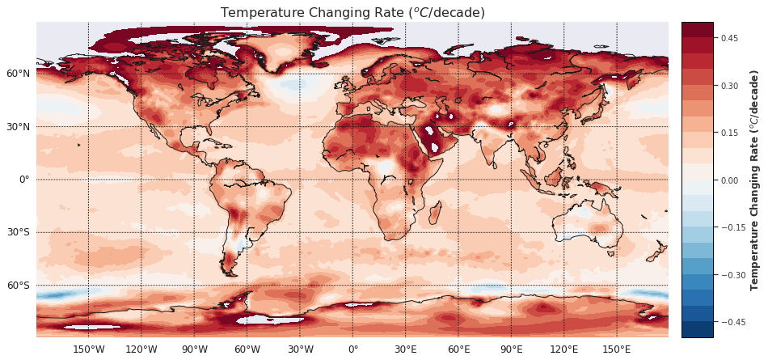
    


# Statistical Model Approach

In this appraoch, we are implementing the ARIMA (Autoregressive integrated moving average) model to predict the 2-52 weeks prediction of the meteorological variable. We select temperature in San diego location (lon = -117, lat = 33). The steps of bulidng the model is as follows:

- Doing EDA analysis
- Checking the stationary method
- Final prediction
 
 For better analysis and performance, we are converting the datafram from xarray to pandas. Also, we are using ARIMA model for the statistical predicition. [Python library statsmodels](https://www.statsmodels.org/stable/index.html) are used in this experiment.

### Loading the libraries


```python
import statsmodels.api as sm

from statsmodels.tsa.stattools import adfuller

from statsmodels.tsa.arima.model import ARIMA

%matplotlib inline
```

### Convering the data from xarray to pandas


```python
sd_temp_val = anom.temp.sel(lon=-117,lat=33,method = 'nearest').values

sd_temp_df = pd.DataFrame(sd_temp_val)

sd_temp_df.columns=['temp']

sd_temp_df.plot()
```


    <AxesSubplot:>


    
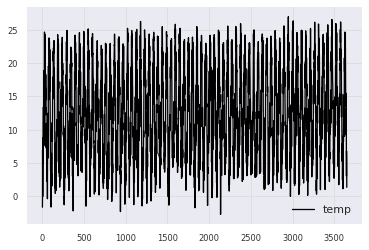
    


### Checking the stationarity of the data
So above plots shows that we do have seasonality but there is no trend. Let's check for below necessary conditions:

* Constant mean
- Constant variance
- Dickey-fuller test which produce a P value. The null hypothesis of the test is that the time series can be represented by a unit root, that it is not stationary (has some time-dependent structure). The alternate hypothesis (rejecting the null hypothesis) is that the time series is stationary.

**p-value > 0.05**: Fail to reject the null hypothesis (H0), the data has a unit root and is non-stationary.

**p-value <= 0.05**: Reject the null hypothesis (H0), the data does not have a unit root and is stationary.


```python
def test_stationarity(timeseries):
 
    '''This function calculate the rolling mean, rolling standard deviation and the dicky fuller test to calculate 
      the stationary of the data. It takes pandas dataframe as a input arguement and calculates if the datafram is 
      stationary or not based on the statistical result of ADF, and P value.
      
      Args:
       timeseries (dataframe): The only parameter.
       
       return:
       
       1. Plot of the time series with rolling mean and rolling standard deviation 
       2. Dick fuller statistical test result with P value
        
     '''
    
    
    #Determine rolling statistics
    movingAverage = timeseries.rolling(window=7).mean()
    movingSTD = timeseries.rolling(window=7).std()
    
    #Plot rolling statistics
    plt.figure(figsize=(10,5))
    plt.plot(timeseries, color='blue', label='Original')
    plt.plot(movingAverage, color='red', label='Rolling Mean')
    plt.plot(movingSTD, color='black', label='Rolling Std')
    plt.legend(loc='best')
    plt.title('Rolling Mean & Standard Deviation')
    plt.show(block=False)
    
    #Perform Dickey–Fuller test:
    print('Results of Dickey Fuller Test:')
    weather_test = adfuller(timeseries['temp'], autolag='AIC')
    dfoutput = pd.Series(weather_test[0:4], index=['Test Statistic','p-value','#Lags Used','Number of Observations Used'])
    print(dfoutput)
    if dfoutput[1] <= 0.05:
        print("\nstrong evidence against the null hypothesis(Ho), reject the null hypothesis. Data has no unit root and is stationary.")
    else:
        print("\nweak evidence against null hypothesis, time series has a unit root, indicating it is non-stationary.")
   
```


```python
test_stationarity(sd_temp_df)
```


    
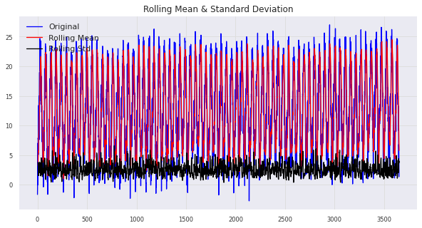
    


    Results of Dickey Fuller Test:
    Test Statistic                  -22.812731
    p-value                           0.000000
    #Lags Used                       30.000000
    Number of Observations Used    3621.000000
    dtype: float64
    
    strong evidence against the null hypothesis(Ho), reject the null hypothesis. Data has no unit root and is stationary.


### Checking the data in a smaller temporal scale for clarity

It shows from the above plot, the time series is stationary. However, to demonstrate the whole procedure, we are slicing the dataset for a smaller temporal scale (4 years) to detect the stationary test.


```python

weeks_in_year = 52

sd_temp_df_4year = sd_temp_df[:(4*weeks_in_year)]
```


```python
test_stationarity(sd_temp_df_4year)
```


    
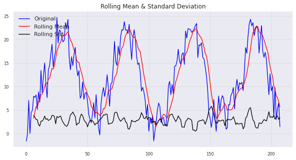
    


    Results of Dickey Fuller Test:
    Test Statistic                  -5.496557
    p-value                          0.000002
    #Lags Used                      15.000000
    Number of Observations Used    192.000000
    dtype: float64
    
    strong evidence against the null hypothesis(Ho), reject the null hypothesis. Data has no unit root and is stationary.


## Optimal parameter tuning for ARIMA model

In this part, we are finding the best hyper parameter, namely p (the order of the auto-regressive model), d (order of first-differencing) and q (the order of the moving-average) of the arima model.


```python
from pmdarima import auto_arima

# Ignore harmless warnings

import warnings

warnings.filterwarnings("ignore")
```


```python
# Model Run

stepwise_fit = auto_arima(sd_temp_df,suppress_warnings=True)           

stepwise_fit.summary()
```


<table class="simpletable">
<caption>SARIMAX Results</caption>
<tr>
  <th>Dep. Variable:</th>           <td>y</td>        <th>  No. Observations:  </th>   <td>3652</td>   
</tr>
<tr>
  <th>Model:</th>           <td>SARIMAX(2, 0, 3)</td> <th>  Log Likelihood     </th> <td>-8508.050</td>
</tr>
<tr>
  <th>Date:</th>            <td>Fri, 16 Sep 2022</td> <th>  AIC                </th> <td>17030.099</td>
</tr>
<tr>
  <th>Time:</th>                <td>15:55:32</td>     <th>  BIC                </th> <td>17073.521</td>
</tr>
<tr>
  <th>Sample:</th>                  <td>0</td>        <th>  HQIC               </th> <td>17045.562</td>
</tr>
<tr>
  <th></th>                      <td> - 3652</td>     <th>                     </th>     <td> </td>    
</tr>
<tr>
  <th>Covariance Type:</th>        <td>opg</td>       <th>                     </th>     <td> </td>    
</tr>
</table>
<table class="simpletable">
<tr>
      <td></td>         <th>coef</th>     <th>std err</th>      <th>z</th>      <th>P>|z|</th>  <th>[0.025</th>    <th>0.975]</th>  
</tr>
<tr>
  <th>intercept</th> <td>    0.1828</td> <td>    0.003</td> <td>   67.531</td> <td> 0.000</td> <td>    0.178</td> <td>    0.188</td>
</tr>
<tr>
  <th>ar.L1</th>     <td>    1.9770</td> <td>    0.002</td> <td> 1160.656</td> <td> 0.000</td> <td>    1.974</td> <td>    1.980</td>
</tr>
<tr>
  <th>ar.L2</th>     <td>   -0.9913</td> <td>    0.002</td> <td> -585.858</td> <td> 0.000</td> <td>   -0.995</td> <td>   -0.988</td>
</tr>
<tr>
  <th>ma.L1</th>     <td>   -1.4809</td> <td>    0.016</td> <td>  -91.373</td> <td> 0.000</td> <td>   -1.513</td> <td>   -1.449</td>
</tr>
<tr>
  <th>ma.L2</th>     <td>    0.2490</td> <td>    0.028</td> <td>    8.837</td> <td> 0.000</td> <td>    0.194</td> <td>    0.304</td>
</tr>
<tr>
  <th>ma.L3</th>     <td>    0.2523</td> <td>    0.016</td> <td>   15.901</td> <td> 0.000</td> <td>    0.221</td> <td>    0.283</td>
</tr>
<tr>
  <th>sigma2</th>    <td>    6.2891</td> <td>    0.152</td> <td>   41.454</td> <td> 0.000</td> <td>    5.992</td> <td>    6.586</td>
</tr>
</table>
<table class="simpletable">
<tr>
  <th>Ljung-Box (L1) (Q):</th>     <td>0.07</td> <th>  Jarque-Bera (JB):  </th> <td>30.08</td>
</tr>
<tr>
  <th>Prob(Q):</th>                <td>0.80</td> <th>  Prob(JB):          </th> <td>0.00</td> 
</tr>
<tr>
  <th>Heteroskedasticity (H):</th> <td>0.93</td> <th>  Skew:              </th> <td>-0.22</td>
</tr>
<tr>
  <th>Prob(H) (two-sided):</th>    <td>0.24</td> <th>  Kurtosis:          </th> <td>3.05</td> 
</tr>
</table><br/><br/>Warnings:<br/>[1] Covariance matrix calculated using the outer product of gradients (complex-step).


In this above result, the value of P, d, and Q are retreived fromt the second row variable, named **Model**.

### Creating the training and testing data

We are splitting the dataset into 80% training and 20% testing part for this mode. 


```python
print(sd_temp_df.shape)

train=sd_temp_df.iloc[:(round(len(sd_temp_df)*0.8)-len(sd_temp_df))]

test=sd_temp_df.iloc[(round(len(sd_temp_df)*0.8)-len(sd_temp_df)):]

print(train.shape,test.shape)

print(test.iloc[0],test.iloc[-1])
```

    (3652, 1)
    (2922, 1) (730, 1)
    temp    8.240835
    Name: 2922, dtype: float32 temp    1.352505
    Name: 3651, dtype: float32


### Training the Model


```python

model=ARIMA(train['temp'],order=(2,0,3)) # Order value is retreive from p,d and q from the optimal parameter part.

model=model.fit()

model.summary()
```


<table class="simpletable">
<caption>SARIMAX Results</caption>
<tr>
  <th>Dep. Variable:</th>         <td>temp</td>       <th>  No. Observations:  </th>   <td>2922</td>   
</tr>
<tr>
  <th>Model:</th>            <td>ARIMA(2, 0, 3)</td>  <th>  Log Likelihood     </th> <td>-6744.500</td>
</tr>
<tr>
  <th>Date:</th>            <td>Fri, 16 Sep 2022</td> <th>  AIC                </th> <td>13503.000</td>
</tr>
<tr>
  <th>Time:</th>                <td>15:55:39</td>     <th>  BIC                </th> <td>13544.860</td>
</tr>
<tr>
  <th>Sample:</th>                  <td>0</td>        <th>  HQIC               </th> <td>13518.077</td>
</tr>
<tr>
  <th></th>                      <td> - 2922</td>     <th>                     </th>     <td> </td>    
</tr>
<tr>
  <th>Covariance Type:</th>        <td>opg</td>       <th>                     </th>     <td> </td>    
</tr>
</table>
<table class="simpletable">
<tr>
     <td></td>       <th>coef</th>     <th>std err</th>      <th>z</th>      <th>P>|z|</th>  <th>[0.025</th>    <th>0.975]</th>  
</tr>
<tr>
  <th>const</th>  <td>   12.5591</td> <td>    0.063</td> <td>  200.405</td> <td> 0.000</td> <td>   12.436</td> <td>   12.682</td>
</tr>
<tr>
  <th>ar.L1</th>  <td>    1.9855</td> <td> 3.76e-06</td> <td> 5.27e+05</td> <td> 0.000</td> <td>    1.986</td> <td>    1.986</td>
</tr>
<tr>
  <th>ar.L2</th>  <td>   -1.0000</td> <td> 2.92e-06</td> <td>-3.43e+05</td> <td> 0.000</td> <td>   -1.000</td> <td>   -1.000</td>
</tr>
<tr>
  <th>ma.L1</th>  <td>   -1.6060</td> <td>    0.016</td> <td>  -97.882</td> <td> 0.000</td> <td>   -1.638</td> <td>   -1.574</td>
</tr>
<tr>
  <th>ma.L2</th>  <td>    0.2477</td> <td>    0.032</td> <td>    7.663</td> <td> 0.000</td> <td>    0.184</td> <td>    0.311</td>
</tr>
<tr>
  <th>ma.L3</th>  <td>    0.3779</td> <td>    0.016</td> <td>   23.009</td> <td> 0.000</td> <td>    0.346</td> <td>    0.410</td>
</tr>
<tr>
  <th>sigma2</th> <td>    5.8859</td> <td>    0.159</td> <td>   37.023</td> <td> 0.000</td> <td>    5.574</td> <td>    6.197</td>
</tr>
</table>
<table class="simpletable">
<tr>
  <th>Ljung-Box (L1) (Q):</th>     <td>14.95</td> <th>  Jarque-Bera (JB):  </th> <td>28.86</td>
</tr>
<tr>
  <th>Prob(Q):</th>                <td>0.00</td>  <th>  Prob(JB):          </th> <td>0.00</td> 
</tr>
<tr>
  <th>Heteroskedasticity (H):</th> <td>0.95</td>  <th>  Skew:              </th> <td>-0.24</td>
</tr>
<tr>
  <th>Prob(H) (two-sided):</th>    <td>0.38</td>  <th>  Kurtosis:          </th> <td>2.94</td> 
</tr>
</table><br/><br/>Warnings:<br/>[1] Covariance matrix calculated using the outer product of gradients (complex-step).


### Make Predicition on the test set and Error calculation

We are plotting the test set with the prediction from the ARIMA model. Also, we are calculation Root mean square error between observed and real value in the next cell. 


```python
start=len(train)

end=len(train)+len(test)-1

pred=model.predict(start=start,end=end)

pred = pred.reset_index(drop=True)

test_temp = test['temp'].reset_index(drop=True)

```


```python
import seaborn as sns
sns.set_theme(style="darkgrid")
plt.figure(figsize=[10, 5])
sns.lineplot(pred,color='blue',label='Predictions')
sns.lineplot(test_temp,color='red',label='Test')
plt.ylabel('Temperature')
plt.xlabel('Index')
plt.legend(loc='best')
```


    <matplotlib.legend.Legend at 0x7fb6888e3670>


    
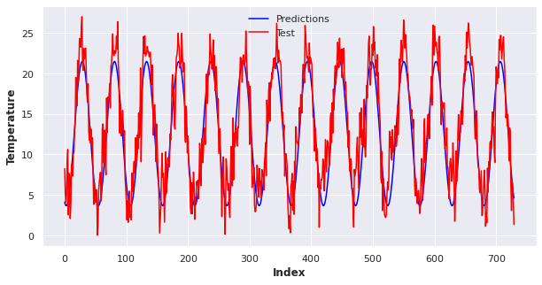
    


```python
# Error calculation

from sklearn.metrics import mean_squared_error

from math import sqrt

rmse=sqrt(mean_squared_error(pred,test['temp']))

print("The root mean square error between prediction and the observation is {}".format(rmse))
```

    The root mean square error between prediction and the observation is 2.805111444404489


```python
# Final Plot with the whole dataset

#fc_series = pd.Series(pred, index=test['temp'].index)
pred=model.predict(start=start,end=end)

# # Plot
plt.figure(figsize=(12,5), dpi=100)
plt.plot(train, label='training')
plt.plot(test, label='test')
plt.plot(pred, label='predicted')
plt.title('Predicted vs Actuals')
plt.ylabel('Temperature')
plt.xlabel ('# of Weeks')
plt.legend(loc='lower right', fontsize=8)
plt.show()
```


    
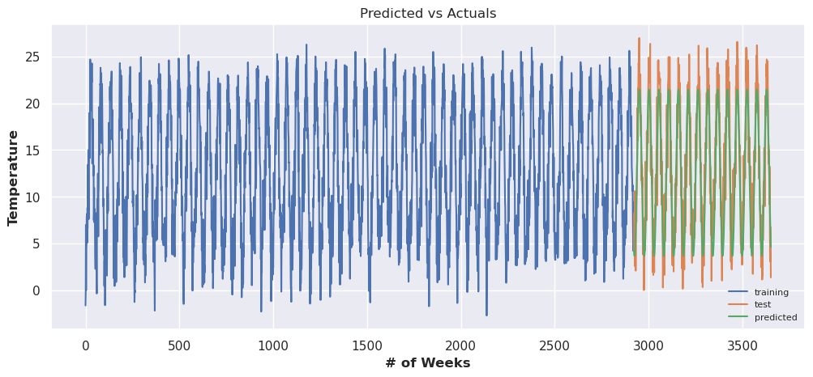
    


## Testing the out of sample data

We have downloaded the preprocess the ERA5 reanalyis data for weekly resolution and substract the mean from the values to capture the anamolies. 


```python
url = ('https://drive.google.com/file/d/1YINLBwmyEuJm3MS_HQzv4HELcWBQHPBa/view?usp=sharing')
path = 'https://drive.google.com/uc?export=download&id='+url.split('/')[-2]
df_oos = pd.read_csv(path)
```


```python
df_oos = df_oos[1:]
```


```python
fc_comp = model.predict(start = end,end = end+2*weeks_in_year,dynamic =True)
```


```python
fc_comp_series = fc_comp.reset_index()
fc_comp_series = fc_comp_series[1:]
fc_comp_series = fc_comp_series['predicted_mean']
```


```python
fc_X = fc_comp_series.to_xarray()
df_oos_X = df_oos.to_xarray()
```


```python
sns.set_theme(style="darkgrid")
plt.figure(figsize=[10, 5])

sns.lineplot(fc_X,label='Forecast')
sns.lineplot(df_oos_X.New_temp,label='Observation')

plt.ylabel('Temperature')
plt.xlabel('Index')
plt.legend(loc='best')
```


    <matplotlib.legend.Legend at 0x7fb68821e280>


    
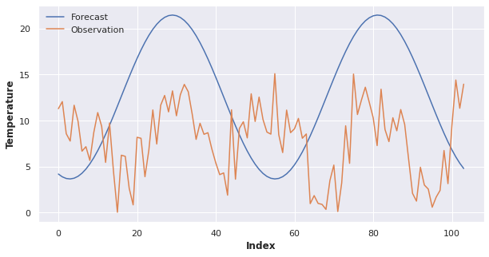
    


### Error Calculation


```python
r = xs.pearson_r(df_oos_X.New_temp,fc_X,dim='index')
p = xs.pearson_r_p_value(df_oos_X.New_temp,fc_X, dim="index")
sp_r = xs.spearman_r(df_oos_X.New_temp,fc_X, dim="index")
mae = xs.mae(df_oos_X.New_temp,fc_X)
rmse = xs.rmse(df_oos_X.New_temp,fc_X)
```


```python
from tabulate import tabulate
d = [["RMSE", rmse.values],
    ["Pearson Coeff", r.values],
    ['Spearman coefficient',sp_r.values],
     ['Mean average value', mae.values],
    ['Pearson Correlation p value', p.values]]

print(tabulate(d,headers=['Deterministic Metrics', 'Values']))
```

    Deterministic Metrics           Values
    ---------------------------  ---------
    RMSE                         8.64192
    Pearson Coeff                0.0561385
    Spearman coefficient         0.0807319
    Mean average value           7.80924
    Pearson Correlation p value  0.571373


# Conclusion 

Statistical model is not very optimized and efficieint to capture the complex relationship of the atmospheric variables like temperature, mean sea level pressure etc. However, it can give us a sense of climatology of the place and after calibration and bias correction of the model, a better prediction can be acheived.

# Neural Network model approach

In this approach, we are going to implement **LSTM (long short-term memory)** model to predict the temperature. 


```python
import torch
import torch.nn as nn
import torch.optim as optim
import numpy as np
import pandas as pd
import shutil
from sklearn.preprocessing import MinMaxScaler
from tqdm import tqdm_notebook as tqdm

from torch.utils.tensorboard import SummaryWriter
import matplotlib.pyplot as plt

from darts import TimeSeries
from darts.dataprocessing.transformers import Scaler
from darts.models import RNNModel, ExponentialSmoothing, BlockRNNModel
from darts.metrics import mape
from darts.utils.statistics import check_seasonality, plot_acf
from darts.datasets import AirPassengersDataset, SunspotsDataset
from darts.utils.timeseries_generation import datetime_attribute_timeseries

import warnings

warnings.filterwarnings("ignore")
import logging

logging.disable(logging.CRITICAL)
import pandas
```


```python
ss = sd_temp.to_dataframe()
```


```python
lstm_ts = TimeSeries.from_dataframe(ss)

train, val = lstm_ts.split_after(pd.Timestamp("20000101"))

```


```python
# Read data:
#series = AirPassengersDataset().load()

# Create training and validation sets:
#train, val = series.split_after(pd.Timestamp("19590101"))

# Normalize the time series (note: we avoid fitting the transformer on the validation set)
transformer = Scaler()
train_transformed = transformer.fit_transform(train)
val_transformed = transformer.transform(val)
series_transformed = transformer.transform(lstm_ts)
```


```python
# create month and year covariate series
year_series = datetime_attribute_timeseries(
    pd.date_range(start=lstm_ts.start_time(), freq=lstm_ts.freq_str, periods=1000),
    attribute="year",
    one_hot=False,
)
year_series = Scaler().fit_transform(year_series)
week_series = datetime_attribute_timeseries(
    year_series, attribute="week", one_hot=True
)
covariates = year_series.stack(week_series)
cov_train, cov_val = covariates.split_after(pd.Timestamp("19590101"))
```


```python
my_model = BlockRNNModel(
    model="LSTM",
    input_chunk_length=16,
    output_chunk_length=4,
    dropout=0.1,
    batch_size=8,
    n_epochs=10,
    optimizer_kwargs={"lr": 1e-3},
    model_name="temp_RNN",
    log_tensorboard=True,
    random_state=42,
    force_reset=True,
    save_checkpoints=True,
)
```


```python
my_model.fit(
    train_transformed,
    val_series=val_transformed,
    verbose=True,
)
```

    Epoch 0:  72%|███████▏  | 324/452 [00:04<00:01, 66.73it/s, loss=0.00434, v_num=logs, train_loss=0.00333]
    Validation: 0it [00:00, ?it/s]
    Validation:   0%|          | 0/128 [00:00<?, ?it/s]
    Validation DataLoader 0:   0%|          | 0/128 [00:00<?, ?it/s]
    Epoch 0:  72%|███████▏  | 325/452 [00:04<00:01, 66.64it/s, loss=0.00434, v_num=logs, train_loss=0.00333]
    Epoch 0:  72%|███████▏  | 326/452 [00:04<00:01, 66.68it/s, loss=0.00434, v_num=logs, train_loss=0.00333]
    Epoch 0:  72%|███████▏  | 327/452 [00:04<00:01, 66.74it/s, loss=0.00434, v_num=logs, train_loss=0.00333]
    Epoch 0:  73%|███████▎  | 328/452 [00:04<00:01, 66.79it/s, loss=0.00434, v_num=logs, train_loss=0.00333]
    Epoch 0:  73%|███████▎  | 329/452 [00:04<00:01, 66.86it/s, loss=0.00434, v_num=logs, train_loss=0.00333]
    Epoch 0:  73%|███████▎  | 330/452 [00:04<00:01, 66.91it/s, loss=0.00434, v_num=logs, train_loss=0.00333]
    Epoch 0:  73%|███████▎  | 331/452 [00:04<00:01, 67.00it/s, loss=0.00434, v_num=logs, train_loss=0.00333]
    Epoch 0:  73%|███████▎  | 332/452 [00:04<00:01, 67.06it/s, loss=0.00434, v_num=logs, train_loss=0.00333]
    Epoch 0:  74%|███████▎  | 333/452 [00:04<00:01, 67.10it/s, loss=0.00434, v_num=logs, train_loss=0.00333]
    Epoch 0:  74%|███████▍  | 334/452 [00:04<00:01, 67.17it/s, loss=0.00434, v_num=logs, train_loss=0.00333]
    Epoch 0:  74%|███████▍  | 335/452 [00:04<00:01, 67.25it/s, loss=0.00434, v_num=logs, train_loss=0.00333]
    Epoch 0:  74%|███████▍  | 336/452 [00:04<00:01, 67.32it/s, loss=0.00434, v_num=logs, train_loss=0.00333]
    Epoch 0:  75%|███████▍  | 337/452 [00:05<00:01, 67.39it/s, loss=0.00434, v_num=logs, train_loss=0.00333]
    Epoch 0:  75%|███████▍  | 338/452 [00:05<00:01, 67.47it/s, loss=0.00434, v_num=logs, train_loss=0.00333]
    Epoch 0:  75%|███████▌  | 339/452 [00:05<00:01, 67.56it/s, loss=0.00434, v_num=logs, train_loss=0.00333]
    Epoch 0:  75%|███████▌  | 340/452 [00:05<00:01, 67.59it/s, loss=0.00434, v_num=logs, train_loss=0.00333]
    Epoch 0:  75%|███████▌  | 341/452 [00:05<00:01, 67.63it/s, loss=0.00434, v_num=logs, train_loss=0.00333]
    Epoch 0:  76%|███████▌  | 342/452 [00:05<00:01, 67.71it/s, loss=0.00434, v_num=logs, train_loss=0.00333]
    Epoch 0:  76%|███████▌  | 343/452 [00:05<00:01, 67.75it/s, loss=0.00434, v_num=logs, train_loss=0.00333]
    Epoch 0:  76%|███████▌  | 344/452 [00:05<00:01, 67.77it/s, loss=0.00434, v_num=logs, train_loss=0.00333]
    Epoch 0:  76%|███████▋  | 345/452 [00:05<00:01, 67.84it/s, loss=0.00434, v_num=logs, train_loss=0.00333]
    Epoch 0:  77%|███████▋  | 346/452 [00:05<00:01, 67.91it/s, loss=0.00434, v_num=logs, train_loss=0.00333]
    Epoch 0:  77%|███████▋  | 347/452 [00:05<00:01, 67.96it/s, loss=0.00434, v_num=logs, train_loss=0.00333]
    Epoch 0:  77%|███████▋  | 348/452 [00:05<00:01, 68.03it/s, loss=0.00434, v_num=logs, train_loss=0.00333]
    Epoch 0:  77%|███████▋  | 349/452 [00:05<00:01, 68.11it/s, loss=0.00434, v_num=logs, train_loss=0.00333]
    Epoch 0:  77%|███████▋  | 350/452 [00:05<00:01, 68.18it/s, loss=0.00434, v_num=logs, train_loss=0.00333]
    Epoch 0:  78%|███████▊  | 351/452 [00:05<00:01, 68.22it/s, loss=0.00434, v_num=logs, train_loss=0.00333]
    Epoch 0:  78%|███████▊  | 352/452 [00:05<00:01, 68.27it/s, loss=0.00434, v_num=logs, train_loss=0.00333]
    Epoch 0:  78%|███████▊  | 353/452 [00:05<00:01, 68.34it/s, loss=0.00434, v_num=logs, train_loss=0.00333]
    Epoch 0:  78%|███████▊  | 354/452 [00:05<00:01, 68.39it/s, loss=0.00434, v_num=logs, train_loss=0.00333]
    Epoch 0:  79%|███████▊  | 355/452 [00:05<00:01, 68.43it/s, loss=0.00434, v_num=logs, train_loss=0.00333]
    Epoch 0:  79%|███████▉  | 356/452 [00:05<00:01, 68.49it/s, loss=0.00434, v_num=logs, train_loss=0.00333]
    Epoch 0:  79%|███████▉  | 357/452 [00:05<00:01, 68.57it/s, loss=0.00434, v_num=logs, train_loss=0.00333]
    Epoch 0:  79%|███████▉  | 358/452 [00:05<00:01, 68.65it/s, loss=0.00434, v_num=logs, train_loss=0.00333]
    Epoch 0:  79%|███████▉  | 359/452 [00:05<00:01, 68.72it/s, loss=0.00434, v_num=logs, train_loss=0.00333]
    Epoch 0:  80%|███████▉  | 360/452 [00:05<00:01, 68.80it/s, loss=0.00434, v_num=logs, train_loss=0.00333]
    Epoch 0:  80%|███████▉  | 361/452 [00:05<00:01, 68.87it/s, loss=0.00434, v_num=logs, train_loss=0.00333]
    Epoch 0:  80%|████████  | 362/452 [00:05<00:01, 68.91it/s, loss=0.00434, v_num=logs, train_loss=0.00333]
    Epoch 0:  80%|████████  | 363/452 [00:05<00:01, 68.95it/s, loss=0.00434, v_num=logs, train_loss=0.00333]
    Epoch 0:  81%|████████  | 364/452 [00:05<00:01, 69.00it/s, loss=0.00434, v_num=logs, train_loss=0.00333]
    Epoch 0:  81%|████████  | 365/452 [00:05<00:01, 69.06it/s, loss=0.00434, v_num=logs, train_loss=0.00333]
    Epoch 0:  81%|████████  | 366/452 [00:05<00:01, 69.12it/s, loss=0.00434, v_num=logs, train_loss=0.00333]
    Epoch 0:  81%|████████  | 367/452 [00:05<00:01, 69.19it/s, loss=0.00434, v_num=logs, train_loss=0.00333]
    Epoch 0:  81%|████████▏ | 368/452 [00:05<00:01, 69.27it/s, loss=0.00434, v_num=logs, train_loss=0.00333]
    Epoch 0:  82%|████████▏ | 369/452 [00:05<00:01, 69.34it/s, loss=0.00434, v_num=logs, train_loss=0.00333]
    Epoch 0:  82%|████████▏ | 370/452 [00:05<00:01, 69.39it/s, loss=0.00434, v_num=logs, train_loss=0.00333]
    Epoch 0:  82%|████████▏ | 371/452 [00:05<00:01, 69.46it/s, loss=0.00434, v_num=logs, train_loss=0.00333]
    Epoch 0:  82%|████████▏ | 372/452 [00:05<00:01, 69.53it/s, loss=0.00434, v_num=logs, train_loss=0.00333]
    Epoch 0:  83%|████████▎ | 373/452 [00:05<00:01, 69.60it/s, loss=0.00434, v_num=logs, train_loss=0.00333]
    Epoch 0:  83%|████████▎ | 374/452 [00:05<00:01, 69.68it/s, loss=0.00434, v_num=logs, train_loss=0.00333]
    Epoch 0:  83%|████████▎ | 375/452 [00:05<00:01, 69.75it/s, loss=0.00434, v_num=logs, train_loss=0.00333]
    Epoch 0:  83%|████████▎ | 376/452 [00:05<00:01, 69.83it/s, loss=0.00434, v_num=logs, train_loss=0.00333]
    Epoch 0:  83%|████████▎ | 377/452 [00:05<00:01, 69.91it/s, loss=0.00434, v_num=logs, train_loss=0.00333]
    Epoch 0:  84%|████████▎ | 378/452 [00:05<00:01, 69.98it/s, loss=0.00434, v_num=logs, train_loss=0.00333]
    Epoch 0:  84%|████████▍ | 379/452 [00:05<00:01, 70.05it/s, loss=0.00434, v_num=logs, train_loss=0.00333]
    Epoch 0:  84%|████████▍ | 380/452 [00:05<00:01, 70.09it/s, loss=0.00434, v_num=logs, train_loss=0.00333]
    Epoch 0:  84%|████████▍ | 381/452 [00:05<00:01, 70.17it/s, loss=0.00434, v_num=logs, train_loss=0.00333]
    Epoch 0:  85%|████████▍ | 382/452 [00:05<00:00, 70.21it/s, loss=0.00434, v_num=logs, train_loss=0.00333]
    Epoch 0:  85%|████████▍ | 383/452 [00:05<00:00, 70.25it/s, loss=0.00434, v_num=logs, train_loss=0.00333]
    Epoch 0:  85%|████████▍ | 384/452 [00:05<00:00, 70.29it/s, loss=0.00434, v_num=logs, train_loss=0.00333]
    Epoch 0:  85%|████████▌ | 385/452 [00:05<00:00, 70.34it/s, loss=0.00434, v_num=logs, train_loss=0.00333]
    Epoch 0:  85%|████████▌ | 386/452 [00:05<00:00, 70.42it/s, loss=0.00434, v_num=logs, train_loss=0.00333]
    Epoch 0:  86%|████████▌ | 387/452 [00:05<00:00, 70.46it/s, loss=0.00434, v_num=logs, train_loss=0.00333]
    Epoch 0:  86%|████████▌ | 388/452 [00:05<00:00, 70.51it/s, loss=0.00434, v_num=logs, train_loss=0.00333]
    Epoch 0:  86%|████████▌ | 389/452 [00:05<00:00, 70.55it/s, loss=0.00434, v_num=logs, train_loss=0.00333]
    Epoch 0:  86%|████████▋ | 390/452 [00:05<00:00, 70.58it/s, loss=0.00434, v_num=logs, train_loss=0.00333]
    Epoch 0:  87%|████████▋ | 391/452 [00:05<00:00, 70.60it/s, loss=0.00434, v_num=logs, train_loss=0.00333]
    Epoch 0:  87%|████████▋ | 392/452 [00:05<00:00, 70.66it/s, loss=0.00434, v_num=logs, train_loss=0.00333]
    Epoch 0:  87%|████████▋ | 393/452 [00:05<00:00, 70.67it/s, loss=0.00434, v_num=logs, train_loss=0.00333]
    Epoch 0:  87%|████████▋ | 394/452 [00:05<00:00, 70.73it/s, loss=0.00434, v_num=logs, train_loss=0.00333]
    Epoch 0:  87%|████████▋ | 395/452 [00:05<00:00, 70.80it/s, loss=0.00434, v_num=logs, train_loss=0.00333]
    Epoch 0:  88%|████████▊ | 396/452 [00:05<00:00, 70.82it/s, loss=0.00434, v_num=logs, train_loss=0.00333]
    Epoch 0:  88%|████████▊ | 397/452 [00:05<00:00, 70.87it/s, loss=0.00434, v_num=logs, train_loss=0.00333]
    Epoch 0:  88%|████████▊ | 398/452 [00:05<00:00, 70.95it/s, loss=0.00434, v_num=logs, train_loss=0.00333]
    Epoch 0:  88%|████████▊ | 399/452 [00:05<00:00, 71.01it/s, loss=0.00434, v_num=logs, train_loss=0.00333]
    Epoch 0:  88%|████████▊ | 400/452 [00:05<00:00, 71.09it/s, loss=0.00434, v_num=logs, train_loss=0.00333]
    Epoch 0:  89%|████████▊ | 401/452 [00:05<00:00, 71.16it/s, loss=0.00434, v_num=logs, train_loss=0.00333]
    Epoch 0:  89%|████████▉ | 402/452 [00:05<00:00, 71.23it/s, loss=0.00434, v_num=logs, train_loss=0.00333]
    Epoch 0:  89%|████████▉ | 403/452 [00:05<00:00, 71.30it/s, loss=0.00434, v_num=logs, train_loss=0.00333]
    Epoch 0:  89%|████████▉ | 404/452 [00:05<00:00, 71.36it/s, loss=0.00434, v_num=logs, train_loss=0.00333]
    Epoch 0:  90%|████████▉ | 405/452 [00:05<00:00, 71.42it/s, loss=0.00434, v_num=logs, train_loss=0.00333]
    Epoch 0:  90%|████████▉ | 406/452 [00:05<00:00, 71.48it/s, loss=0.00434, v_num=logs, train_loss=0.00333]
    Epoch 0:  90%|█████████ | 407/452 [00:05<00:00, 71.56it/s, loss=0.00434, v_num=logs, train_loss=0.00333]
    Epoch 0:  90%|█████████ | 408/452 [00:05<00:00, 71.65it/s, loss=0.00434, v_num=logs, train_loss=0.00333]
    Epoch 0:  90%|█████████ | 409/452 [00:05<00:00, 71.71it/s, loss=0.00434, v_num=logs, train_loss=0.00333]
    Epoch 0:  91%|█████████ | 410/452 [00:05<00:00, 71.79it/s, loss=0.00434, v_num=logs, train_loss=0.00333]
    Epoch 0:  91%|█████████ | 411/452 [00:05<00:00, 71.86it/s, loss=0.00434, v_num=logs, train_loss=0.00333]
    Epoch 0:  91%|█████████ | 412/452 [00:05<00:00, 71.92it/s, loss=0.00434, v_num=logs, train_loss=0.00333]
    Epoch 0:  91%|█████████▏| 413/452 [00:05<00:00, 71.99it/s, loss=0.00434, v_num=logs, train_loss=0.00333]
    Epoch 0:  92%|█████████▏| 414/452 [00:05<00:00, 72.07it/s, loss=0.00434, v_num=logs, train_loss=0.00333]
    Epoch 0:  92%|█████████▏| 415/452 [00:05<00:00, 72.11it/s, loss=0.00434, v_num=logs, train_loss=0.00333]
    Epoch 0:  92%|█████████▏| 416/452 [00:05<00:00, 72.15it/s, loss=0.00434, v_num=logs, train_loss=0.00333]
    Epoch 0:  92%|█████████▏| 417/452 [00:05<00:00, 72.18it/s, loss=0.00434, v_num=logs, train_loss=0.00333]
    Epoch 0:  92%|█████████▏| 418/452 [00:05<00:00, 72.21it/s, loss=0.00434, v_num=logs, train_loss=0.00333]
    Epoch 0:  93%|█████████▎| 419/452 [00:05<00:00, 72.20it/s, loss=0.00434, v_num=logs, train_loss=0.00333]
    Epoch 0:  93%|█████████▎| 420/452 [00:05<00:00, 72.25it/s, loss=0.00434, v_num=logs, train_loss=0.00333]
    Epoch 0:  93%|█████████▎| 421/452 [00:05<00:00, 72.31it/s, loss=0.00434, v_num=logs, train_loss=0.00333]
    Epoch 0:  93%|█████████▎| 422/452 [00:05<00:00, 72.36it/s, loss=0.00434, v_num=logs, train_loss=0.00333]
    Epoch 0:  94%|█████████▎| 423/452 [00:05<00:00, 72.42it/s, loss=0.00434, v_num=logs, train_loss=0.00333]
    Epoch 0:  94%|█████████▍| 424/452 [00:05<00:00, 72.49it/s, loss=0.00434, v_num=logs, train_loss=0.00333]
    Epoch 0:  94%|█████████▍| 425/452 [00:05<00:00, 72.56it/s, loss=0.00434, v_num=logs, train_loss=0.00333]
    Epoch 0:  94%|█████████▍| 426/452 [00:05<00:00, 72.62it/s, loss=0.00434, v_num=logs, train_loss=0.00333]
    Epoch 0:  94%|█████████▍| 427/452 [00:05<00:00, 72.68it/s, loss=0.00434, v_num=logs, train_loss=0.00333]
    Epoch 0:  95%|█████████▍| 428/452 [00:05<00:00, 72.73it/s, loss=0.00434, v_num=logs, train_loss=0.00333]
    Epoch 0:  95%|█████████▍| 429/452 [00:05<00:00, 72.79it/s, loss=0.00434, v_num=logs, train_loss=0.00333]
    Epoch 0:  95%|█████████▌| 430/452 [00:05<00:00, 72.86it/s, loss=0.00434, v_num=logs, train_loss=0.00333]
    Epoch 0:  95%|█████████▌| 431/452 [00:05<00:00, 72.93it/s, loss=0.00434, v_num=logs, train_loss=0.00333]
    Epoch 0:  96%|█████████▌| 432/452 [00:05<00:00, 72.98it/s, loss=0.00434, v_num=logs, train_loss=0.00333]
    Epoch 0:  96%|█████████▌| 433/452 [00:05<00:00, 73.04it/s, loss=0.00434, v_num=logs, train_loss=0.00333]
    Epoch 0:  96%|█████████▌| 434/452 [00:05<00:00, 73.11it/s, loss=0.00434, v_num=logs, train_loss=0.00333]
    Epoch 0:  96%|█████████▌| 435/452 [00:05<00:00, 73.17it/s, loss=0.00434, v_num=logs, train_loss=0.00333]
    Epoch 0:  96%|█████████▋| 436/452 [00:05<00:00, 73.24it/s, loss=0.00434, v_num=logs, train_loss=0.00333]
    Epoch 0:  97%|█████████▋| 437/452 [00:05<00:00, 73.32it/s, loss=0.00434, v_num=logs, train_loss=0.00333]
    Epoch 0:  97%|█████████▋| 438/452 [00:05<00:00, 73.36it/s, loss=0.00434, v_num=logs, train_loss=0.00333]
    Epoch 0:  97%|█████████▋| 439/452 [00:05<00:00, 73.43it/s, loss=0.00434, v_num=logs, train_loss=0.00333]
    Epoch 0:  97%|█████████▋| 440/452 [00:05<00:00, 73.48it/s, loss=0.00434, v_num=logs, train_loss=0.00333]
    Epoch 0:  98%|█████████▊| 441/452 [00:05<00:00, 73.55it/s, loss=0.00434, v_num=logs, train_loss=0.00333]
    Epoch 0:  98%|█████████▊| 442/452 [00:06<00:00, 73.61it/s, loss=0.00434, v_num=logs, train_loss=0.00333]
    Epoch 0:  98%|█████████▊| 443/452 [00:06<00:00, 73.66it/s, loss=0.00434, v_num=logs, train_loss=0.00333]
    Epoch 0:  98%|█████████▊| 444/452 [00:06<00:00, 73.71it/s, loss=0.00434, v_num=logs, train_loss=0.00333]
    Epoch 0:  98%|█████████▊| 445/452 [00:06<00:00, 73.75it/s, loss=0.00434, v_num=logs, train_loss=0.00333]
    Epoch 0:  99%|█████████▊| 446/452 [00:06<00:00, 73.80it/s, loss=0.00434, v_num=logs, train_loss=0.00333]
    Epoch 0:  99%|█████████▉| 447/452 [00:06<00:00, 73.86it/s, loss=0.00434, v_num=logs, train_loss=0.00333]
    Epoch 0:  99%|█████████▉| 448/452 [00:06<00:00, 73.92it/s, loss=0.00434, v_num=logs, train_loss=0.00333]
    Epoch 0:  99%|█████████▉| 449/452 [00:06<00:00, 73.98it/s, loss=0.00434, v_num=logs, train_loss=0.00333]
    Epoch 0: 100%|█████████▉| 450/452 [00:06<00:00, 74.03it/s, loss=0.00434, v_num=logs, train_loss=0.00333]
    Epoch 0: 100%|█████████▉| 451/452 [00:06<00:00, 74.07it/s, loss=0.00434, v_num=logs, train_loss=0.00333]
    Epoch 0: 100%|██████████| 452/452 [00:06<00:00, 74.08it/s, loss=0.00434, v_num=logs, train_loss=0.00333, val_loss=0.00399]
    Epoch 1:  72%|███████▏  | 324/452 [00:04<00:01, 67.42it/s, loss=0.0031, v_num=logs, train_loss=0.00377, val_loss=0.00399] 
    Validation: 0it [00:00, ?it/s]
    Validation:   0%|          | 0/128 [00:00<?, ?it/s]
    Validation DataLoader 0:   0%|          | 0/128 [00:00<?, ?it/s]
    Epoch 1:  72%|███████▏  | 325/452 [00:04<00:01, 67.32it/s, loss=0.0031, v_num=logs, train_loss=0.00377, val_loss=0.00399]
    Epoch 1:  72%|███████▏  | 326/452 [00:04<00:01, 67.39it/s, loss=0.0031, v_num=logs, train_loss=0.00377, val_loss=0.00399]
    Epoch 1:  72%|███████▏  | 327/452 [00:04<00:01, 67.45it/s, loss=0.0031, v_num=logs, train_loss=0.00377, val_loss=0.00399]
    Epoch 1:  73%|███████▎  | 328/452 [00:04<00:01, 67.53it/s, loss=0.0031, v_num=logs, train_loss=0.00377, val_loss=0.00399]
    Epoch 1:  73%|███████▎  | 329/452 [00:04<00:01, 67.61it/s, loss=0.0031, v_num=logs, train_loss=0.00377, val_loss=0.00399]
    Epoch 1:  73%|███████▎  | 330/452 [00:04<00:01, 67.68it/s, loss=0.0031, v_num=logs, train_loss=0.00377, val_loss=0.00399]
    Epoch 1:  73%|███████▎  | 331/452 [00:04<00:01, 67.74it/s, loss=0.0031, v_num=logs, train_loss=0.00377, val_loss=0.00399]
    Epoch 1:  73%|███████▎  | 332/452 [00:04<00:01, 67.83it/s, loss=0.0031, v_num=logs, train_loss=0.00377, val_loss=0.00399]
    Epoch 1:  74%|███████▎  | 333/452 [00:04<00:01, 67.90it/s, loss=0.0031, v_num=logs, train_loss=0.00377, val_loss=0.00399]
    Epoch 1:  74%|███████▍  | 334/452 [00:04<00:01, 67.98it/s, loss=0.0031, v_num=logs, train_loss=0.00377, val_loss=0.00399]
    Epoch 1:  74%|███████▍  | 335/452 [00:04<00:01, 68.04it/s, loss=0.0031, v_num=logs, train_loss=0.00377, val_loss=0.00399]
    Epoch 1:  74%|███████▍  | 336/452 [00:04<00:01, 68.11it/s, loss=0.0031, v_num=logs, train_loss=0.00377, val_loss=0.00399]
    Epoch 1:  75%|███████▍  | 337/452 [00:04<00:01, 68.17it/s, loss=0.0031, v_num=logs, train_loss=0.00377, val_loss=0.00399]
    Epoch 1:  75%|███████▍  | 338/452 [00:04<00:01, 68.23it/s, loss=0.0031, v_num=logs, train_loss=0.00377, val_loss=0.00399]
    Epoch 1:  75%|███████▌  | 339/452 [00:04<00:01, 68.28it/s, loss=0.0031, v_num=logs, train_loss=0.00377, val_loss=0.00399]
    Epoch 1:  75%|███████▌  | 340/452 [00:04<00:01, 68.31it/s, loss=0.0031, v_num=logs, train_loss=0.00377, val_loss=0.00399]
    Epoch 1:  75%|███████▌  | 341/452 [00:04<00:01, 68.33it/s, loss=0.0031, v_num=logs, train_loss=0.00377, val_loss=0.00399]
    Epoch 1:  76%|███████▌  | 342/452 [00:05<00:01, 68.38it/s, loss=0.0031, v_num=logs, train_loss=0.00377, val_loss=0.00399]
    Epoch 1:  76%|███████▌  | 343/452 [00:05<00:01, 68.43it/s, loss=0.0031, v_num=logs, train_loss=0.00377, val_loss=0.00399]
    Epoch 1:  76%|███████▌  | 344/452 [00:05<00:01, 68.45it/s, loss=0.0031, v_num=logs, train_loss=0.00377, val_loss=0.00399]
    Epoch 1:  76%|███████▋  | 345/452 [00:05<00:01, 68.51it/s, loss=0.0031, v_num=logs, train_loss=0.00377, val_loss=0.00399]
    Epoch 1:  77%|███████▋  | 346/452 [00:05<00:01, 68.56it/s, loss=0.0031, v_num=logs, train_loss=0.00377, val_loss=0.00399]
    Epoch 1:  77%|███████▋  | 347/452 [00:05<00:01, 68.61it/s, loss=0.0031, v_num=logs, train_loss=0.00377, val_loss=0.00399]
    Epoch 1:  77%|███████▋  | 348/452 [00:05<00:01, 68.63it/s, loss=0.0031, v_num=logs, train_loss=0.00377, val_loss=0.00399]
    Epoch 1:  77%|███████▋  | 349/452 [00:05<00:01, 68.66it/s, loss=0.0031, v_num=logs, train_loss=0.00377, val_loss=0.00399]
    Epoch 1:  77%|███████▋  | 350/452 [00:05<00:01, 68.72it/s, loss=0.0031, v_num=logs, train_loss=0.00377, val_loss=0.00399]
    Epoch 1:  78%|███████▊  | 351/452 [00:05<00:01, 68.73it/s, loss=0.0031, v_num=logs, train_loss=0.00377, val_loss=0.00399]
    Epoch 1:  78%|███████▊  | 352/452 [00:05<00:01, 68.80it/s, loss=0.0031, v_num=logs, train_loss=0.00377, val_loss=0.00399]
    Epoch 1:  78%|███████▊  | 353/452 [00:05<00:01, 68.83it/s, loss=0.0031, v_num=logs, train_loss=0.00377, val_loss=0.00399]
    Epoch 1:  78%|███████▊  | 354/452 [00:05<00:01, 68.88it/s, loss=0.0031, v_num=logs, train_loss=0.00377, val_loss=0.00399]
    Epoch 1:  79%|███████▊  | 355/452 [00:05<00:01, 68.93it/s, loss=0.0031, v_num=logs, train_loss=0.00377, val_loss=0.00399]
    Epoch 1:  79%|███████▉  | 356/452 [00:05<00:01, 69.00it/s, loss=0.0031, v_num=logs, train_loss=0.00377, val_loss=0.00399]
    Epoch 1:  79%|███████▉  | 357/452 [00:05<00:01, 69.07it/s, loss=0.0031, v_num=logs, train_loss=0.00377, val_loss=0.00399]
    Epoch 1:  79%|███████▉  | 358/452 [00:05<00:01, 69.14it/s, loss=0.0031, v_num=logs, train_loss=0.00377, val_loss=0.00399]
    Epoch 1:  79%|███████▉  | 359/452 [00:05<00:01, 69.20it/s, loss=0.0031, v_num=logs, train_loss=0.00377, val_loss=0.00399]
    Epoch 1:  80%|███████▉  | 360/452 [00:05<00:01, 69.22it/s, loss=0.0031, v_num=logs, train_loss=0.00377, val_loss=0.00399]
    Epoch 1:  80%|███████▉  | 361/452 [00:05<00:01, 69.25it/s, loss=0.0031, v_num=logs, train_loss=0.00377, val_loss=0.00399]
    Epoch 1:  80%|████████  | 362/452 [00:05<00:01, 69.28it/s, loss=0.0031, v_num=logs, train_loss=0.00377, val_loss=0.00399]
    Epoch 1:  80%|████████  | 363/452 [00:05<00:01, 69.36it/s, loss=0.0031, v_num=logs, train_loss=0.00377, val_loss=0.00399]
    Epoch 1:  81%|████████  | 364/452 [00:05<00:01, 69.41it/s, loss=0.0031, v_num=logs, train_loss=0.00377, val_loss=0.00399]
    Epoch 1:  81%|████████  | 365/452 [00:05<00:01, 69.49it/s, loss=0.0031, v_num=logs, train_loss=0.00377, val_loss=0.00399]
    Epoch 1:  81%|████████  | 366/452 [00:05<00:01, 69.54it/s, loss=0.0031, v_num=logs, train_loss=0.00377, val_loss=0.00399]
    Epoch 1:  81%|████████  | 367/452 [00:05<00:01, 69.57it/s, loss=0.0031, v_num=logs, train_loss=0.00377, val_loss=0.00399]
    Epoch 1:  81%|████████▏ | 368/452 [00:05<00:01, 69.60it/s, loss=0.0031, v_num=logs, train_loss=0.00377, val_loss=0.00399]
    Epoch 1:  82%|████████▏ | 369/452 [00:05<00:01, 69.62it/s, loss=0.0031, v_num=logs, train_loss=0.00377, val_loss=0.00399]
    Epoch 1:  82%|████████▏ | 370/452 [00:05<00:01, 69.65it/s, loss=0.0031, v_num=logs, train_loss=0.00377, val_loss=0.00399]
    Epoch 1:  82%|████████▏ | 371/452 [00:05<00:01, 69.70it/s, loss=0.0031, v_num=logs, train_loss=0.00377, val_loss=0.00399]
    Epoch 1:  82%|████████▏ | 372/452 [00:05<00:01, 69.75it/s, loss=0.0031, v_num=logs, train_loss=0.00377, val_loss=0.00399]
    Epoch 1:  83%|████████▎ | 373/452 [00:05<00:01, 69.80it/s, loss=0.0031, v_num=logs, train_loss=0.00377, val_loss=0.00399]
    Epoch 1:  83%|████████▎ | 374/452 [00:05<00:01, 69.84it/s, loss=0.0031, v_num=logs, train_loss=0.00377, val_loss=0.00399]
    Epoch 1:  83%|████████▎ | 375/452 [00:05<00:01, 69.90it/s, loss=0.0031, v_num=logs, train_loss=0.00377, val_loss=0.00399]
    Epoch 1:  83%|████████▎ | 376/452 [00:05<00:01, 69.93it/s, loss=0.0031, v_num=logs, train_loss=0.00377, val_loss=0.00399]
    Epoch 1:  83%|████████▎ | 377/452 [00:05<00:01, 69.95it/s, loss=0.0031, v_num=logs, train_loss=0.00377, val_loss=0.00399]
    Epoch 1:  84%|████████▎ | 378/452 [00:05<00:01, 69.99it/s, loss=0.0031, v_num=logs, train_loss=0.00377, val_loss=0.00399]
    Epoch 1:  84%|████████▍ | 379/452 [00:05<00:01, 70.03it/s, loss=0.0031, v_num=logs, train_loss=0.00377, val_loss=0.00399]
    Epoch 1:  84%|████████▍ | 380/452 [00:05<00:01, 70.11it/s, loss=0.0031, v_num=logs, train_loss=0.00377, val_loss=0.00399]
    Epoch 1:  84%|████████▍ | 381/452 [00:05<00:01, 70.15it/s, loss=0.0031, v_num=logs, train_loss=0.00377, val_loss=0.00399]
    Epoch 1:  85%|████████▍ | 382/452 [00:05<00:00, 70.20it/s, loss=0.0031, v_num=logs, train_loss=0.00377, val_loss=0.00399]
    Epoch 1:  85%|████████▍ | 383/452 [00:05<00:00, 70.23it/s, loss=0.0031, v_num=logs, train_loss=0.00377, val_loss=0.00399]
    Epoch 1:  85%|████████▍ | 384/452 [00:05<00:00, 70.25it/s, loss=0.0031, v_num=logs, train_loss=0.00377, val_loss=0.00399]
    Epoch 1:  85%|████████▌ | 385/452 [00:05<00:00, 70.29it/s, loss=0.0031, v_num=logs, train_loss=0.00377, val_loss=0.00399]
    Epoch 1:  85%|████████▌ | 386/452 [00:05<00:00, 70.35it/s, loss=0.0031, v_num=logs, train_loss=0.00377, val_loss=0.00399]
    Epoch 1:  86%|████████▌ | 387/452 [00:05<00:00, 70.42it/s, loss=0.0031, v_num=logs, train_loss=0.00377, val_loss=0.00399]
    Epoch 1:  86%|████████▌ | 388/452 [00:05<00:00, 70.46it/s, loss=0.0031, v_num=logs, train_loss=0.00377, val_loss=0.00399]
    Epoch 1:  86%|████████▌ | 389/452 [00:05<00:00, 70.52it/s, loss=0.0031, v_num=logs, train_loss=0.00377, val_loss=0.00399]
    Epoch 1:  86%|████████▋ | 390/452 [00:05<00:00, 70.57it/s, loss=0.0031, v_num=logs, train_loss=0.00377, val_loss=0.00399]
    Epoch 1:  87%|████████▋ | 391/452 [00:05<00:00, 70.63it/s, loss=0.0031, v_num=logs, train_loss=0.00377, val_loss=0.00399]
    Epoch 1:  87%|████████▋ | 392/452 [00:05<00:00, 70.68it/s, loss=0.0031, v_num=logs, train_loss=0.00377, val_loss=0.00399]
    Epoch 1:  87%|████████▋ | 393/452 [00:05<00:00, 70.73it/s, loss=0.0031, v_num=logs, train_loss=0.00377, val_loss=0.00399]
    Epoch 1:  87%|████████▋ | 394/452 [00:05<00:00, 70.79it/s, loss=0.0031, v_num=logs, train_loss=0.00377, val_loss=0.00399]
    Epoch 1:  87%|████████▋ | 395/452 [00:05<00:00, 70.86it/s, loss=0.0031, v_num=logs, train_loss=0.00377, val_loss=0.00399]
    Epoch 1:  88%|████████▊ | 396/452 [00:05<00:00, 70.91it/s, loss=0.0031, v_num=logs, train_loss=0.00377, val_loss=0.00399]
    Epoch 1:  88%|████████▊ | 397/452 [00:05<00:00, 70.94it/s, loss=0.0031, v_num=logs, train_loss=0.00377, val_loss=0.00399]
    Epoch 1:  88%|████████▊ | 398/452 [00:05<00:00, 71.00it/s, loss=0.0031, v_num=logs, train_loss=0.00377, val_loss=0.00399]
    Epoch 1:  88%|████████▊ | 399/452 [00:05<00:00, 71.08it/s, loss=0.0031, v_num=logs, train_loss=0.00377, val_loss=0.00399]
    Epoch 1:  88%|████████▊ | 400/452 [00:05<00:00, 71.14it/s, loss=0.0031, v_num=logs, train_loss=0.00377, val_loss=0.00399]
    Epoch 1:  89%|████████▊ | 401/452 [00:05<00:00, 71.22it/s, loss=0.0031, v_num=logs, train_loss=0.00377, val_loss=0.00399]
    Epoch 1:  89%|████████▉ | 402/452 [00:05<00:00, 71.28it/s, loss=0.0031, v_num=logs, train_loss=0.00377, val_loss=0.00399]
    Epoch 1:  89%|████████▉ | 403/452 [00:05<00:00, 71.33it/s, loss=0.0031, v_num=logs, train_loss=0.00377, val_loss=0.00399]
    Epoch 1:  89%|████████▉ | 404/452 [00:05<00:00, 71.36it/s, loss=0.0031, v_num=logs, train_loss=0.00377, val_loss=0.00399]
    Epoch 1:  90%|████████▉ | 405/452 [00:05<00:00, 71.39it/s, loss=0.0031, v_num=logs, train_loss=0.00377, val_loss=0.00399]
    Epoch 1:  90%|████████▉ | 406/452 [00:05<00:00, 71.46it/s, loss=0.0031, v_num=logs, train_loss=0.00377, val_loss=0.00399]
    Epoch 1:  90%|█████████ | 407/452 [00:05<00:00, 71.51it/s, loss=0.0031, v_num=logs, train_loss=0.00377, val_loss=0.00399]
    Epoch 1:  90%|█████████ | 408/452 [00:05<00:00, 71.58it/s, loss=0.0031, v_num=logs, train_loss=0.00377, val_loss=0.00399]
    Epoch 1:  90%|█████████ | 409/452 [00:05<00:00, 71.61it/s, loss=0.0031, v_num=logs, train_loss=0.00377, val_loss=0.00399]
    Epoch 1:  91%|█████████ | 410/452 [00:05<00:00, 71.67it/s, loss=0.0031, v_num=logs, train_loss=0.00377, val_loss=0.00399]
    Epoch 1:  91%|█████████ | 411/452 [00:05<00:00, 71.75it/s, loss=0.0031, v_num=logs, train_loss=0.00377, val_loss=0.00399]
    Epoch 1:  91%|█████████ | 412/452 [00:05<00:00, 71.81it/s, loss=0.0031, v_num=logs, train_loss=0.00377, val_loss=0.00399]
    Epoch 1:  91%|█████████▏| 413/452 [00:05<00:00, 71.85it/s, loss=0.0031, v_num=logs, train_loss=0.00377, val_loss=0.00399]
    Epoch 1:  92%|█████████▏| 414/452 [00:05<00:00, 71.90it/s, loss=0.0031, v_num=logs, train_loss=0.00377, val_loss=0.00399]
    Epoch 1:  92%|█████████▏| 415/452 [00:05<00:00, 71.96it/s, loss=0.0031, v_num=logs, train_loss=0.00377, val_loss=0.00399]
    Epoch 1:  92%|█████████▏| 416/452 [00:05<00:00, 72.03it/s, loss=0.0031, v_num=logs, train_loss=0.00377, val_loss=0.00399]
    Epoch 1:  92%|█████████▏| 417/452 [00:05<00:00, 72.09it/s, loss=0.0031, v_num=logs, train_loss=0.00377, val_loss=0.00399]
    Epoch 1:  92%|█████████▏| 418/452 [00:05<00:00, 72.13it/s, loss=0.0031, v_num=logs, train_loss=0.00377, val_loss=0.00399]
    Epoch 1:  93%|█████████▎| 419/452 [00:05<00:00, 72.14it/s, loss=0.0031, v_num=logs, train_loss=0.00377, val_loss=0.00399]
    Epoch 1:  93%|█████████▎| 420/452 [00:05<00:00, 72.17it/s, loss=0.0031, v_num=logs, train_loss=0.00377, val_loss=0.00399]
    Epoch 1:  93%|█████████▎| 421/452 [00:05<00:00, 72.22it/s, loss=0.0031, v_num=logs, train_loss=0.00377, val_loss=0.00399]
    Epoch 1:  93%|█████████▎| 422/452 [00:05<00:00, 72.26it/s, loss=0.0031, v_num=logs, train_loss=0.00377, val_loss=0.00399]
    Epoch 1:  94%|█████████▎| 423/452 [00:05<00:00, 72.30it/s, loss=0.0031, v_num=logs, train_loss=0.00377, val_loss=0.00399]
    Epoch 1:  94%|█████████▍| 424/452 [00:05<00:00, 72.33it/s, loss=0.0031, v_num=logs, train_loss=0.00377, val_loss=0.00399]
    Epoch 1:  94%|█████████▍| 425/452 [00:05<00:00, 72.38it/s, loss=0.0031, v_num=logs, train_loss=0.00377, val_loss=0.00399]
    Epoch 1:  94%|█████████▍| 426/452 [00:05<00:00, 72.44it/s, loss=0.0031, v_num=logs, train_loss=0.00377, val_loss=0.00399]
    Epoch 1:  94%|█████████▍| 427/452 [00:05<00:00, 72.48it/s, loss=0.0031, v_num=logs, train_loss=0.00377, val_loss=0.00399]
    Epoch 1:  95%|█████████▍| 428/452 [00:05<00:00, 72.54it/s, loss=0.0031, v_num=logs, train_loss=0.00377, val_loss=0.00399]
    Epoch 1:  95%|█████████▍| 429/452 [00:05<00:00, 72.61it/s, loss=0.0031, v_num=logs, train_loss=0.00377, val_loss=0.00399]
    Epoch 1:  95%|█████████▌| 430/452 [00:05<00:00, 72.67it/s, loss=0.0031, v_num=logs, train_loss=0.00377, val_loss=0.00399]
    Epoch 1:  95%|█████████▌| 431/452 [00:05<00:00, 72.73it/s, loss=0.0031, v_num=logs, train_loss=0.00377, val_loss=0.00399]
    Epoch 1:  96%|█████████▌| 432/452 [00:05<00:00, 72.76it/s, loss=0.0031, v_num=logs, train_loss=0.00377, val_loss=0.00399]
    Epoch 1:  96%|█████████▌| 433/452 [00:05<00:00, 72.81it/s, loss=0.0031, v_num=logs, train_loss=0.00377, val_loss=0.00399]
    Epoch 1:  96%|█████████▌| 434/452 [00:05<00:00, 72.87it/s, loss=0.0031, v_num=logs, train_loss=0.00377, val_loss=0.00399]
    Epoch 1:  96%|█████████▌| 435/452 [00:05<00:00, 72.92it/s, loss=0.0031, v_num=logs, train_loss=0.00377, val_loss=0.00399]
    Epoch 1:  96%|█████████▋| 436/452 [00:05<00:00, 72.98it/s, loss=0.0031, v_num=logs, train_loss=0.00377, val_loss=0.00399]
    Epoch 1:  97%|█████████▋| 437/452 [00:05<00:00, 73.04it/s, loss=0.0031, v_num=logs, train_loss=0.00377, val_loss=0.00399]
    Epoch 1:  97%|█████████▋| 438/452 [00:05<00:00, 73.09it/s, loss=0.0031, v_num=logs, train_loss=0.00377, val_loss=0.00399]
    Epoch 1:  97%|█████████▋| 439/452 [00:06<00:00, 73.16it/s, loss=0.0031, v_num=logs, train_loss=0.00377, val_loss=0.00399]
    Epoch 1:  97%|█████████▋| 440/452 [00:06<00:00, 73.23it/s, loss=0.0031, v_num=logs, train_loss=0.00377, val_loss=0.00399]
    Epoch 1:  98%|█████████▊| 441/452 [00:06<00:00, 73.29it/s, loss=0.0031, v_num=logs, train_loss=0.00377, val_loss=0.00399]
    Epoch 1:  98%|█████████▊| 442/452 [00:06<00:00, 73.33it/s, loss=0.0031, v_num=logs, train_loss=0.00377, val_loss=0.00399]
    Epoch 1:  98%|█████████▊| 443/452 [00:06<00:00, 73.36it/s, loss=0.0031, v_num=logs, train_loss=0.00377, val_loss=0.00399]
    Epoch 1:  98%|█████████▊| 444/452 [00:06<00:00, 73.39it/s, loss=0.0031, v_num=logs, train_loss=0.00377, val_loss=0.00399]
    Epoch 1:  98%|█████████▊| 445/452 [00:06<00:00, 73.42it/s, loss=0.0031, v_num=logs, train_loss=0.00377, val_loss=0.00399]
    Epoch 1:  99%|█████████▊| 446/452 [00:06<00:00, 73.46it/s, loss=0.0031, v_num=logs, train_loss=0.00377, val_loss=0.00399]
    Epoch 1:  99%|█████████▉| 447/452 [00:06<00:00, 73.50it/s, loss=0.0031, v_num=logs, train_loss=0.00377, val_loss=0.00399]
    Epoch 1:  99%|█████████▉| 448/452 [00:06<00:00, 73.54it/s, loss=0.0031, v_num=logs, train_loss=0.00377, val_loss=0.00399]
    Epoch 1:  99%|█████████▉| 449/452 [00:06<00:00, 73.60it/s, loss=0.0031, v_num=logs, train_loss=0.00377, val_loss=0.00399]
    Epoch 1: 100%|█████████▉| 450/452 [00:06<00:00, 73.66it/s, loss=0.0031, v_num=logs, train_loss=0.00377, val_loss=0.00399]
    Epoch 1: 100%|█████████▉| 451/452 [00:06<00:00, 73.70it/s, loss=0.0031, v_num=logs, train_loss=0.00377, val_loss=0.00399]
    Epoch 1: 100%|██████████| 452/452 [00:06<00:00, 73.70it/s, loss=0.0031, v_num=logs, train_loss=0.00377, val_loss=0.00311]
    Epoch 2:  72%|███████▏  | 324/452 [00:04<00:01, 67.08it/s, loss=0.00376, v_num=logs, train_loss=0.00544, val_loss=0.00311]
    Validation: 0it [00:00, ?it/s]
    Validation:   0%|          | 0/128 [00:00<?, ?it/s]
    Validation DataLoader 0:   0%|          | 0/128 [00:00<?, ?it/s]
    Epoch 2:  72%|███████▏  | 325/452 [00:04<00:01, 66.95it/s, loss=0.00376, v_num=logs, train_loss=0.00544, val_loss=0.00311]
    Epoch 2:  72%|███████▏  | 326/452 [00:04<00:01, 67.01it/s, loss=0.00376, v_num=logs, train_loss=0.00544, val_loss=0.00311]
    Epoch 2:  72%|███████▏  | 327/452 [00:04<00:01, 67.08it/s, loss=0.00376, v_num=logs, train_loss=0.00544, val_loss=0.00311]
    Epoch 2:  73%|███████▎  | 328/452 [00:04<00:01, 67.14it/s, loss=0.00376, v_num=logs, train_loss=0.00544, val_loss=0.00311]
    Epoch 2:  73%|███████▎  | 329/452 [00:04<00:01, 67.20it/s, loss=0.00376, v_num=logs, train_loss=0.00544, val_loss=0.00311]
    Epoch 2:  73%|███████▎  | 330/452 [00:04<00:01, 67.26it/s, loss=0.00376, v_num=logs, train_loss=0.00544, val_loss=0.00311]
    Epoch 2:  73%|███████▎  | 331/452 [00:04<00:01, 67.34it/s, loss=0.00376, v_num=logs, train_loss=0.00544, val_loss=0.00311]
    Epoch 2:  73%|███████▎  | 332/452 [00:04<00:01, 67.41it/s, loss=0.00376, v_num=logs, train_loss=0.00544, val_loss=0.00311]
    Epoch 2:  74%|███████▎  | 333/452 [00:04<00:01, 67.50it/s, loss=0.00376, v_num=logs, train_loss=0.00544, val_loss=0.00311]
    Epoch 2:  74%|███████▍  | 334/452 [00:04<00:01, 67.59it/s, loss=0.00376, v_num=logs, train_loss=0.00544, val_loss=0.00311]
    Epoch 2:  74%|███████▍  | 335/452 [00:04<00:01, 67.64it/s, loss=0.00376, v_num=logs, train_loss=0.00544, val_loss=0.00311]
    Epoch 2:  74%|███████▍  | 336/452 [00:04<00:01, 67.70it/s, loss=0.00376, v_num=logs, train_loss=0.00544, val_loss=0.00311]
    Epoch 2:  75%|███████▍  | 337/452 [00:04<00:01, 67.78it/s, loss=0.00376, v_num=logs, train_loss=0.00544, val_loss=0.00311]
    Epoch 2:  75%|███████▍  | 338/452 [00:04<00:01, 67.87it/s, loss=0.00376, v_num=logs, train_loss=0.00544, val_loss=0.00311]
    Epoch 2:  75%|███████▌  | 339/452 [00:04<00:01, 67.97it/s, loss=0.00376, v_num=logs, train_loss=0.00544, val_loss=0.00311]
    Epoch 2:  75%|███████▌  | 340/452 [00:04<00:01, 68.06it/s, loss=0.00376, v_num=logs, train_loss=0.00544, val_loss=0.00311]
    Epoch 2:  75%|███████▌  | 341/452 [00:05<00:01, 68.13it/s, loss=0.00376, v_num=logs, train_loss=0.00544, val_loss=0.00311]
    Epoch 2:  76%|███████▌  | 342/452 [00:05<00:01, 68.21it/s, loss=0.00376, v_num=logs, train_loss=0.00544, val_loss=0.00311]
    Epoch 2:  76%|███████▌  | 343/452 [00:05<00:01, 68.29it/s, loss=0.00376, v_num=logs, train_loss=0.00544, val_loss=0.00311]
    Epoch 2:  76%|███████▌  | 344/452 [00:05<00:01, 68.37it/s, loss=0.00376, v_num=logs, train_loss=0.00544, val_loss=0.00311]
    Epoch 2:  76%|███████▋  | 345/452 [00:05<00:01, 68.44it/s, loss=0.00376, v_num=logs, train_loss=0.00544, val_loss=0.00311]
    Epoch 2:  77%|███████▋  | 346/452 [00:05<00:01, 68.51it/s, loss=0.00376, v_num=logs, train_loss=0.00544, val_loss=0.00311]
    Epoch 2:  77%|███████▋  | 347/452 [00:05<00:01, 68.58it/s, loss=0.00376, v_num=logs, train_loss=0.00544, val_loss=0.00311]
    Epoch 2:  77%|███████▋  | 348/452 [00:05<00:01, 68.65it/s, loss=0.00376, v_num=logs, train_loss=0.00544, val_loss=0.00311]
    Epoch 2:  77%|███████▋  | 349/452 [00:05<00:01, 68.74it/s, loss=0.00376, v_num=logs, train_loss=0.00544, val_loss=0.00311]
    Epoch 2:  77%|███████▋  | 350/452 [00:05<00:01, 68.82it/s, loss=0.00376, v_num=logs, train_loss=0.00544, val_loss=0.00311]
    Epoch 2:  78%|███████▊  | 351/452 [00:05<00:01, 68.91it/s, loss=0.00376, v_num=logs, train_loss=0.00544, val_loss=0.00311]
    Epoch 2:  78%|███████▊  | 352/452 [00:05<00:01, 68.99it/s, loss=0.00376, v_num=logs, train_loss=0.00544, val_loss=0.00311]
    Epoch 2:  78%|███████▊  | 353/452 [00:05<00:01, 69.07it/s, loss=0.00376, v_num=logs, train_loss=0.00544, val_loss=0.00311]
    Epoch 2:  78%|███████▊  | 354/452 [00:05<00:01, 69.13it/s, loss=0.00376, v_num=logs, train_loss=0.00544, val_loss=0.00311]
    Epoch 2:  79%|███████▊  | 355/452 [00:05<00:01, 69.18it/s, loss=0.00376, v_num=logs, train_loss=0.00544, val_loss=0.00311]
    Epoch 2:  79%|███████▉  | 356/452 [00:05<00:01, 69.24it/s, loss=0.00376, v_num=logs, train_loss=0.00544, val_loss=0.00311]
    Epoch 2:  79%|███████▉  | 357/452 [00:05<00:01, 69.30it/s, loss=0.00376, v_num=logs, train_loss=0.00544, val_loss=0.00311]
    Epoch 2:  79%|███████▉  | 358/452 [00:05<00:01, 69.33it/s, loss=0.00376, v_num=logs, train_loss=0.00544, val_loss=0.00311]
    Epoch 2:  79%|███████▉  | 359/452 [00:05<00:01, 69.38it/s, loss=0.00376, v_num=logs, train_loss=0.00544, val_loss=0.00311]
    Epoch 2:  80%|███████▉  | 360/452 [00:05<00:01, 69.40it/s, loss=0.00376, v_num=logs, train_loss=0.00544, val_loss=0.00311]
    Epoch 2:  80%|███████▉  | 361/452 [00:05<00:01, 69.40it/s, loss=0.00376, v_num=logs, train_loss=0.00544, val_loss=0.00311]
    Epoch 2:  80%|████████  | 362/452 [00:05<00:01, 69.44it/s, loss=0.00376, v_num=logs, train_loss=0.00544, val_loss=0.00311]
    Epoch 2:  80%|████████  | 363/452 [00:05<00:01, 69.48it/s, loss=0.00376, v_num=logs, train_loss=0.00544, val_loss=0.00311]
    Epoch 2:  81%|████████  | 364/452 [00:05<00:01, 69.51it/s, loss=0.00376, v_num=logs, train_loss=0.00544, val_loss=0.00311]
    Epoch 2:  81%|████████  | 365/452 [00:05<00:01, 69.57it/s, loss=0.00376, v_num=logs, train_loss=0.00544, val_loss=0.00311]
    Epoch 2:  81%|████████  | 366/452 [00:05<00:01, 69.59it/s, loss=0.00376, v_num=logs, train_loss=0.00544, val_loss=0.00311]
    Epoch 2:  81%|████████  | 367/452 [00:05<00:01, 69.66it/s, loss=0.00376, v_num=logs, train_loss=0.00544, val_loss=0.00311]
    Epoch 2:  81%|████████▏ | 368/452 [00:05<00:01, 69.71it/s, loss=0.00376, v_num=logs, train_loss=0.00544, val_loss=0.00311]
    Epoch 2:  82%|████████▏ | 369/452 [00:05<00:01, 69.79it/s, loss=0.00376, v_num=logs, train_loss=0.00544, val_loss=0.00311]
    Epoch 2:  82%|████████▏ | 370/452 [00:05<00:01, 69.86it/s, loss=0.00376, v_num=logs, train_loss=0.00544, val_loss=0.00311]
    Epoch 2:  82%|████████▏ | 371/452 [00:05<00:01, 69.92it/s, loss=0.00376, v_num=logs, train_loss=0.00544, val_loss=0.00311]
    Epoch 2:  82%|████████▏ | 372/452 [00:05<00:01, 69.97it/s, loss=0.00376, v_num=logs, train_loss=0.00544, val_loss=0.00311]
    Epoch 2:  83%|████████▎ | 373/452 [00:05<00:01, 70.01it/s, loss=0.00376, v_num=logs, train_loss=0.00544, val_loss=0.00311]
    Epoch 2:  83%|████████▎ | 374/452 [00:05<00:01, 70.05it/s, loss=0.00376, v_num=logs, train_loss=0.00544, val_loss=0.00311]
    Epoch 2:  83%|████████▎ | 375/452 [00:05<00:01, 70.11it/s, loss=0.00376, v_num=logs, train_loss=0.00544, val_loss=0.00311]
    Epoch 2:  83%|████████▎ | 376/452 [00:05<00:01, 70.18it/s, loss=0.00376, v_num=logs, train_loss=0.00544, val_loss=0.00311]
    Epoch 2:  83%|████████▎ | 377/452 [00:05<00:01, 70.25it/s, loss=0.00376, v_num=logs, train_loss=0.00544, val_loss=0.00311]
    Epoch 2:  84%|████████▎ | 378/452 [00:05<00:01, 70.31it/s, loss=0.00376, v_num=logs, train_loss=0.00544, val_loss=0.00311]
    Epoch 2:  84%|████████▍ | 379/452 [00:05<00:01, 70.36it/s, loss=0.00376, v_num=logs, train_loss=0.00544, val_loss=0.00311]
    Epoch 2:  84%|████████▍ | 380/452 [00:05<00:01, 70.39it/s, loss=0.00376, v_num=logs, train_loss=0.00544, val_loss=0.00311]
    Epoch 2:  84%|████████▍ | 381/452 [00:05<00:01, 70.43it/s, loss=0.00376, v_num=logs, train_loss=0.00544, val_loss=0.00311]
    Epoch 2:  85%|████████▍ | 382/452 [00:05<00:00, 70.49it/s, loss=0.00376, v_num=logs, train_loss=0.00544, val_loss=0.00311]
    Epoch 2:  85%|████████▍ | 383/452 [00:05<00:00, 70.54it/s, loss=0.00376, v_num=logs, train_loss=0.00544, val_loss=0.00311]
    Epoch 2:  85%|████████▍ | 384/452 [00:05<00:00, 70.59it/s, loss=0.00376, v_num=logs, train_loss=0.00544, val_loss=0.00311]
    Epoch 2:  85%|████████▌ | 385/452 [00:05<00:00, 70.66it/s, loss=0.00376, v_num=logs, train_loss=0.00544, val_loss=0.00311]
    Epoch 2:  85%|████████▌ | 386/452 [00:05<00:00, 70.68it/s, loss=0.00376, v_num=logs, train_loss=0.00544, val_loss=0.00311]
    Epoch 2:  86%|████████▌ | 387/452 [00:05<00:00, 70.75it/s, loss=0.00376, v_num=logs, train_loss=0.00544, val_loss=0.00311]
    Epoch 2:  86%|████████▌ | 388/452 [00:05<00:00, 70.78it/s, loss=0.00376, v_num=logs, train_loss=0.00544, val_loss=0.00311]
    Epoch 2:  86%|████████▌ | 389/452 [00:05<00:00, 70.82it/s, loss=0.00376, v_num=logs, train_loss=0.00544, val_loss=0.00311]
    Epoch 2:  86%|████████▋ | 390/452 [00:05<00:00, 70.84it/s, loss=0.00376, v_num=logs, train_loss=0.00544, val_loss=0.00311]
    Epoch 2:  87%|████████▋ | 391/452 [00:05<00:00, 70.89it/s, loss=0.00376, v_num=logs, train_loss=0.00544, val_loss=0.00311]
    Epoch 2:  87%|████████▋ | 392/452 [00:05<00:00, 70.95it/s, loss=0.00376, v_num=logs, train_loss=0.00544, val_loss=0.00311]
    Epoch 2:  87%|████████▋ | 393/452 [00:05<00:00, 70.98it/s, loss=0.00376, v_num=logs, train_loss=0.00544, val_loss=0.00311]
    Epoch 2:  87%|████████▋ | 394/452 [00:05<00:00, 71.02it/s, loss=0.00376, v_num=logs, train_loss=0.00544, val_loss=0.00311]
    Epoch 2:  87%|████████▋ | 395/452 [00:05<00:00, 71.07it/s, loss=0.00376, v_num=logs, train_loss=0.00544, val_loss=0.00311]
    Epoch 2:  88%|████████▊ | 396/452 [00:05<00:00, 71.14it/s, loss=0.00376, v_num=logs, train_loss=0.00544, val_loss=0.00311]
    Epoch 2:  88%|████████▊ | 397/452 [00:05<00:00, 71.17it/s, loss=0.00376, v_num=logs, train_loss=0.00544, val_loss=0.00311]
    Epoch 2:  88%|████████▊ | 398/452 [00:05<00:00, 71.21it/s, loss=0.00376, v_num=logs, train_loss=0.00544, val_loss=0.00311]
    Epoch 2:  88%|████████▊ | 399/452 [00:05<00:00, 71.28it/s, loss=0.00376, v_num=logs, train_loss=0.00544, val_loss=0.00311]
    Epoch 2:  88%|████████▊ | 400/452 [00:05<00:00, 71.35it/s, loss=0.00376, v_num=logs, train_loss=0.00544, val_loss=0.00311]
    Epoch 2:  89%|████████▊ | 401/452 [00:05<00:00, 71.39it/s, loss=0.00376, v_num=logs, train_loss=0.00544, val_loss=0.00311]
    Epoch 2:  89%|████████▉ | 402/452 [00:05<00:00, 71.44it/s, loss=0.00376, v_num=logs, train_loss=0.00544, val_loss=0.00311]
    Epoch 2:  89%|████████▉ | 403/452 [00:05<00:00, 71.50it/s, loss=0.00376, v_num=logs, train_loss=0.00544, val_loss=0.00311]
    Epoch 2:  89%|████████▉ | 404/452 [00:05<00:00, 71.56it/s, loss=0.00376, v_num=logs, train_loss=0.00544, val_loss=0.00311]
    Epoch 2:  90%|████████▉ | 405/452 [00:05<00:00, 71.61it/s, loss=0.00376, v_num=logs, train_loss=0.00544, val_loss=0.00311]
    Epoch 2:  90%|████████▉ | 406/452 [00:05<00:00, 71.66it/s, loss=0.00376, v_num=logs, train_loss=0.00544, val_loss=0.00311]
    Epoch 2:  90%|█████████ | 407/452 [00:05<00:00, 71.71it/s, loss=0.00376, v_num=logs, train_loss=0.00544, val_loss=0.00311]
    Epoch 2:  90%|█████████ | 408/452 [00:05<00:00, 71.78it/s, loss=0.00376, v_num=logs, train_loss=0.00544, val_loss=0.00311]
    Epoch 2:  90%|█████████ | 409/452 [00:05<00:00, 71.80it/s, loss=0.00376, v_num=logs, train_loss=0.00544, val_loss=0.00311]
    Epoch 2:  91%|█████████ | 410/452 [00:05<00:00, 71.82it/s, loss=0.00376, v_num=logs, train_loss=0.00544, val_loss=0.00311]
    Epoch 2:  91%|█████████ | 411/452 [00:05<00:00, 71.87it/s, loss=0.00376, v_num=logs, train_loss=0.00544, val_loss=0.00311]
    Epoch 2:  91%|█████████ | 412/452 [00:05<00:00, 71.93it/s, loss=0.00376, v_num=logs, train_loss=0.00544, val_loss=0.00311]
    Epoch 2:  91%|█████████▏| 413/452 [00:05<00:00, 71.98it/s, loss=0.00376, v_num=logs, train_loss=0.00544, val_loss=0.00311]
    Epoch 2:  92%|█████████▏| 414/452 [00:05<00:00, 72.03it/s, loss=0.00376, v_num=logs, train_loss=0.00544, val_loss=0.00311]
    Epoch 2:  92%|█████████▏| 415/452 [00:05<00:00, 72.07it/s, loss=0.00376, v_num=logs, train_loss=0.00544, val_loss=0.00311]
    Epoch 2:  92%|█████████▏| 416/452 [00:05<00:00, 72.14it/s, loss=0.00376, v_num=logs, train_loss=0.00544, val_loss=0.00311]
    Epoch 2:  92%|█████████▏| 417/452 [00:05<00:00, 72.20it/s, loss=0.00376, v_num=logs, train_loss=0.00544, val_loss=0.00311]
    Epoch 2:  92%|█████████▏| 418/452 [00:05<00:00, 72.27it/s, loss=0.00376, v_num=logs, train_loss=0.00544, val_loss=0.00311]
    Epoch 2:  93%|█████████▎| 419/452 [00:05<00:00, 72.31it/s, loss=0.00376, v_num=logs, train_loss=0.00544, val_loss=0.00311]
    Epoch 2:  93%|█████████▎| 420/452 [00:05<00:00, 72.36it/s, loss=0.00376, v_num=logs, train_loss=0.00544, val_loss=0.00311]
    Epoch 2:  93%|█████████▎| 421/452 [00:05<00:00, 72.41it/s, loss=0.00376, v_num=logs, train_loss=0.00544, val_loss=0.00311]
    Epoch 2:  93%|█████████▎| 422/452 [00:05<00:00, 72.45it/s, loss=0.00376, v_num=logs, train_loss=0.00544, val_loss=0.00311]
    Epoch 2:  94%|█████████▎| 423/452 [00:05<00:00, 72.47it/s, loss=0.00376, v_num=logs, train_loss=0.00544, val_loss=0.00311]
    Epoch 2:  94%|█████████▍| 424/452 [00:05<00:00, 72.53it/s, loss=0.00376, v_num=logs, train_loss=0.00544, val_loss=0.00311]
    Epoch 2:  94%|█████████▍| 425/452 [00:05<00:00, 72.59it/s, loss=0.00376, v_num=logs, train_loss=0.00544, val_loss=0.00311]
    Epoch 2:  94%|█████████▍| 426/452 [00:05<00:00, 72.62it/s, loss=0.00376, v_num=logs, train_loss=0.00544, val_loss=0.00311]
    Epoch 2:  94%|█████████▍| 427/452 [00:05<00:00, 72.67it/s, loss=0.00376, v_num=logs, train_loss=0.00544, val_loss=0.00311]
    Epoch 2:  95%|█████████▍| 428/452 [00:05<00:00, 72.72it/s, loss=0.00376, v_num=logs, train_loss=0.00544, val_loss=0.00311]
    Epoch 2:  95%|█████████▍| 429/452 [00:05<00:00, 72.76it/s, loss=0.00376, v_num=logs, train_loss=0.00544, val_loss=0.00311]
    Epoch 2:  95%|█████████▌| 430/452 [00:05<00:00, 72.80it/s, loss=0.00376, v_num=logs, train_loss=0.00544, val_loss=0.00311]
    Epoch 2:  95%|█████████▌| 431/452 [00:05<00:00, 72.83it/s, loss=0.00376, v_num=logs, train_loss=0.00544, val_loss=0.00311]
    Epoch 2:  96%|█████████▌| 432/452 [00:05<00:00, 72.85it/s, loss=0.00376, v_num=logs, train_loss=0.00544, val_loss=0.00311]
    Epoch 2:  96%|█████████▌| 433/452 [00:05<00:00, 72.86it/s, loss=0.00376, v_num=logs, train_loss=0.00544, val_loss=0.00311]
    Epoch 2:  96%|█████████▌| 434/452 [00:05<00:00, 72.91it/s, loss=0.00376, v_num=logs, train_loss=0.00544, val_loss=0.00311]
    Epoch 2:  96%|█████████▌| 435/452 [00:05<00:00, 72.94it/s, loss=0.00376, v_num=logs, train_loss=0.00544, val_loss=0.00311]
    Epoch 2:  96%|█████████▋| 436/452 [00:05<00:00, 72.98it/s, loss=0.00376, v_num=logs, train_loss=0.00544, val_loss=0.00311]
    Epoch 2:  97%|█████████▋| 437/452 [00:05<00:00, 73.01it/s, loss=0.00376, v_num=logs, train_loss=0.00544, val_loss=0.00311]
    Epoch 2:  97%|█████████▋| 438/452 [00:05<00:00, 73.03it/s, loss=0.00376, v_num=logs, train_loss=0.00544, val_loss=0.00311]
    Epoch 2:  97%|█████████▋| 439/452 [00:06<00:00, 73.06it/s, loss=0.00376, v_num=logs, train_loss=0.00544, val_loss=0.00311]
    Epoch 2:  97%|█████████▋| 440/452 [00:06<00:00, 73.08it/s, loss=0.00376, v_num=logs, train_loss=0.00544, val_loss=0.00311]
    Epoch 2:  98%|█████████▊| 441/452 [00:06<00:00, 73.12it/s, loss=0.00376, v_num=logs, train_loss=0.00544, val_loss=0.00311]
    Epoch 2:  98%|█████████▊| 442/452 [00:06<00:00, 73.15it/s, loss=0.00376, v_num=logs, train_loss=0.00544, val_loss=0.00311]
    Epoch 2:  98%|█████████▊| 443/452 [00:06<00:00, 73.20it/s, loss=0.00376, v_num=logs, train_loss=0.00544, val_loss=0.00311]
    Epoch 2:  98%|█████████▊| 444/452 [00:06<00:00, 73.25it/s, loss=0.00376, v_num=logs, train_loss=0.00544, val_loss=0.00311]
    Epoch 2:  98%|█████████▊| 445/452 [00:06<00:00, 73.30it/s, loss=0.00376, v_num=logs, train_loss=0.00544, val_loss=0.00311]
    Epoch 2:  99%|█████████▊| 446/452 [00:06<00:00, 73.33it/s, loss=0.00376, v_num=logs, train_loss=0.00544, val_loss=0.00311]
    Epoch 2:  99%|█████████▉| 447/452 [00:06<00:00, 73.39it/s, loss=0.00376, v_num=logs, train_loss=0.00544, val_loss=0.00311]
    Epoch 2:  99%|█████████▉| 448/452 [00:06<00:00, 73.42it/s, loss=0.00376, v_num=logs, train_loss=0.00544, val_loss=0.00311]
    Epoch 2:  99%|█████████▉| 449/452 [00:06<00:00, 73.41it/s, loss=0.00376, v_num=logs, train_loss=0.00544, val_loss=0.00311]
    Epoch 2: 100%|█████████▉| 450/452 [00:06<00:00, 73.32it/s, loss=0.00376, v_num=logs, train_loss=0.00544, val_loss=0.00311]
    Epoch 2: 100%|█████████▉| 451/452 [00:06<00:00, 73.38it/s, loss=0.00376, v_num=logs, train_loss=0.00544, val_loss=0.00311]
    Epoch 2: 100%|██████████| 452/452 [00:06<00:00, 73.39it/s, loss=0.00376, v_num=logs, train_loss=0.00544, val_loss=0.0034] 
    Epoch 3:  72%|███████▏  | 324/452 [00:04<00:01, 66.64it/s, loss=0.00299, v_num=logs, train_loss=0.00388, val_loss=0.0034]
    Validation: 0it [00:00, ?it/s]
    Validation:   0%|          | 0/128 [00:00<?, ?it/s]
    Validation DataLoader 0:   0%|          | 0/128 [00:00<?, ?it/s]
    Epoch 3:  72%|███████▏  | 325/452 [00:04<00:01, 66.54it/s, loss=0.00299, v_num=logs, train_loss=0.00388, val_loss=0.0034]
    Epoch 3:  72%|███████▏  | 326/452 [00:04<00:01, 66.63it/s, loss=0.00299, v_num=logs, train_loss=0.00388, val_loss=0.0034]
    Epoch 3:  72%|███████▏  | 327/452 [00:04<00:01, 66.71it/s, loss=0.00299, v_num=logs, train_loss=0.00388, val_loss=0.0034]
    Epoch 3:  73%|███████▎  | 328/452 [00:04<00:01, 66.78it/s, loss=0.00299, v_num=logs, train_loss=0.00388, val_loss=0.0034]
    Epoch 3:  73%|███████▎  | 329/452 [00:04<00:01, 66.86it/s, loss=0.00299, v_num=logs, train_loss=0.00388, val_loss=0.0034]
    Epoch 3:  73%|███████▎  | 330/452 [00:04<00:01, 66.94it/s, loss=0.00299, v_num=logs, train_loss=0.00388, val_loss=0.0034]
    Epoch 3:  73%|███████▎  | 331/452 [00:04<00:01, 67.00it/s, loss=0.00299, v_num=logs, train_loss=0.00388, val_loss=0.0034]
    Epoch 3:  73%|███████▎  | 332/452 [00:04<00:01, 67.07it/s, loss=0.00299, v_num=logs, train_loss=0.00388, val_loss=0.0034]
    Epoch 3:  74%|███████▎  | 333/452 [00:04<00:01, 67.12it/s, loss=0.00299, v_num=logs, train_loss=0.00388, val_loss=0.0034]
    Epoch 3:  74%|███████▍  | 334/452 [00:04<00:01, 67.21it/s, loss=0.00299, v_num=logs, train_loss=0.00388, val_loss=0.0034]
    Epoch 3:  74%|███████▍  | 335/452 [00:04<00:01, 67.30it/s, loss=0.00299, v_num=logs, train_loss=0.00388, val_loss=0.0034]
    Epoch 3:  74%|███████▍  | 336/452 [00:04<00:01, 67.38it/s, loss=0.00299, v_num=logs, train_loss=0.00388, val_loss=0.0034]
    Epoch 3:  75%|███████▍  | 337/452 [00:04<00:01, 67.47it/s, loss=0.00299, v_num=logs, train_loss=0.00388, val_loss=0.0034]
    Epoch 3:  75%|███████▍  | 338/452 [00:05<00:01, 67.54it/s, loss=0.00299, v_num=logs, train_loss=0.00388, val_loss=0.0034]
    Epoch 3:  75%|███████▌  | 339/452 [00:05<00:01, 67.59it/s, loss=0.00299, v_num=logs, train_loss=0.00388, val_loss=0.0034]
    Epoch 3:  75%|███████▌  | 340/452 [00:05<00:01, 67.64it/s, loss=0.00299, v_num=logs, train_loss=0.00388, val_loss=0.0034]
    Epoch 3:  75%|███████▌  | 341/452 [00:05<00:01, 67.69it/s, loss=0.00299, v_num=logs, train_loss=0.00388, val_loss=0.0034]
    Epoch 3:  76%|███████▌  | 342/452 [00:05<00:01, 67.74it/s, loss=0.00299, v_num=logs, train_loss=0.00388, val_loss=0.0034]
    Epoch 3:  76%|███████▌  | 343/452 [00:05<00:01, 67.80it/s, loss=0.00299, v_num=logs, train_loss=0.00388, val_loss=0.0034]
    Epoch 3:  76%|███████▌  | 344/452 [00:05<00:01, 67.86it/s, loss=0.00299, v_num=logs, train_loss=0.00388, val_loss=0.0034]
    Epoch 3:  76%|███████▋  | 345/452 [00:05<00:01, 67.94it/s, loss=0.00299, v_num=logs, train_loss=0.00388, val_loss=0.0034]
    Epoch 3:  77%|███████▋  | 346/452 [00:05<00:01, 68.04it/s, loss=0.00299, v_num=logs, train_loss=0.00388, val_loss=0.0034]
    Epoch 3:  77%|███████▋  | 347/452 [00:05<00:01, 68.09it/s, loss=0.00299, v_num=logs, train_loss=0.00388, val_loss=0.0034]
    Epoch 3:  77%|███████▋  | 348/452 [00:05<00:01, 68.13it/s, loss=0.00299, v_num=logs, train_loss=0.00388, val_loss=0.0034]
    Epoch 3:  77%|███████▋  | 349/452 [00:05<00:01, 68.19it/s, loss=0.00299, v_num=logs, train_loss=0.00388, val_loss=0.0034]
    Epoch 3:  77%|███████▋  | 350/452 [00:05<00:01, 68.24it/s, loss=0.00299, v_num=logs, train_loss=0.00388, val_loss=0.0034]
    Epoch 3:  78%|███████▊  | 351/452 [00:05<00:01, 68.29it/s, loss=0.00299, v_num=logs, train_loss=0.00388, val_loss=0.0034]
    Epoch 3:  78%|███████▊  | 352/452 [00:05<00:01, 68.34it/s, loss=0.00299, v_num=logs, train_loss=0.00388, val_loss=0.0034]
    Epoch 3:  78%|███████▊  | 353/452 [00:05<00:01, 68.39it/s, loss=0.00299, v_num=logs, train_loss=0.00388, val_loss=0.0034]
    Epoch 3:  78%|███████▊  | 354/452 [00:05<00:01, 68.44it/s, loss=0.00299, v_num=logs, train_loss=0.00388, val_loss=0.0034]
    Epoch 3:  79%|███████▊  | 355/452 [00:05<00:01, 68.49it/s, loss=0.00299, v_num=logs, train_loss=0.00388, val_loss=0.0034]
    Epoch 3:  79%|███████▉  | 356/452 [00:05<00:01, 68.54it/s, loss=0.00299, v_num=logs, train_loss=0.00388, val_loss=0.0034]
    Epoch 3:  79%|███████▉  | 357/452 [00:05<00:01, 68.60it/s, loss=0.00299, v_num=logs, train_loss=0.00388, val_loss=0.0034]
    Epoch 3:  79%|███████▉  | 358/452 [00:05<00:01, 68.69it/s, loss=0.00299, v_num=logs, train_loss=0.00388, val_loss=0.0034]
    Epoch 3:  79%|███████▉  | 359/452 [00:05<00:01, 68.77it/s, loss=0.00299, v_num=logs, train_loss=0.00388, val_loss=0.0034]
    Epoch 3:  80%|███████▉  | 360/452 [00:05<00:01, 68.81it/s, loss=0.00299, v_num=logs, train_loss=0.00388, val_loss=0.0034]
    Epoch 3:  80%|███████▉  | 361/452 [00:05<00:01, 68.85it/s, loss=0.00299, v_num=logs, train_loss=0.00388, val_loss=0.0034]
    Epoch 3:  80%|████████  | 362/452 [00:05<00:01, 68.92it/s, loss=0.00299, v_num=logs, train_loss=0.00388, val_loss=0.0034]
    Epoch 3:  80%|████████  | 363/452 [00:05<00:01, 68.97it/s, loss=0.00299, v_num=logs, train_loss=0.00388, val_loss=0.0034]
    Epoch 3:  81%|████████  | 364/452 [00:05<00:01, 69.02it/s, loss=0.00299, v_num=logs, train_loss=0.00388, val_loss=0.0034]
    Epoch 3:  81%|████████  | 365/452 [00:05<00:01, 69.08it/s, loss=0.00299, v_num=logs, train_loss=0.00388, val_loss=0.0034]
    Epoch 3:  81%|████████  | 366/452 [00:05<00:01, 69.16it/s, loss=0.00299, v_num=logs, train_loss=0.00388, val_loss=0.0034]
    Epoch 3:  81%|████████  | 367/452 [00:05<00:01, 69.21it/s, loss=0.00299, v_num=logs, train_loss=0.00388, val_loss=0.0034]
    Epoch 3:  81%|████████▏ | 368/452 [00:05<00:01, 69.24it/s, loss=0.00299, v_num=logs, train_loss=0.00388, val_loss=0.0034]
    Epoch 3:  82%|████████▏ | 369/452 [00:05<00:01, 69.32it/s, loss=0.00299, v_num=logs, train_loss=0.00388, val_loss=0.0034]
    Epoch 3:  82%|████████▏ | 370/452 [00:05<00:01, 69.37it/s, loss=0.00299, v_num=logs, train_loss=0.00388, val_loss=0.0034]
    Epoch 3:  82%|████████▏ | 371/452 [00:05<00:01, 69.41it/s, loss=0.00299, v_num=logs, train_loss=0.00388, val_loss=0.0034]
    Epoch 3:  82%|████████▏ | 372/452 [00:05<00:01, 69.48it/s, loss=0.00299, v_num=logs, train_loss=0.00388, val_loss=0.0034]
    Epoch 3:  83%|████████▎ | 373/452 [00:05<00:01, 69.56it/s, loss=0.00299, v_num=logs, train_loss=0.00388, val_loss=0.0034]
    Epoch 3:  83%|████████▎ | 374/452 [00:05<00:01, 69.65it/s, loss=0.00299, v_num=logs, train_loss=0.00388, val_loss=0.0034]
    Epoch 3:  83%|████████▎ | 375/452 [00:05<00:01, 69.71it/s, loss=0.00299, v_num=logs, train_loss=0.00388, val_loss=0.0034]
    Epoch 3:  83%|████████▎ | 376/452 [00:05<00:01, 69.80it/s, loss=0.00299, v_num=logs, train_loss=0.00388, val_loss=0.0034]
    Epoch 3:  83%|████████▎ | 377/452 [00:05<00:01, 69.83it/s, loss=0.00299, v_num=logs, train_loss=0.00388, val_loss=0.0034]
    Epoch 3:  84%|████████▎ | 378/452 [00:05<00:01, 69.85it/s, loss=0.00299, v_num=logs, train_loss=0.00388, val_loss=0.0034]
    Epoch 3:  84%|████████▍ | 379/452 [00:05<00:01, 69.92it/s, loss=0.00299, v_num=logs, train_loss=0.00388, val_loss=0.0034]
    Epoch 3:  84%|████████▍ | 380/452 [00:05<00:01, 69.95it/s, loss=0.00299, v_num=logs, train_loss=0.00388, val_loss=0.0034]
    Epoch 3:  84%|████████▍ | 381/452 [00:05<00:01, 70.03it/s, loss=0.00299, v_num=logs, train_loss=0.00388, val_loss=0.0034]
    Epoch 3:  85%|████████▍ | 382/452 [00:05<00:00, 70.10it/s, loss=0.00299, v_num=logs, train_loss=0.00388, val_loss=0.0034]
    Epoch 3:  85%|████████▍ | 383/452 [00:05<00:00, 70.16it/s, loss=0.00299, v_num=logs, train_loss=0.00388, val_loss=0.0034]
    Epoch 3:  85%|████████▍ | 384/452 [00:05<00:00, 70.22it/s, loss=0.00299, v_num=logs, train_loss=0.00388, val_loss=0.0034]
    Epoch 3:  85%|████████▌ | 385/452 [00:05<00:00, 70.29it/s, loss=0.00299, v_num=logs, train_loss=0.00388, val_loss=0.0034]
    Epoch 3:  85%|████████▌ | 386/452 [00:05<00:00, 70.36it/s, loss=0.00299, v_num=logs, train_loss=0.00388, val_loss=0.0034]
    Epoch 3:  86%|████████▌ | 387/452 [00:05<00:00, 70.39it/s, loss=0.00299, v_num=logs, train_loss=0.00388, val_loss=0.0034]
    Epoch 3:  86%|████████▌ | 388/452 [00:05<00:00, 70.44it/s, loss=0.00299, v_num=logs, train_loss=0.00388, val_loss=0.0034]
    Epoch 3:  86%|████████▌ | 389/452 [00:05<00:00, 70.50it/s, loss=0.00299, v_num=logs, train_loss=0.00388, val_loss=0.0034]
    Epoch 3:  86%|████████▋ | 390/452 [00:05<00:00, 70.55it/s, loss=0.00299, v_num=logs, train_loss=0.00388, val_loss=0.0034]
    Epoch 3:  87%|████████▋ | 391/452 [00:05<00:00, 70.61it/s, loss=0.00299, v_num=logs, train_loss=0.00388, val_loss=0.0034]
    Epoch 3:  87%|████████▋ | 392/452 [00:05<00:00, 70.65it/s, loss=0.00299, v_num=logs, train_loss=0.00388, val_loss=0.0034]
    Epoch 3:  87%|████████▋ | 393/452 [00:05<00:00, 70.69it/s, loss=0.00299, v_num=logs, train_loss=0.00388, val_loss=0.0034]
    Epoch 3:  87%|████████▋ | 394/452 [00:05<00:00, 70.73it/s, loss=0.00299, v_num=logs, train_loss=0.00388, val_loss=0.0034]
    Epoch 3:  87%|████████▋ | 395/452 [00:05<00:00, 70.80it/s, loss=0.00299, v_num=logs, train_loss=0.00388, val_loss=0.0034]
    Epoch 3:  88%|████████▊ | 396/452 [00:05<00:00, 70.87it/s, loss=0.00299, v_num=logs, train_loss=0.00388, val_loss=0.0034]
    Epoch 3:  88%|████████▊ | 397/452 [00:05<00:00, 70.94it/s, loss=0.00299, v_num=logs, train_loss=0.00388, val_loss=0.0034]
    Epoch 3:  88%|████████▊ | 398/452 [00:05<00:00, 71.00it/s, loss=0.00299, v_num=logs, train_loss=0.00388, val_loss=0.0034]
    Epoch 3:  88%|████████▊ | 399/452 [00:05<00:00, 71.06it/s, loss=0.00299, v_num=logs, train_loss=0.00388, val_loss=0.0034]
    Epoch 3:  88%|████████▊ | 400/452 [00:05<00:00, 71.09it/s, loss=0.00299, v_num=logs, train_loss=0.00388, val_loss=0.0034]
    Epoch 3:  89%|████████▊ | 401/452 [00:05<00:00, 71.13it/s, loss=0.00299, v_num=logs, train_loss=0.00388, val_loss=0.0034]
    Epoch 3:  89%|████████▉ | 402/452 [00:05<00:00, 71.17it/s, loss=0.00299, v_num=logs, train_loss=0.00388, val_loss=0.0034]
    Epoch 3:  89%|████████▉ | 403/452 [00:05<00:00, 71.21it/s, loss=0.00299, v_num=logs, train_loss=0.00388, val_loss=0.0034]
    Epoch 3:  89%|████████▉ | 404/452 [00:05<00:00, 71.26it/s, loss=0.00299, v_num=logs, train_loss=0.00388, val_loss=0.0034]
    Epoch 3:  90%|████████▉ | 405/452 [00:05<00:00, 71.28it/s, loss=0.00299, v_num=logs, train_loss=0.00388, val_loss=0.0034]
    Epoch 3:  90%|████████▉ | 406/452 [00:05<00:00, 71.31it/s, loss=0.00299, v_num=logs, train_loss=0.00388, val_loss=0.0034]
    Epoch 3:  90%|█████████ | 407/452 [00:05<00:00, 71.36it/s, loss=0.00299, v_num=logs, train_loss=0.00388, val_loss=0.0034]
    Epoch 3:  90%|█████████ | 408/452 [00:05<00:00, 71.38it/s, loss=0.00299, v_num=logs, train_loss=0.00388, val_loss=0.0034]
    Epoch 3:  90%|█████████ | 409/452 [00:05<00:00, 71.44it/s, loss=0.00299, v_num=logs, train_loss=0.00388, val_loss=0.0034]
    Epoch 3:  91%|█████████ | 410/452 [00:05<00:00, 71.50it/s, loss=0.00299, v_num=logs, train_loss=0.00388, val_loss=0.0034]
    Epoch 3:  91%|█████████ | 411/452 [00:05<00:00, 71.56it/s, loss=0.00299, v_num=logs, train_loss=0.00388, val_loss=0.0034]
    Epoch 3:  91%|█████████ | 412/452 [00:05<00:00, 71.62it/s, loss=0.00299, v_num=logs, train_loss=0.00388, val_loss=0.0034]
    Epoch 3:  91%|█████████▏| 413/452 [00:05<00:00, 71.68it/s, loss=0.00299, v_num=logs, train_loss=0.00388, val_loss=0.0034]
    Epoch 3:  92%|█████████▏| 414/452 [00:05<00:00, 71.74it/s, loss=0.00299, v_num=logs, train_loss=0.00388, val_loss=0.0034]
    Epoch 3:  92%|█████████▏| 415/452 [00:05<00:00, 71.79it/s, loss=0.00299, v_num=logs, train_loss=0.00388, val_loss=0.0034]
    Epoch 3:  92%|█████████▏| 416/452 [00:05<00:00, 71.84it/s, loss=0.00299, v_num=logs, train_loss=0.00388, val_loss=0.0034]
    Epoch 3:  92%|█████████▏| 417/452 [00:05<00:00, 71.88it/s, loss=0.00299, v_num=logs, train_loss=0.00388, val_loss=0.0034]
    Epoch 3:  92%|█████████▏| 418/452 [00:05<00:00, 71.94it/s, loss=0.00299, v_num=logs, train_loss=0.00388, val_loss=0.0034]
    Epoch 3:  93%|█████████▎| 419/452 [00:05<00:00, 71.98it/s, loss=0.00299, v_num=logs, train_loss=0.00388, val_loss=0.0034]
    Epoch 3:  93%|█████████▎| 420/452 [00:05<00:00, 72.03it/s, loss=0.00299, v_num=logs, train_loss=0.00388, val_loss=0.0034]
    Epoch 3:  93%|█████████▎| 421/452 [00:05<00:00, 72.08it/s, loss=0.00299, v_num=logs, train_loss=0.00388, val_loss=0.0034]
    Epoch 3:  93%|█████████▎| 422/452 [00:05<00:00, 72.14it/s, loss=0.00299, v_num=logs, train_loss=0.00388, val_loss=0.0034]
    Epoch 3:  94%|█████████▎| 423/452 [00:05<00:00, 72.20it/s, loss=0.00299, v_num=logs, train_loss=0.00388, val_loss=0.0034]
    Epoch 3:  94%|█████████▍| 424/452 [00:05<00:00, 72.27it/s, loss=0.00299, v_num=logs, train_loss=0.00388, val_loss=0.0034]
    Epoch 3:  94%|█████████▍| 425/452 [00:05<00:00, 72.29it/s, loss=0.00299, v_num=logs, train_loss=0.00388, val_loss=0.0034]
    Epoch 3:  94%|█████████▍| 426/452 [00:05<00:00, 72.31it/s, loss=0.00299, v_num=logs, train_loss=0.00388, val_loss=0.0034]
    Epoch 3:  94%|█████████▍| 427/452 [00:05<00:00, 72.37it/s, loss=0.00299, v_num=logs, train_loss=0.00388, val_loss=0.0034]
    Epoch 3:  95%|█████████▍| 428/452 [00:05<00:00, 72.43it/s, loss=0.00299, v_num=logs, train_loss=0.00388, val_loss=0.0034]
    Epoch 3:  95%|█████████▍| 429/452 [00:05<00:00, 72.49it/s, loss=0.00299, v_num=logs, train_loss=0.00388, val_loss=0.0034]
    Epoch 3:  95%|█████████▌| 430/452 [00:05<00:00, 72.53it/s, loss=0.00299, v_num=logs, train_loss=0.00388, val_loss=0.0034]
    Epoch 3:  95%|█████████▌| 431/452 [00:05<00:00, 72.59it/s, loss=0.00299, v_num=logs, train_loss=0.00388, val_loss=0.0034]
    Epoch 3:  96%|█████████▌| 432/452 [00:05<00:00, 72.65it/s, loss=0.00299, v_num=logs, train_loss=0.00388, val_loss=0.0034]
    Epoch 3:  96%|█████████▌| 433/452 [00:05<00:00, 72.69it/s, loss=0.00299, v_num=logs, train_loss=0.00388, val_loss=0.0034]
    Epoch 3:  96%|█████████▌| 434/452 [00:05<00:00, 72.76it/s, loss=0.00299, v_num=logs, train_loss=0.00388, val_loss=0.0034]
    Epoch 3:  96%|█████████▌| 435/452 [00:05<00:00, 72.80it/s, loss=0.00299, v_num=logs, train_loss=0.00388, val_loss=0.0034]
    Epoch 3:  96%|█████████▋| 436/452 [00:05<00:00, 72.85it/s, loss=0.00299, v_num=logs, train_loss=0.00388, val_loss=0.0034]
    Epoch 3:  97%|█████████▋| 437/452 [00:05<00:00, 72.87it/s, loss=0.00299, v_num=logs, train_loss=0.00388, val_loss=0.0034]
    Epoch 3:  97%|█████████▋| 438/452 [00:06<00:00, 72.93it/s, loss=0.00299, v_num=logs, train_loss=0.00388, val_loss=0.0034]
    Epoch 3:  97%|█████████▋| 439/452 [00:06<00:00, 73.00it/s, loss=0.00299, v_num=logs, train_loss=0.00388, val_loss=0.0034]
    Epoch 3:  97%|█████████▋| 440/452 [00:06<00:00, 73.04it/s, loss=0.00299, v_num=logs, train_loss=0.00388, val_loss=0.0034]
    Epoch 3:  98%|█████████▊| 441/452 [00:06<00:00, 73.07it/s, loss=0.00299, v_num=logs, train_loss=0.00388, val_loss=0.0034]
    Epoch 3:  98%|█████████▊| 442/452 [00:06<00:00, 73.13it/s, loss=0.00299, v_num=logs, train_loss=0.00388, val_loss=0.0034]
    Epoch 3:  98%|█████████▊| 443/452 [00:06<00:00, 73.18it/s, loss=0.00299, v_num=logs, train_loss=0.00388, val_loss=0.0034]
    Epoch 3:  98%|█████████▊| 444/452 [00:06<00:00, 73.23it/s, loss=0.00299, v_num=logs, train_loss=0.00388, val_loss=0.0034]
    Epoch 3:  98%|█████████▊| 445/452 [00:06<00:00, 73.27it/s, loss=0.00299, v_num=logs, train_loss=0.00388, val_loss=0.0034]
    Epoch 3:  99%|█████████▊| 446/452 [00:06<00:00, 73.32it/s, loss=0.00299, v_num=logs, train_loss=0.00388, val_loss=0.0034]
    Epoch 3:  99%|█████████▉| 447/452 [00:06<00:00, 73.36it/s, loss=0.00299, v_num=logs, train_loss=0.00388, val_loss=0.0034]
    Epoch 3:  99%|█████████▉| 448/452 [00:06<00:00, 73.43it/s, loss=0.00299, v_num=logs, train_loss=0.00388, val_loss=0.0034]
    Epoch 3:  99%|█████████▉| 449/452 [00:06<00:00, 73.49it/s, loss=0.00299, v_num=logs, train_loss=0.00388, val_loss=0.0034]
    Epoch 3: 100%|█████████▉| 450/452 [00:06<00:00, 73.54it/s, loss=0.00299, v_num=logs, train_loss=0.00388, val_loss=0.0034]
    Epoch 3: 100%|█████████▉| 451/452 [00:06<00:00, 73.60it/s, loss=0.00299, v_num=logs, train_loss=0.00388, val_loss=0.0034]
    Epoch 3: 100%|██████████| 452/452 [00:06<00:00, 73.60it/s, loss=0.00299, v_num=logs, train_loss=0.00388, val_loss=0.00324]
    Epoch 4:  72%|███████▏  | 324/452 [00:04<00:01, 69.51it/s, loss=0.00294, v_num=logs, train_loss=0.00239, val_loss=0.00324]
    Validation: 0it [00:00, ?it/s]
    Validation:   0%|          | 0/128 [00:00<?, ?it/s]
    Validation DataLoader 0:   0%|          | 0/128 [00:00<?, ?it/s]
    Epoch 4:  72%|███████▏  | 325/452 [00:04<00:01, 69.39it/s, loss=0.00294, v_num=logs, train_loss=0.00239, val_loss=0.00324]
    Epoch 4:  72%|███████▏  | 326/452 [00:04<00:01, 69.46it/s, loss=0.00294, v_num=logs, train_loss=0.00239, val_loss=0.00324]
    Epoch 4:  72%|███████▏  | 327/452 [00:04<00:01, 69.55it/s, loss=0.00294, v_num=logs, train_loss=0.00239, val_loss=0.00324]
    Epoch 4:  73%|███████▎  | 328/452 [00:04<00:01, 69.65it/s, loss=0.00294, v_num=logs, train_loss=0.00239, val_loss=0.00324]
    Epoch 4:  73%|███████▎  | 329/452 [00:04<00:01, 69.73it/s, loss=0.00294, v_num=logs, train_loss=0.00239, val_loss=0.00324]
    Epoch 4:  73%|███████▎  | 330/452 [00:04<00:01, 69.78it/s, loss=0.00294, v_num=logs, train_loss=0.00239, val_loss=0.00324]
    Epoch 4:  73%|███████▎  | 331/452 [00:04<00:01, 69.84it/s, loss=0.00294, v_num=logs, train_loss=0.00239, val_loss=0.00324]
    Epoch 4:  73%|███████▎  | 332/452 [00:04<00:01, 69.92it/s, loss=0.00294, v_num=logs, train_loss=0.00239, val_loss=0.00324]
    Epoch 4:  74%|███████▎  | 333/452 [00:04<00:01, 70.02it/s, loss=0.00294, v_num=logs, train_loss=0.00239, val_loss=0.00324]
    Epoch 4:  74%|███████▍  | 334/452 [00:04<00:01, 70.10it/s, loss=0.00294, v_num=logs, train_loss=0.00239, val_loss=0.00324]
    Epoch 4:  74%|███████▍  | 335/452 [00:04<00:01, 70.18it/s, loss=0.00294, v_num=logs, train_loss=0.00239, val_loss=0.00324]
    Epoch 4:  74%|███████▍  | 336/452 [00:04<00:01, 70.24it/s, loss=0.00294, v_num=logs, train_loss=0.00239, val_loss=0.00324]
    Epoch 4:  75%|███████▍  | 337/452 [00:04<00:01, 70.30it/s, loss=0.00294, v_num=logs, train_loss=0.00239, val_loss=0.00324]
    Epoch 4:  75%|███████▍  | 338/452 [00:04<00:01, 70.34it/s, loss=0.00294, v_num=logs, train_loss=0.00239, val_loss=0.00324]
    Epoch 4:  75%|███████▌  | 339/452 [00:04<00:01, 70.40it/s, loss=0.00294, v_num=logs, train_loss=0.00239, val_loss=0.00324]
    Epoch 4:  75%|███████▌  | 340/452 [00:04<00:01, 70.45it/s, loss=0.00294, v_num=logs, train_loss=0.00239, val_loss=0.00324]
    Epoch 4:  75%|███████▌  | 341/452 [00:04<00:01, 70.51it/s, loss=0.00294, v_num=logs, train_loss=0.00239, val_loss=0.00324]
    Epoch 4:  76%|███████▌  | 342/452 [00:04<00:01, 70.58it/s, loss=0.00294, v_num=logs, train_loss=0.00239, val_loss=0.00324]
    Epoch 4:  76%|███████▌  | 343/452 [00:04<00:01, 70.65it/s, loss=0.00294, v_num=logs, train_loss=0.00239, val_loss=0.00324]
    Epoch 4:  76%|███████▌  | 344/452 [00:04<00:01, 70.73it/s, loss=0.00294, v_num=logs, train_loss=0.00239, val_loss=0.00324]
    Epoch 4:  76%|███████▋  | 345/452 [00:04<00:01, 70.82it/s, loss=0.00294, v_num=logs, train_loss=0.00239, val_loss=0.00324]
    Epoch 4:  77%|███████▋  | 346/452 [00:04<00:01, 70.88it/s, loss=0.00294, v_num=logs, train_loss=0.00239, val_loss=0.00324]
    Epoch 4:  77%|███████▋  | 347/452 [00:04<00:01, 70.94it/s, loss=0.00294, v_num=logs, train_loss=0.00239, val_loss=0.00324]
    Epoch 4:  77%|███████▋  | 348/452 [00:04<00:01, 71.01it/s, loss=0.00294, v_num=logs, train_loss=0.00239, val_loss=0.00324]
    Epoch 4:  77%|███████▋  | 349/452 [00:04<00:01, 71.06it/s, loss=0.00294, v_num=logs, train_loss=0.00239, val_loss=0.00324]
    Epoch 4:  77%|███████▋  | 350/452 [00:04<00:01, 71.13it/s, loss=0.00294, v_num=logs, train_loss=0.00239, val_loss=0.00324]
    Epoch 4:  78%|███████▊  | 351/452 [00:04<00:01, 71.16it/s, loss=0.00294, v_num=logs, train_loss=0.00239, val_loss=0.00324]
    Epoch 4:  78%|███████▊  | 352/452 [00:04<00:01, 71.23it/s, loss=0.00294, v_num=logs, train_loss=0.00239, val_loss=0.00324]
    Epoch 4:  78%|███████▊  | 353/452 [00:04<00:01, 71.32it/s, loss=0.00294, v_num=logs, train_loss=0.00239, val_loss=0.00324]
    Epoch 4:  78%|███████▊  | 354/452 [00:04<00:01, 71.40it/s, loss=0.00294, v_num=logs, train_loss=0.00239, val_loss=0.00324]
    Epoch 4:  79%|███████▊  | 355/452 [00:04<00:01, 71.46it/s, loss=0.00294, v_num=logs, train_loss=0.00239, val_loss=0.00324]
    Epoch 4:  79%|███████▉  | 356/452 [00:04<00:01, 71.54it/s, loss=0.00294, v_num=logs, train_loss=0.00239, val_loss=0.00324]
    Epoch 4:  79%|███████▉  | 357/452 [00:04<00:01, 71.61it/s, loss=0.00294, v_num=logs, train_loss=0.00239, val_loss=0.00324]
    Epoch 4:  79%|███████▉  | 358/452 [00:04<00:01, 71.65it/s, loss=0.00294, v_num=logs, train_loss=0.00239, val_loss=0.00324]
    Epoch 4:  79%|███████▉  | 359/452 [00:05<00:01, 71.73it/s, loss=0.00294, v_num=logs, train_loss=0.00239, val_loss=0.00324]
    Epoch 4:  80%|███████▉  | 360/452 [00:05<00:01, 71.79it/s, loss=0.00294, v_num=logs, train_loss=0.00239, val_loss=0.00324]
    Epoch 4:  80%|███████▉  | 361/452 [00:05<00:01, 71.85it/s, loss=0.00294, v_num=logs, train_loss=0.00239, val_loss=0.00324]
    Epoch 4:  80%|████████  | 362/452 [00:05<00:01, 71.90it/s, loss=0.00294, v_num=logs, train_loss=0.00239, val_loss=0.00324]
    Epoch 4:  80%|████████  | 363/452 [00:05<00:01, 71.96it/s, loss=0.00294, v_num=logs, train_loss=0.00239, val_loss=0.00324]
    Epoch 4:  81%|████████  | 364/452 [00:05<00:01, 72.05it/s, loss=0.00294, v_num=logs, train_loss=0.00239, val_loss=0.00324]
    Epoch 4:  81%|████████  | 365/452 [00:05<00:01, 72.12it/s, loss=0.00294, v_num=logs, train_loss=0.00239, val_loss=0.00324]
    Epoch 4:  81%|████████  | 366/452 [00:05<00:01, 72.19it/s, loss=0.00294, v_num=logs, train_loss=0.00239, val_loss=0.00324]
    Epoch 4:  81%|████████  | 367/452 [00:05<00:01, 72.26it/s, loss=0.00294, v_num=logs, train_loss=0.00239, val_loss=0.00324]
    Epoch 4:  81%|████████▏ | 368/452 [00:05<00:01, 72.32it/s, loss=0.00294, v_num=logs, train_loss=0.00239, val_loss=0.00324]
    Epoch 4:  82%|████████▏ | 369/452 [00:05<00:01, 72.40it/s, loss=0.00294, v_num=logs, train_loss=0.00239, val_loss=0.00324]
    Epoch 4:  82%|████████▏ | 370/452 [00:05<00:01, 72.46it/s, loss=0.00294, v_num=logs, train_loss=0.00239, val_loss=0.00324]
    Epoch 4:  82%|████████▏ | 371/452 [00:05<00:01, 72.53it/s, loss=0.00294, v_num=logs, train_loss=0.00239, val_loss=0.00324]
    Epoch 4:  82%|████████▏ | 372/452 [00:05<00:01, 72.58it/s, loss=0.00294, v_num=logs, train_loss=0.00239, val_loss=0.00324]
    Epoch 4:  83%|████████▎ | 373/452 [00:05<00:01, 72.66it/s, loss=0.00294, v_num=logs, train_loss=0.00239, val_loss=0.00324]
    Epoch 4:  83%|████████▎ | 374/452 [00:05<00:01, 72.73it/s, loss=0.00294, v_num=logs, train_loss=0.00239, val_loss=0.00324]
    Epoch 4:  83%|████████▎ | 375/452 [00:05<00:01, 72.80it/s, loss=0.00294, v_num=logs, train_loss=0.00239, val_loss=0.00324]
    Epoch 4:  83%|████████▎ | 376/452 [00:05<00:01, 72.88it/s, loss=0.00294, v_num=logs, train_loss=0.00239, val_loss=0.00324]
    Epoch 4:  83%|████████▎ | 377/452 [00:05<00:01, 72.95it/s, loss=0.00294, v_num=logs, train_loss=0.00239, val_loss=0.00324]
    Epoch 4:  84%|████████▎ | 378/452 [00:05<00:01, 73.01it/s, loss=0.00294, v_num=logs, train_loss=0.00239, val_loss=0.00324]
    Epoch 4:  84%|████████▍ | 379/452 [00:05<00:00, 73.09it/s, loss=0.00294, v_num=logs, train_loss=0.00239, val_loss=0.00324]
    Epoch 4:  84%|████████▍ | 380/452 [00:05<00:00, 73.16it/s, loss=0.00294, v_num=logs, train_loss=0.00239, val_loss=0.00324]
    Epoch 4:  84%|████████▍ | 381/452 [00:05<00:00, 73.21it/s, loss=0.00294, v_num=logs, train_loss=0.00239, val_loss=0.00324]
    Epoch 4:  85%|████████▍ | 382/452 [00:05<00:00, 73.30it/s, loss=0.00294, v_num=logs, train_loss=0.00239, val_loss=0.00324]
    Epoch 4:  85%|████████▍ | 383/452 [00:05<00:00, 73.35it/s, loss=0.00294, v_num=logs, train_loss=0.00239, val_loss=0.00324]
    Epoch 4:  85%|████████▍ | 384/452 [00:05<00:00, 73.39it/s, loss=0.00294, v_num=logs, train_loss=0.00239, val_loss=0.00324]
    Epoch 4:  85%|████████▌ | 385/452 [00:05<00:00, 73.44it/s, loss=0.00294, v_num=logs, train_loss=0.00239, val_loss=0.00324]
    Epoch 4:  85%|████████▌ | 386/452 [00:05<00:00, 73.48it/s, loss=0.00294, v_num=logs, train_loss=0.00239, val_loss=0.00324]
    Epoch 4:  86%|████████▌ | 387/452 [00:05<00:00, 73.55it/s, loss=0.00294, v_num=logs, train_loss=0.00239, val_loss=0.00324]
    Epoch 4:  86%|████████▌ | 388/452 [00:05<00:00, 73.62it/s, loss=0.00294, v_num=logs, train_loss=0.00239, val_loss=0.00324]
    Epoch 4:  86%|████████▌ | 389/452 [00:05<00:00, 73.68it/s, loss=0.00294, v_num=logs, train_loss=0.00239, val_loss=0.00324]
    Epoch 4:  86%|████████▋ | 390/452 [00:05<00:00, 73.74it/s, loss=0.00294, v_num=logs, train_loss=0.00239, val_loss=0.00324]
    Epoch 4:  87%|████████▋ | 391/452 [00:05<00:00, 73.81it/s, loss=0.00294, v_num=logs, train_loss=0.00239, val_loss=0.00324]
    Epoch 4:  87%|████████▋ | 392/452 [00:05<00:00, 73.85it/s, loss=0.00294, v_num=logs, train_loss=0.00239, val_loss=0.00324]
    Epoch 4:  87%|████████▋ | 393/452 [00:05<00:00, 73.91it/s, loss=0.00294, v_num=logs, train_loss=0.00239, val_loss=0.00324]
    Epoch 4:  87%|████████▋ | 394/452 [00:05<00:00, 73.95it/s, loss=0.00294, v_num=logs, train_loss=0.00239, val_loss=0.00324]
    Epoch 4:  87%|████████▋ | 395/452 [00:05<00:00, 74.01it/s, loss=0.00294, v_num=logs, train_loss=0.00239, val_loss=0.00324]
    Epoch 4:  88%|████████▊ | 396/452 [00:05<00:00, 74.07it/s, loss=0.00294, v_num=logs, train_loss=0.00239, val_loss=0.00324]
    Epoch 4:  88%|████████▊ | 397/452 [00:05<00:00, 74.12it/s, loss=0.00294, v_num=logs, train_loss=0.00239, val_loss=0.00324]
    Epoch 4:  88%|████████▊ | 398/452 [00:05<00:00, 74.18it/s, loss=0.00294, v_num=logs, train_loss=0.00239, val_loss=0.00324]
    Epoch 4:  88%|████████▊ | 399/452 [00:05<00:00, 74.22it/s, loss=0.00294, v_num=logs, train_loss=0.00239, val_loss=0.00324]
    Epoch 4:  88%|████████▊ | 400/452 [00:05<00:00, 74.29it/s, loss=0.00294, v_num=logs, train_loss=0.00239, val_loss=0.00324]
    Epoch 4:  89%|████████▊ | 401/452 [00:05<00:00, 74.34it/s, loss=0.00294, v_num=logs, train_loss=0.00239, val_loss=0.00324]
    Epoch 4:  89%|████████▉ | 402/452 [00:05<00:00, 74.41it/s, loss=0.00294, v_num=logs, train_loss=0.00239, val_loss=0.00324]
    Epoch 4:  89%|████████▉ | 403/452 [00:05<00:00, 74.46it/s, loss=0.00294, v_num=logs, train_loss=0.00239, val_loss=0.00324]
    Epoch 4:  89%|████████▉ | 404/452 [00:05<00:00, 74.49it/s, loss=0.00294, v_num=logs, train_loss=0.00239, val_loss=0.00324]
    Epoch 4:  90%|████████▉ | 405/452 [00:05<00:00, 74.52it/s, loss=0.00294, v_num=logs, train_loss=0.00239, val_loss=0.00324]
    Epoch 4:  90%|████████▉ | 406/452 [00:05<00:00, 74.55it/s, loss=0.00294, v_num=logs, train_loss=0.00239, val_loss=0.00324]
    Epoch 4:  90%|█████████ | 407/452 [00:05<00:00, 74.61it/s, loss=0.00294, v_num=logs, train_loss=0.00239, val_loss=0.00324]
    Epoch 4:  90%|█████████ | 408/452 [00:05<00:00, 74.68it/s, loss=0.00294, v_num=logs, train_loss=0.00239, val_loss=0.00324]
    Epoch 4:  90%|█████████ | 409/452 [00:05<00:00, 74.77it/s, loss=0.00294, v_num=logs, train_loss=0.00239, val_loss=0.00324]
    Epoch 4:  91%|█████████ | 410/452 [00:05<00:00, 74.84it/s, loss=0.00294, v_num=logs, train_loss=0.00239, val_loss=0.00324]
    Epoch 4:  91%|█████████ | 411/452 [00:05<00:00, 74.90it/s, loss=0.00294, v_num=logs, train_loss=0.00239, val_loss=0.00324]
    Epoch 4:  91%|█████████ | 412/452 [00:05<00:00, 74.97it/s, loss=0.00294, v_num=logs, train_loss=0.00239, val_loss=0.00324]
    Epoch 4:  91%|█████████▏| 413/452 [00:05<00:00, 75.02it/s, loss=0.00294, v_num=logs, train_loss=0.00239, val_loss=0.00324]
    Epoch 4:  92%|█████████▏| 414/452 [00:05<00:00, 75.08it/s, loss=0.00294, v_num=logs, train_loss=0.00239, val_loss=0.00324]
    Epoch 4:  92%|█████████▏| 415/452 [00:05<00:00, 75.12it/s, loss=0.00294, v_num=logs, train_loss=0.00239, val_loss=0.00324]
    Epoch 4:  92%|█████████▏| 416/452 [00:05<00:00, 75.14it/s, loss=0.00294, v_num=logs, train_loss=0.00239, val_loss=0.00324]
    Epoch 4:  92%|█████████▏| 417/452 [00:05<00:00, 75.20it/s, loss=0.00294, v_num=logs, train_loss=0.00239, val_loss=0.00324]
    Epoch 4:  92%|█████████▏| 418/452 [00:05<00:00, 75.23it/s, loss=0.00294, v_num=logs, train_loss=0.00239, val_loss=0.00324]
    Epoch 4:  93%|█████████▎| 419/452 [00:05<00:00, 75.26it/s, loss=0.00294, v_num=logs, train_loss=0.00239, val_loss=0.00324]
    Epoch 4:  93%|█████████▎| 420/452 [00:05<00:00, 75.26it/s, loss=0.00294, v_num=logs, train_loss=0.00239, val_loss=0.00324]
    Epoch 4:  93%|█████████▎| 421/452 [00:05<00:00, 75.30it/s, loss=0.00294, v_num=logs, train_loss=0.00239, val_loss=0.00324]
    Epoch 4:  93%|█████████▎| 422/452 [00:05<00:00, 75.31it/s, loss=0.00294, v_num=logs, train_loss=0.00239, val_loss=0.00324]
    Epoch 4:  94%|█████████▎| 423/452 [00:05<00:00, 75.36it/s, loss=0.00294, v_num=logs, train_loss=0.00239, val_loss=0.00324]
    Epoch 4:  94%|█████████▍| 424/452 [00:05<00:00, 75.41it/s, loss=0.00294, v_num=logs, train_loss=0.00239, val_loss=0.00324]
    Epoch 4:  94%|█████████▍| 425/452 [00:05<00:00, 75.42it/s, loss=0.00294, v_num=logs, train_loss=0.00239, val_loss=0.00324]
    Epoch 4:  94%|█████████▍| 426/452 [00:05<00:00, 75.46it/s, loss=0.00294, v_num=logs, train_loss=0.00239, val_loss=0.00324]
    Epoch 4:  94%|█████████▍| 427/452 [00:05<00:00, 75.51it/s, loss=0.00294, v_num=logs, train_loss=0.00239, val_loss=0.00324]
    Epoch 4:  95%|█████████▍| 428/452 [00:05<00:00, 75.55it/s, loss=0.00294, v_num=logs, train_loss=0.00239, val_loss=0.00324]
    Epoch 4:  95%|█████████▍| 429/452 [00:05<00:00, 75.59it/s, loss=0.00294, v_num=logs, train_loss=0.00239, val_loss=0.00324]
    Epoch 4:  95%|█████████▌| 430/452 [00:05<00:00, 75.64it/s, loss=0.00294, v_num=logs, train_loss=0.00239, val_loss=0.00324]
    Epoch 4:  95%|█████████▌| 431/452 [00:05<00:00, 75.71it/s, loss=0.00294, v_num=logs, train_loss=0.00239, val_loss=0.00324]
    Epoch 4:  96%|█████████▌| 432/452 [00:05<00:00, 75.76it/s, loss=0.00294, v_num=logs, train_loss=0.00239, val_loss=0.00324]
    Epoch 4:  96%|█████████▌| 433/452 [00:05<00:00, 75.80it/s, loss=0.00294, v_num=logs, train_loss=0.00239, val_loss=0.00324]
    Epoch 4:  96%|█████████▌| 434/452 [00:05<00:00, 75.85it/s, loss=0.00294, v_num=logs, train_loss=0.00239, val_loss=0.00324]
    Epoch 4:  96%|█████████▌| 435/452 [00:05<00:00, 75.89it/s, loss=0.00294, v_num=logs, train_loss=0.00239, val_loss=0.00324]
    Epoch 4:  96%|█████████▋| 436/452 [00:05<00:00, 75.96it/s, loss=0.00294, v_num=logs, train_loss=0.00239, val_loss=0.00324]
    Epoch 4:  97%|█████████▋| 437/452 [00:05<00:00, 75.98it/s, loss=0.00294, v_num=logs, train_loss=0.00239, val_loss=0.00324]
    Epoch 4:  97%|█████████▋| 438/452 [00:05<00:00, 76.01it/s, loss=0.00294, v_num=logs, train_loss=0.00239, val_loss=0.00324]
    Epoch 4:  97%|█████████▋| 439/452 [00:05<00:00, 76.03it/s, loss=0.00294, v_num=logs, train_loss=0.00239, val_loss=0.00324]
    Epoch 4:  97%|█████████▋| 440/452 [00:05<00:00, 76.06it/s, loss=0.00294, v_num=logs, train_loss=0.00239, val_loss=0.00324]
    Epoch 4:  98%|█████████▊| 441/452 [00:05<00:00, 76.08it/s, loss=0.00294, v_num=logs, train_loss=0.00239, val_loss=0.00324]
    Epoch 4:  98%|█████████▊| 442/452 [00:05<00:00, 76.11it/s, loss=0.00294, v_num=logs, train_loss=0.00239, val_loss=0.00324]
    Epoch 4:  98%|█████████▊| 443/452 [00:05<00:00, 76.15it/s, loss=0.00294, v_num=logs, train_loss=0.00239, val_loss=0.00324]
    Epoch 4:  98%|█████████▊| 444/452 [00:05<00:00, 76.20it/s, loss=0.00294, v_num=logs, train_loss=0.00239, val_loss=0.00324]
    Epoch 4:  98%|█████████▊| 445/452 [00:05<00:00, 76.24it/s, loss=0.00294, v_num=logs, train_loss=0.00239, val_loss=0.00324]
    Epoch 4:  99%|█████████▊| 446/452 [00:05<00:00, 76.29it/s, loss=0.00294, v_num=logs, train_loss=0.00239, val_loss=0.00324]
    Epoch 4:  99%|█████████▉| 447/452 [00:05<00:00, 76.33it/s, loss=0.00294, v_num=logs, train_loss=0.00239, val_loss=0.00324]
    Epoch 4:  99%|█████████▉| 448/452 [00:05<00:00, 76.39it/s, loss=0.00294, v_num=logs, train_loss=0.00239, val_loss=0.00324]
    Epoch 4:  99%|█████████▉| 449/452 [00:05<00:00, 76.45it/s, loss=0.00294, v_num=logs, train_loss=0.00239, val_loss=0.00324]
    Epoch 4: 100%|█████████▉| 450/452 [00:05<00:00, 76.51it/s, loss=0.00294, v_num=logs, train_loss=0.00239, val_loss=0.00324]
    Epoch 4: 100%|█████████▉| 451/452 [00:05<00:00, 76.56it/s, loss=0.00294, v_num=logs, train_loss=0.00239, val_loss=0.00324]
    Epoch 4: 100%|██████████| 452/452 [00:05<00:00, 76.54it/s, loss=0.00294, v_num=logs, train_loss=0.00239, val_loss=0.00317]
    Epoch 5:  72%|███████▏  | 324/452 [00:04<00:01, 74.49it/s, loss=0.00287, v_num=logs, train_loss=0.0024, val_loss=0.00317] 
    Validation: 0it [00:00, ?it/s]
    Validation:   0%|          | 0/128 [00:00<?, ?it/s]
    Validation DataLoader 0:   0%|          | 0/128 [00:00<?, ?it/s]
    Epoch 5:  72%|███████▏  | 325/452 [00:04<00:01, 74.32it/s, loss=0.00287, v_num=logs, train_loss=0.0024, val_loss=0.00317]
    Epoch 5:  72%|███████▏  | 326/452 [00:04<00:01, 74.39it/s, loss=0.00287, v_num=logs, train_loss=0.0024, val_loss=0.00317]
    Epoch 5:  72%|███████▏  | 327/452 [00:04<00:01, 74.45it/s, loss=0.00287, v_num=logs, train_loss=0.0024, val_loss=0.00317]
    Epoch 5:  73%|███████▎  | 328/452 [00:04<00:01, 74.50it/s, loss=0.00287, v_num=logs, train_loss=0.0024, val_loss=0.00317]
    Epoch 5:  73%|███████▎  | 329/452 [00:04<00:01, 74.55it/s, loss=0.00287, v_num=logs, train_loss=0.0024, val_loss=0.00317]
    Epoch 5:  73%|███████▎  | 330/452 [00:04<00:01, 74.62it/s, loss=0.00287, v_num=logs, train_loss=0.0024, val_loss=0.00317]
    Epoch 5:  73%|███████▎  | 331/452 [00:04<00:01, 74.69it/s, loss=0.00287, v_num=logs, train_loss=0.0024, val_loss=0.00317]
    Epoch 5:  73%|███████▎  | 332/452 [00:04<00:01, 74.74it/s, loss=0.00287, v_num=logs, train_loss=0.0024, val_loss=0.00317]
    Epoch 5:  74%|███████▎  | 333/452 [00:04<00:01, 74.77it/s, loss=0.00287, v_num=logs, train_loss=0.0024, val_loss=0.00317]
    Epoch 5:  74%|███████▍  | 334/452 [00:04<00:01, 74.82it/s, loss=0.00287, v_num=logs, train_loss=0.0024, val_loss=0.00317]
    Epoch 5:  74%|███████▍  | 335/452 [00:04<00:01, 74.86it/s, loss=0.00287, v_num=logs, train_loss=0.0024, val_loss=0.00317]
    Epoch 5:  74%|███████▍  | 336/452 [00:04<00:01, 74.89it/s, loss=0.00287, v_num=logs, train_loss=0.0024, val_loss=0.00317]
    Epoch 5:  75%|███████▍  | 337/452 [00:04<00:01, 74.92it/s, loss=0.00287, v_num=logs, train_loss=0.0024, val_loss=0.00317]
    Epoch 5:  75%|███████▍  | 338/452 [00:04<00:01, 74.94it/s, loss=0.00287, v_num=logs, train_loss=0.0024, val_loss=0.00317]
    Epoch 5:  75%|███████▌  | 339/452 [00:04<00:01, 74.96it/s, loss=0.00287, v_num=logs, train_loss=0.0024, val_loss=0.00317]
    Epoch 5:  75%|███████▌  | 340/452 [00:04<00:01, 75.03it/s, loss=0.00287, v_num=logs, train_loss=0.0024, val_loss=0.00317]
    Epoch 5:  75%|███████▌  | 341/452 [00:04<00:01, 75.07it/s, loss=0.00287, v_num=logs, train_loss=0.0024, val_loss=0.00317]
    Epoch 5:  76%|███████▌  | 342/452 [00:04<00:01, 75.15it/s, loss=0.00287, v_num=logs, train_loss=0.0024, val_loss=0.00317]
    Epoch 5:  76%|███████▌  | 343/452 [00:04<00:01, 75.22it/s, loss=0.00287, v_num=logs, train_loss=0.0024, val_loss=0.00317]
    Epoch 5:  76%|███████▌  | 344/452 [00:04<00:01, 75.27it/s, loss=0.00287, v_num=logs, train_loss=0.0024, val_loss=0.00317]
    Epoch 5:  76%|███████▋  | 345/452 [00:04<00:01, 75.30it/s, loss=0.00287, v_num=logs, train_loss=0.0024, val_loss=0.00317]
    Epoch 5:  77%|███████▋  | 346/452 [00:04<00:01, 75.35it/s, loss=0.00287, v_num=logs, train_loss=0.0024, val_loss=0.00317]
    Epoch 5:  77%|███████▋  | 347/452 [00:04<00:01, 75.43it/s, loss=0.00287, v_num=logs, train_loss=0.0024, val_loss=0.00317]
    Epoch 5:  77%|███████▋  | 348/452 [00:04<00:01, 75.50it/s, loss=0.00287, v_num=logs, train_loss=0.0024, val_loss=0.00317]
    Epoch 5:  77%|███████▋  | 349/452 [00:04<00:01, 75.58it/s, loss=0.00287, v_num=logs, train_loss=0.0024, val_loss=0.00317]
    Epoch 5:  77%|███████▋  | 350/452 [00:04<00:01, 75.64it/s, loss=0.00287, v_num=logs, train_loss=0.0024, val_loss=0.00317]
    Epoch 5:  78%|███████▊  | 351/452 [00:04<00:01, 75.71it/s, loss=0.00287, v_num=logs, train_loss=0.0024, val_loss=0.00317]
    Epoch 5:  78%|███████▊  | 352/452 [00:04<00:01, 75.76it/s, loss=0.00287, v_num=logs, train_loss=0.0024, val_loss=0.00317]
    Epoch 5:  78%|███████▊  | 353/452 [00:04<00:01, 75.85it/s, loss=0.00287, v_num=logs, train_loss=0.0024, val_loss=0.00317]
    Epoch 5:  78%|███████▊  | 354/452 [00:04<00:01, 75.93it/s, loss=0.00287, v_num=logs, train_loss=0.0024, val_loss=0.00317]
    Epoch 5:  79%|███████▊  | 355/452 [00:04<00:01, 76.01it/s, loss=0.00287, v_num=logs, train_loss=0.0024, val_loss=0.00317]
    Epoch 5:  79%|███████▉  | 356/452 [00:04<00:01, 76.10it/s, loss=0.00287, v_num=logs, train_loss=0.0024, val_loss=0.00317]
    Epoch 5:  79%|███████▉  | 357/452 [00:04<00:01, 76.19it/s, loss=0.00287, v_num=logs, train_loss=0.0024, val_loss=0.00317]
    Epoch 5:  79%|███████▉  | 358/452 [00:04<00:01, 76.24it/s, loss=0.00287, v_num=logs, train_loss=0.0024, val_loss=0.00317]
    Epoch 5:  79%|███████▉  | 359/452 [00:04<00:01, 76.32it/s, loss=0.00287, v_num=logs, train_loss=0.0024, val_loss=0.00317]
    Epoch 5:  80%|███████▉  | 360/452 [00:04<00:01, 76.39it/s, loss=0.00287, v_num=logs, train_loss=0.0024, val_loss=0.00317]
    Epoch 5:  80%|███████▉  | 361/452 [00:04<00:01, 76.47it/s, loss=0.00287, v_num=logs, train_loss=0.0024, val_loss=0.00317]
    Epoch 5:  80%|████████  | 362/452 [00:04<00:01, 76.55it/s, loss=0.00287, v_num=logs, train_loss=0.0024, val_loss=0.00317]
    Epoch 5:  80%|████████  | 363/452 [00:04<00:01, 76.62it/s, loss=0.00287, v_num=logs, train_loss=0.0024, val_loss=0.00317]
    Epoch 5:  81%|████████  | 364/452 [00:04<00:01, 76.70it/s, loss=0.00287, v_num=logs, train_loss=0.0024, val_loss=0.00317]
    Epoch 5:  81%|████████  | 365/452 [00:04<00:01, 76.77it/s, loss=0.00287, v_num=logs, train_loss=0.0024, val_loss=0.00317]
    Epoch 5:  81%|████████  | 366/452 [00:04<00:01, 76.86it/s, loss=0.00287, v_num=logs, train_loss=0.0024, val_loss=0.00317]
    Epoch 5:  81%|████████  | 367/452 [00:04<00:01, 76.94it/s, loss=0.00287, v_num=logs, train_loss=0.0024, val_loss=0.00317]
    Epoch 5:  81%|████████▏ | 368/452 [00:04<00:01, 76.97it/s, loss=0.00287, v_num=logs, train_loss=0.0024, val_loss=0.00317]
    Epoch 5:  82%|████████▏ | 369/452 [00:04<00:01, 77.00it/s, loss=0.00287, v_num=logs, train_loss=0.0024, val_loss=0.00317]
    Epoch 5:  82%|████████▏ | 370/452 [00:04<00:01, 77.07it/s, loss=0.00287, v_num=logs, train_loss=0.0024, val_loss=0.00317]
    Epoch 5:  82%|████████▏ | 371/452 [00:04<00:01, 77.14it/s, loss=0.00287, v_num=logs, train_loss=0.0024, val_loss=0.00317]
    Epoch 5:  82%|████████▏ | 372/452 [00:04<00:01, 77.19it/s, loss=0.00287, v_num=logs, train_loss=0.0024, val_loss=0.00317]
    Epoch 5:  83%|████████▎ | 373/452 [00:04<00:01, 77.24it/s, loss=0.00287, v_num=logs, train_loss=0.0024, val_loss=0.00317]
    Epoch 5:  83%|████████▎ | 374/452 [00:04<00:01, 77.30it/s, loss=0.00287, v_num=logs, train_loss=0.0024, val_loss=0.00317]
    Epoch 5:  83%|████████▎ | 375/452 [00:04<00:00, 77.36it/s, loss=0.00287, v_num=logs, train_loss=0.0024, val_loss=0.00317]
    Epoch 5:  83%|████████▎ | 376/452 [00:04<00:00, 77.44it/s, loss=0.00287, v_num=logs, train_loss=0.0024, val_loss=0.00317]
    Epoch 5:  83%|████████▎ | 377/452 [00:04<00:00, 77.46it/s, loss=0.00287, v_num=logs, train_loss=0.0024, val_loss=0.00317]
    Epoch 5:  84%|████████▎ | 378/452 [00:04<00:00, 77.49it/s, loss=0.00287, v_num=logs, train_loss=0.0024, val_loss=0.00317]
    Epoch 5:  84%|████████▍ | 379/452 [00:04<00:00, 77.56it/s, loss=0.00287, v_num=logs, train_loss=0.0024, val_loss=0.00317]
    Epoch 5:  84%|████████▍ | 380/452 [00:04<00:00, 77.62it/s, loss=0.00287, v_num=logs, train_loss=0.0024, val_loss=0.00317]
    Epoch 5:  84%|████████▍ | 381/452 [00:04<00:00, 77.66it/s, loss=0.00287, v_num=logs, train_loss=0.0024, val_loss=0.00317]
    Epoch 5:  85%|████████▍ | 382/452 [00:04<00:00, 77.74it/s, loss=0.00287, v_num=logs, train_loss=0.0024, val_loss=0.00317]
    Epoch 5:  85%|████████▍ | 383/452 [00:04<00:00, 77.81it/s, loss=0.00287, v_num=logs, train_loss=0.0024, val_loss=0.00317]
    Epoch 5:  85%|████████▍ | 384/452 [00:04<00:00, 77.86it/s, loss=0.00287, v_num=logs, train_loss=0.0024, val_loss=0.00317]
    Epoch 5:  85%|████████▌ | 385/452 [00:04<00:00, 77.88it/s, loss=0.00287, v_num=logs, train_loss=0.0024, val_loss=0.00317]
    Epoch 5:  85%|████████▌ | 386/452 [00:04<00:00, 77.93it/s, loss=0.00287, v_num=logs, train_loss=0.0024, val_loss=0.00317]
    Epoch 5:  86%|████████▌ | 387/452 [00:04<00:00, 77.98it/s, loss=0.00287, v_num=logs, train_loss=0.0024, val_loss=0.00317]
    Epoch 5:  86%|████████▌ | 388/452 [00:04<00:00, 77.98it/s, loss=0.00287, v_num=logs, train_loss=0.0024, val_loss=0.00317]
    Epoch 5:  86%|████████▌ | 389/452 [00:04<00:00, 78.01it/s, loss=0.00287, v_num=logs, train_loss=0.0024, val_loss=0.00317]
    Epoch 5:  86%|████████▋ | 390/452 [00:04<00:00, 78.08it/s, loss=0.00287, v_num=logs, train_loss=0.0024, val_loss=0.00317]
    Epoch 5:  87%|████████▋ | 391/452 [00:05<00:00, 78.13it/s, loss=0.00287, v_num=logs, train_loss=0.0024, val_loss=0.00317]
    Epoch 5:  87%|████████▋ | 392/452 [00:05<00:00, 78.20it/s, loss=0.00287, v_num=logs, train_loss=0.0024, val_loss=0.00317]
    Epoch 5:  87%|████████▋ | 393/452 [00:05<00:00, 78.22it/s, loss=0.00287, v_num=logs, train_loss=0.0024, val_loss=0.00317]
    Epoch 5:  87%|████████▋ | 394/452 [00:05<00:00, 78.30it/s, loss=0.00287, v_num=logs, train_loss=0.0024, val_loss=0.00317]
    Epoch 5:  87%|████████▋ | 395/452 [00:05<00:00, 78.37it/s, loss=0.00287, v_num=logs, train_loss=0.0024, val_loss=0.00317]
    Epoch 5:  88%|████████▊ | 396/452 [00:05<00:00, 78.43it/s, loss=0.00287, v_num=logs, train_loss=0.0024, val_loss=0.00317]
    Epoch 5:  88%|████████▊ | 397/452 [00:05<00:00, 78.49it/s, loss=0.00287, v_num=logs, train_loss=0.0024, val_loss=0.00317]
    Epoch 5:  88%|████████▊ | 398/452 [00:05<00:00, 78.58it/s, loss=0.00287, v_num=logs, train_loss=0.0024, val_loss=0.00317]
    Epoch 5:  88%|████████▊ | 399/452 [00:05<00:00, 78.62it/s, loss=0.00287, v_num=logs, train_loss=0.0024, val_loss=0.00317]
    Epoch 5:  88%|████████▊ | 400/452 [00:05<00:00, 78.67it/s, loss=0.00287, v_num=logs, train_loss=0.0024, val_loss=0.00317]
    Epoch 5:  89%|████████▊ | 401/452 [00:05<00:00, 78.71it/s, loss=0.00287, v_num=logs, train_loss=0.0024, val_loss=0.00317]
    Epoch 5:  89%|████████▉ | 402/452 [00:05<00:00, 78.75it/s, loss=0.00287, v_num=logs, train_loss=0.0024, val_loss=0.00317]
    Epoch 5:  89%|████████▉ | 403/452 [00:05<00:00, 78.81it/s, loss=0.00287, v_num=logs, train_loss=0.0024, val_loss=0.00317]
    Epoch 5:  89%|████████▉ | 404/452 [00:05<00:00, 78.87it/s, loss=0.00287, v_num=logs, train_loss=0.0024, val_loss=0.00317]
    Epoch 5:  90%|████████▉ | 405/452 [00:05<00:00, 78.91it/s, loss=0.00287, v_num=logs, train_loss=0.0024, val_loss=0.00317]
    Epoch 5:  90%|████████▉ | 406/452 [00:05<00:00, 78.98it/s, loss=0.00287, v_num=logs, train_loss=0.0024, val_loss=0.00317]
    Epoch 5:  90%|█████████ | 407/452 [00:05<00:00, 79.04it/s, loss=0.00287, v_num=logs, train_loss=0.0024, val_loss=0.00317]
    Epoch 5:  90%|█████████ | 408/452 [00:05<00:00, 79.12it/s, loss=0.00287, v_num=logs, train_loss=0.0024, val_loss=0.00317]
    Epoch 5:  90%|█████████ | 409/452 [00:05<00:00, 79.15it/s, loss=0.00287, v_num=logs, train_loss=0.0024, val_loss=0.00317]
    Epoch 5:  91%|█████████ | 410/452 [00:05<00:00, 79.17it/s, loss=0.00287, v_num=logs, train_loss=0.0024, val_loss=0.00317]
    Epoch 5:  91%|█████████ | 411/452 [00:05<00:00, 79.19it/s, loss=0.00287, v_num=logs, train_loss=0.0024, val_loss=0.00317]
    Epoch 5:  91%|█████████ | 412/452 [00:05<00:00, 79.26it/s, loss=0.00287, v_num=logs, train_loss=0.0024, val_loss=0.00317]
    Epoch 5:  91%|█████████▏| 413/452 [00:05<00:00, 79.27it/s, loss=0.00287, v_num=logs, train_loss=0.0024, val_loss=0.00317]
    Epoch 5:  92%|█████████▏| 414/452 [00:05<00:00, 79.31it/s, loss=0.00287, v_num=logs, train_loss=0.0024, val_loss=0.00317]
    Epoch 5:  92%|█████████▏| 415/452 [00:05<00:00, 79.32it/s, loss=0.00287, v_num=logs, train_loss=0.0024, val_loss=0.00317]
    Epoch 5:  92%|█████████▏| 416/452 [00:05<00:00, 79.34it/s, loss=0.00287, v_num=logs, train_loss=0.0024, val_loss=0.00317]
    Epoch 5:  92%|█████████▏| 417/452 [00:05<00:00, 79.32it/s, loss=0.00287, v_num=logs, train_loss=0.0024, val_loss=0.00317]
    Epoch 5:  92%|█████████▏| 418/452 [00:05<00:00, 79.38it/s, loss=0.00287, v_num=logs, train_loss=0.0024, val_loss=0.00317]
    Epoch 5:  93%|█████████▎| 419/452 [00:05<00:00, 79.38it/s, loss=0.00287, v_num=logs, train_loss=0.0024, val_loss=0.00317]
    Epoch 5:  93%|█████████▎| 420/452 [00:05<00:00, 79.38it/s, loss=0.00287, v_num=logs, train_loss=0.0024, val_loss=0.00317]
    Epoch 5:  93%|█████████▎| 421/452 [00:05<00:00, 79.44it/s, loss=0.00287, v_num=logs, train_loss=0.0024, val_loss=0.00317]
    Epoch 5:  93%|█████████▎| 422/452 [00:05<00:00, 79.47it/s, loss=0.00287, v_num=logs, train_loss=0.0024, val_loss=0.00317]
    Epoch 5:  94%|█████████▎| 423/452 [00:05<00:00, 79.48it/s, loss=0.00287, v_num=logs, train_loss=0.0024, val_loss=0.00317]
    Epoch 5:  94%|█████████▍| 424/452 [00:05<00:00, 79.52it/s, loss=0.00287, v_num=logs, train_loss=0.0024, val_loss=0.00317]
    Epoch 5:  94%|█████████▍| 425/452 [00:05<00:00, 79.55it/s, loss=0.00287, v_num=logs, train_loss=0.0024, val_loss=0.00317]
    Epoch 5:  94%|█████████▍| 426/452 [00:05<00:00, 79.61it/s, loss=0.00287, v_num=logs, train_loss=0.0024, val_loss=0.00317]
    Epoch 5:  94%|█████████▍| 427/452 [00:05<00:00, 79.67it/s, loss=0.00287, v_num=logs, train_loss=0.0024, val_loss=0.00317]
    Epoch 5:  95%|█████████▍| 428/452 [00:05<00:00, 79.73it/s, loss=0.00287, v_num=logs, train_loss=0.0024, val_loss=0.00317]
    Epoch 5:  95%|█████████▍| 429/452 [00:05<00:00, 79.77it/s, loss=0.00287, v_num=logs, train_loss=0.0024, val_loss=0.00317]
    Epoch 5:  95%|█████████▌| 430/452 [00:05<00:00, 79.79it/s, loss=0.00287, v_num=logs, train_loss=0.0024, val_loss=0.00317]
    Epoch 5:  95%|█████████▌| 431/452 [00:05<00:00, 79.83it/s, loss=0.00287, v_num=logs, train_loss=0.0024, val_loss=0.00317]
    Epoch 5:  96%|█████████▌| 432/452 [00:05<00:00, 79.87it/s, loss=0.00287, v_num=logs, train_loss=0.0024, val_loss=0.00317]
    Epoch 5:  96%|█████████▌| 433/452 [00:05<00:00, 79.90it/s, loss=0.00287, v_num=logs, train_loss=0.0024, val_loss=0.00317]
    Epoch 5:  96%|█████████▌| 434/452 [00:05<00:00, 79.93it/s, loss=0.00287, v_num=logs, train_loss=0.0024, val_loss=0.00317]
    Epoch 5:  96%|█████████▌| 435/452 [00:05<00:00, 79.99it/s, loss=0.00287, v_num=logs, train_loss=0.0024, val_loss=0.00317]
    Epoch 5:  96%|█████████▋| 436/452 [00:05<00:00, 80.02it/s, loss=0.00287, v_num=logs, train_loss=0.0024, val_loss=0.00317]
    Epoch 5:  97%|█████████▋| 437/452 [00:05<00:00, 80.09it/s, loss=0.00287, v_num=logs, train_loss=0.0024, val_loss=0.00317]
    Epoch 5:  97%|█████████▋| 438/452 [00:05<00:00, 80.13it/s, loss=0.00287, v_num=logs, train_loss=0.0024, val_loss=0.00317]
    Epoch 5:  97%|█████████▋| 439/452 [00:05<00:00, 80.18it/s, loss=0.00287, v_num=logs, train_loss=0.0024, val_loss=0.00317]
    Epoch 5:  97%|█████████▋| 440/452 [00:05<00:00, 80.24it/s, loss=0.00287, v_num=logs, train_loss=0.0024, val_loss=0.00317]
    Epoch 5:  98%|█████████▊| 441/452 [00:05<00:00, 80.27it/s, loss=0.00287, v_num=logs, train_loss=0.0024, val_loss=0.00317]
    Epoch 5:  98%|█████████▊| 442/452 [00:05<00:00, 80.30it/s, loss=0.00287, v_num=logs, train_loss=0.0024, val_loss=0.00317]
    Epoch 5:  98%|█████████▊| 443/452 [00:05<00:00, 80.35it/s, loss=0.00287, v_num=logs, train_loss=0.0024, val_loss=0.00317]
    Epoch 5:  98%|█████████▊| 444/452 [00:05<00:00, 80.39it/s, loss=0.00287, v_num=logs, train_loss=0.0024, val_loss=0.00317]
    Epoch 5:  98%|█████████▊| 445/452 [00:05<00:00, 80.42it/s, loss=0.00287, v_num=logs, train_loss=0.0024, val_loss=0.00317]
    Epoch 5:  99%|█████████▊| 446/452 [00:05<00:00, 80.44it/s, loss=0.00287, v_num=logs, train_loss=0.0024, val_loss=0.00317]
    Epoch 5:  99%|█████████▉| 447/452 [00:05<00:00, 80.51it/s, loss=0.00287, v_num=logs, train_loss=0.0024, val_loss=0.00317]
    Epoch 5:  99%|█████████▉| 448/452 [00:05<00:00, 80.56it/s, loss=0.00287, v_num=logs, train_loss=0.0024, val_loss=0.00317]
    Epoch 5:  99%|█████████▉| 449/452 [00:05<00:00, 80.58it/s, loss=0.00287, v_num=logs, train_loss=0.0024, val_loss=0.00317]
    Epoch 5: 100%|█████████▉| 450/452 [00:05<00:00, 80.59it/s, loss=0.00287, v_num=logs, train_loss=0.0024, val_loss=0.00317]
    Epoch 5: 100%|█████████▉| 451/452 [00:05<00:00, 80.63it/s, loss=0.00287, v_num=logs, train_loss=0.0024, val_loss=0.00317]
    Epoch 5: 100%|██████████| 452/452 [00:05<00:00, 80.59it/s, loss=0.00287, v_num=logs, train_loss=0.0024, val_loss=0.00344]
    Epoch 6:  72%|███████▏  | 324/452 [00:04<00:01, 69.51it/s, loss=0.00336, v_num=logs, train_loss=0.00188, val_loss=0.00344]
    Validation: 0it [00:00, ?it/s]
    Validation:   0%|          | 0/128 [00:00<?, ?it/s]
    Validation DataLoader 0:   0%|          | 0/128 [00:00<?, ?it/s]
    Epoch 6:  72%|███████▏  | 325/452 [00:04<00:01, 69.40it/s, loss=0.00336, v_num=logs, train_loss=0.00188, val_loss=0.00344]
    Epoch 6:  72%|███████▏  | 326/452 [00:04<00:01, 69.43it/s, loss=0.00336, v_num=logs, train_loss=0.00188, val_loss=0.00344]
    Epoch 6:  72%|███████▏  | 327/452 [00:04<00:01, 69.49it/s, loss=0.00336, v_num=logs, train_loss=0.00188, val_loss=0.00344]
    Epoch 6:  73%|███████▎  | 328/452 [00:04<00:01, 69.59it/s, loss=0.00336, v_num=logs, train_loss=0.00188, val_loss=0.00344]
    Epoch 6:  73%|███████▎  | 329/452 [00:04<00:01, 69.69it/s, loss=0.00336, v_num=logs, train_loss=0.00188, val_loss=0.00344]
    Epoch 6:  73%|███████▎  | 330/452 [00:04<00:01, 69.75it/s, loss=0.00336, v_num=logs, train_loss=0.00188, val_loss=0.00344]
    Epoch 6:  73%|███████▎  | 331/452 [00:04<00:01, 69.84it/s, loss=0.00336, v_num=logs, train_loss=0.00188, val_loss=0.00344]
    Epoch 6:  73%|███████▎  | 332/452 [00:04<00:01, 69.93it/s, loss=0.00336, v_num=logs, train_loss=0.00188, val_loss=0.00344]
    Epoch 6:  74%|███████▎  | 333/452 [00:04<00:01, 70.02it/s, loss=0.00336, v_num=logs, train_loss=0.00188, val_loss=0.00344]
    Epoch 6:  74%|███████▍  | 334/452 [00:04<00:01, 70.11it/s, loss=0.00336, v_num=logs, train_loss=0.00188, val_loss=0.00344]
    Epoch 6:  74%|███████▍  | 335/452 [00:04<00:01, 70.20it/s, loss=0.00336, v_num=logs, train_loss=0.00188, val_loss=0.00344]
    Epoch 6:  74%|███████▍  | 336/452 [00:04<00:01, 70.26it/s, loss=0.00336, v_num=logs, train_loss=0.00188, val_loss=0.00344]
    Epoch 6:  75%|███████▍  | 337/452 [00:04<00:01, 70.31it/s, loss=0.00336, v_num=logs, train_loss=0.00188, val_loss=0.00344]
    Epoch 6:  75%|███████▍  | 338/452 [00:04<00:01, 70.39it/s, loss=0.00336, v_num=logs, train_loss=0.00188, val_loss=0.00344]
    Epoch 6:  75%|███████▌  | 339/452 [00:04<00:01, 70.47it/s, loss=0.00336, v_num=logs, train_loss=0.00188, val_loss=0.00344]
    Epoch 6:  75%|███████▌  | 340/452 [00:04<00:01, 70.54it/s, loss=0.00336, v_num=logs, train_loss=0.00188, val_loss=0.00344]
    Epoch 6:  75%|███████▌  | 341/452 [00:04<00:01, 70.62it/s, loss=0.00336, v_num=logs, train_loss=0.00188, val_loss=0.00344]
    Epoch 6:  76%|███████▌  | 342/452 [00:04<00:01, 70.70it/s, loss=0.00336, v_num=logs, train_loss=0.00188, val_loss=0.00344]
    Epoch 6:  76%|███████▌  | 343/452 [00:04<00:01, 70.76it/s, loss=0.00336, v_num=logs, train_loss=0.00188, val_loss=0.00344]
    Epoch 6:  76%|███████▌  | 344/452 [00:04<00:01, 70.84it/s, loss=0.00336, v_num=logs, train_loss=0.00188, val_loss=0.00344]
    Epoch 6:  76%|███████▋  | 345/452 [00:04<00:01, 70.89it/s, loss=0.00336, v_num=logs, train_loss=0.00188, val_loss=0.00344]
    Epoch 6:  77%|███████▋  | 346/452 [00:04<00:01, 70.95it/s, loss=0.00336, v_num=logs, train_loss=0.00188, val_loss=0.00344]
    Epoch 6:  77%|███████▋  | 347/452 [00:04<00:01, 71.03it/s, loss=0.00336, v_num=logs, train_loss=0.00188, val_loss=0.00344]
    Epoch 6:  77%|███████▋  | 348/452 [00:04<00:01, 71.11it/s, loss=0.00336, v_num=logs, train_loss=0.00188, val_loss=0.00344]
    Epoch 6:  77%|███████▋  | 349/452 [00:04<00:01, 71.19it/s, loss=0.00336, v_num=logs, train_loss=0.00188, val_loss=0.00344]
    Epoch 6:  77%|███████▋  | 350/452 [00:04<00:01, 71.26it/s, loss=0.00336, v_num=logs, train_loss=0.00188, val_loss=0.00344]
    Epoch 6:  78%|███████▊  | 351/452 [00:04<00:01, 71.34it/s, loss=0.00336, v_num=logs, train_loss=0.00188, val_loss=0.00344]
    Epoch 6:  78%|███████▊  | 352/452 [00:04<00:01, 71.42it/s, loss=0.00336, v_num=logs, train_loss=0.00188, val_loss=0.00344]
    Epoch 6:  78%|███████▊  | 353/452 [00:04<00:01, 71.49it/s, loss=0.00336, v_num=logs, train_loss=0.00188, val_loss=0.00344]
    Epoch 6:  78%|███████▊  | 354/452 [00:04<00:01, 71.53it/s, loss=0.00336, v_num=logs, train_loss=0.00188, val_loss=0.00344]
    Epoch 6:  79%|███████▊  | 355/452 [00:04<00:01, 71.57it/s, loss=0.00336, v_num=logs, train_loss=0.00188, val_loss=0.00344]
    Epoch 6:  79%|███████▉  | 356/452 [00:04<00:01, 71.60it/s, loss=0.00336, v_num=logs, train_loss=0.00188, val_loss=0.00344]
    Epoch 6:  79%|███████▉  | 357/452 [00:04<00:01, 71.68it/s, loss=0.00336, v_num=logs, train_loss=0.00188, val_loss=0.00344]
    Epoch 6:  79%|███████▉  | 358/452 [00:04<00:01, 71.74it/s, loss=0.00336, v_num=logs, train_loss=0.00188, val_loss=0.00344]
    Epoch 6:  79%|███████▉  | 359/452 [00:04<00:01, 71.83it/s, loss=0.00336, v_num=logs, train_loss=0.00188, val_loss=0.00344]
    Epoch 6:  80%|███████▉  | 360/452 [00:05<00:01, 71.87it/s, loss=0.00336, v_num=logs, train_loss=0.00188, val_loss=0.00344]
    Epoch 6:  80%|███████▉  | 361/452 [00:05<00:01, 71.94it/s, loss=0.00336, v_num=logs, train_loss=0.00188, val_loss=0.00344]
    Epoch 6:  80%|████████  | 362/452 [00:05<00:01, 71.99it/s, loss=0.00336, v_num=logs, train_loss=0.00188, val_loss=0.00344]
    Epoch 6:  80%|████████  | 363/452 [00:05<00:01, 72.02it/s, loss=0.00336, v_num=logs, train_loss=0.00188, val_loss=0.00344]
    Epoch 6:  81%|████████  | 364/452 [00:05<00:01, 72.08it/s, loss=0.00336, v_num=logs, train_loss=0.00188, val_loss=0.00344]
    Epoch 6:  81%|████████  | 365/452 [00:05<00:01, 72.12it/s, loss=0.00336, v_num=logs, train_loss=0.00188, val_loss=0.00344]
    Epoch 6:  81%|████████  | 366/452 [00:05<00:01, 72.17it/s, loss=0.00336, v_num=logs, train_loss=0.00188, val_loss=0.00344]
    Epoch 6:  81%|████████  | 367/452 [00:05<00:01, 72.22it/s, loss=0.00336, v_num=logs, train_loss=0.00188, val_loss=0.00344]
    Epoch 6:  81%|████████▏ | 368/452 [00:05<00:01, 72.29it/s, loss=0.00336, v_num=logs, train_loss=0.00188, val_loss=0.00344]
    Epoch 6:  82%|████████▏ | 369/452 [00:05<00:01, 72.36it/s, loss=0.00336, v_num=logs, train_loss=0.00188, val_loss=0.00344]
    Epoch 6:  82%|████████▏ | 370/452 [00:05<00:01, 72.42it/s, loss=0.00336, v_num=logs, train_loss=0.00188, val_loss=0.00344]
    Epoch 6:  82%|████████▏ | 371/452 [00:05<00:01, 72.48it/s, loss=0.00336, v_num=logs, train_loss=0.00188, val_loss=0.00344]
    Epoch 6:  82%|████████▏ | 372/452 [00:05<00:01, 72.53it/s, loss=0.00336, v_num=logs, train_loss=0.00188, val_loss=0.00344]
    Epoch 6:  83%|████████▎ | 373/452 [00:05<00:01, 72.59it/s, loss=0.00336, v_num=logs, train_loss=0.00188, val_loss=0.00344]
    Epoch 6:  83%|████████▎ | 374/452 [00:05<00:01, 72.64it/s, loss=0.00336, v_num=logs, train_loss=0.00188, val_loss=0.00344]
    Epoch 6:  83%|████████▎ | 375/452 [00:05<00:01, 72.69it/s, loss=0.00336, v_num=logs, train_loss=0.00188, val_loss=0.00344]
    Epoch 6:  83%|████████▎ | 376/452 [00:05<00:01, 72.75it/s, loss=0.00336, v_num=logs, train_loss=0.00188, val_loss=0.00344]
    Epoch 6:  83%|████████▎ | 377/452 [00:05<00:01, 72.82it/s, loss=0.00336, v_num=logs, train_loss=0.00188, val_loss=0.00344]
    Epoch 6:  84%|████████▎ | 378/452 [00:05<00:01, 72.88it/s, loss=0.00336, v_num=logs, train_loss=0.00188, val_loss=0.00344]
    Epoch 6:  84%|████████▍ | 379/452 [00:05<00:01, 72.94it/s, loss=0.00336, v_num=logs, train_loss=0.00188, val_loss=0.00344]
    Epoch 6:  84%|████████▍ | 380/452 [00:05<00:00, 72.98it/s, loss=0.00336, v_num=logs, train_loss=0.00188, val_loss=0.00344]
    Epoch 6:  84%|████████▍ | 381/452 [00:05<00:00, 73.04it/s, loss=0.00336, v_num=logs, train_loss=0.00188, val_loss=0.00344]
    Epoch 6:  85%|████████▍ | 382/452 [00:05<00:00, 73.08it/s, loss=0.00336, v_num=logs, train_loss=0.00188, val_loss=0.00344]
    Epoch 6:  85%|████████▍ | 383/452 [00:05<00:00, 73.10it/s, loss=0.00336, v_num=logs, train_loss=0.00188, val_loss=0.00344]
    Epoch 6:  85%|████████▍ | 384/452 [00:05<00:00, 73.14it/s, loss=0.00336, v_num=logs, train_loss=0.00188, val_loss=0.00344]
    Epoch 6:  85%|████████▌ | 385/452 [00:05<00:00, 73.21it/s, loss=0.00336, v_num=logs, train_loss=0.00188, val_loss=0.00344]
    Epoch 6:  85%|████████▌ | 386/452 [00:05<00:00, 73.25it/s, loss=0.00336, v_num=logs, train_loss=0.00188, val_loss=0.00344]
    Epoch 6:  86%|████████▌ | 387/452 [00:05<00:00, 73.28it/s, loss=0.00336, v_num=logs, train_loss=0.00188, val_loss=0.00344]
    Epoch 6:  86%|████████▌ | 388/452 [00:05<00:00, 73.36it/s, loss=0.00336, v_num=logs, train_loss=0.00188, val_loss=0.00344]
    Epoch 6:  86%|████████▌ | 389/452 [00:05<00:00, 73.38it/s, loss=0.00336, v_num=logs, train_loss=0.00188, val_loss=0.00344]
    Epoch 6:  86%|████████▋ | 390/452 [00:05<00:00, 73.40it/s, loss=0.00336, v_num=logs, train_loss=0.00188, val_loss=0.00344]
    Epoch 6:  87%|████████▋ | 391/452 [00:05<00:00, 73.47it/s, loss=0.00336, v_num=logs, train_loss=0.00188, val_loss=0.00344]
    Epoch 6:  87%|████████▋ | 392/452 [00:05<00:00, 73.53it/s, loss=0.00336, v_num=logs, train_loss=0.00188, val_loss=0.00344]
    Epoch 6:  87%|████████▋ | 393/452 [00:05<00:00, 73.56it/s, loss=0.00336, v_num=logs, train_loss=0.00188, val_loss=0.00344]
    Epoch 6:  87%|████████▋ | 394/452 [00:05<00:00, 73.63it/s, loss=0.00336, v_num=logs, train_loss=0.00188, val_loss=0.00344]
    Epoch 6:  87%|████████▋ | 395/452 [00:05<00:00, 73.68it/s, loss=0.00336, v_num=logs, train_loss=0.00188, val_loss=0.00344]
    Epoch 6:  88%|████████▊ | 396/452 [00:05<00:00, 73.75it/s, loss=0.00336, v_num=logs, train_loss=0.00188, val_loss=0.00344]
    Epoch 6:  88%|████████▊ | 397/452 [00:05<00:00, 73.79it/s, loss=0.00336, v_num=logs, train_loss=0.00188, val_loss=0.00344]
    Epoch 6:  88%|████████▊ | 398/452 [00:05<00:00, 73.84it/s, loss=0.00336, v_num=logs, train_loss=0.00188, val_loss=0.00344]
    Epoch 6:  88%|████████▊ | 399/452 [00:05<00:00, 73.88it/s, loss=0.00336, v_num=logs, train_loss=0.00188, val_loss=0.00344]
    Epoch 6:  88%|████████▊ | 400/452 [00:05<00:00, 73.91it/s, loss=0.00336, v_num=logs, train_loss=0.00188, val_loss=0.00344]
    Epoch 6:  89%|████████▊ | 401/452 [00:05<00:00, 73.96it/s, loss=0.00336, v_num=logs, train_loss=0.00188, val_loss=0.00344]
    Epoch 6:  89%|████████▉ | 402/452 [00:05<00:00, 74.01it/s, loss=0.00336, v_num=logs, train_loss=0.00188, val_loss=0.00344]
    Epoch 6:  89%|████████▉ | 403/452 [00:05<00:00, 74.09it/s, loss=0.00336, v_num=logs, train_loss=0.00188, val_loss=0.00344]
    Epoch 6:  89%|████████▉ | 404/452 [00:05<00:00, 74.14it/s, loss=0.00336, v_num=logs, train_loss=0.00188, val_loss=0.00344]
    Epoch 6:  90%|████████▉ | 405/452 [00:05<00:00, 74.16it/s, loss=0.00336, v_num=logs, train_loss=0.00188, val_loss=0.00344]
    Epoch 6:  90%|████████▉ | 406/452 [00:05<00:00, 74.23it/s, loss=0.00336, v_num=logs, train_loss=0.00188, val_loss=0.00344]
    Epoch 6:  90%|█████████ | 407/452 [00:05<00:00, 74.27it/s, loss=0.00336, v_num=logs, train_loss=0.00188, val_loss=0.00344]
    Epoch 6:  90%|█████████ | 408/452 [00:05<00:00, 74.35it/s, loss=0.00336, v_num=logs, train_loss=0.00188, val_loss=0.00344]
    Epoch 6:  90%|█████████ | 409/452 [00:05<00:00, 74.39it/s, loss=0.00336, v_num=logs, train_loss=0.00188, val_loss=0.00344]
    Epoch 6:  91%|█████████ | 410/452 [00:05<00:00, 74.44it/s, loss=0.00336, v_num=logs, train_loss=0.00188, val_loss=0.00344]
    Epoch 6:  91%|█████████ | 411/452 [00:05<00:00, 74.47it/s, loss=0.00336, v_num=logs, train_loss=0.00188, val_loss=0.00344]
    Epoch 6:  91%|█████████ | 412/452 [00:05<00:00, 74.53it/s, loss=0.00336, v_num=logs, train_loss=0.00188, val_loss=0.00344]
    Epoch 6:  91%|█████████▏| 413/452 [00:05<00:00, 74.59it/s, loss=0.00336, v_num=logs, train_loss=0.00188, val_loss=0.00344]
    Epoch 6:  92%|█████████▏| 414/452 [00:05<00:00, 74.67it/s, loss=0.00336, v_num=logs, train_loss=0.00188, val_loss=0.00344]
    Epoch 6:  92%|█████████▏| 415/452 [00:05<00:00, 74.70it/s, loss=0.00336, v_num=logs, train_loss=0.00188, val_loss=0.00344]
    Epoch 6:  92%|█████████▏| 416/452 [00:05<00:00, 74.72it/s, loss=0.00336, v_num=logs, train_loss=0.00188, val_loss=0.00344]
    Epoch 6:  92%|█████████▏| 417/452 [00:05<00:00, 74.76it/s, loss=0.00336, v_num=logs, train_loss=0.00188, val_loss=0.00344]
    Epoch 6:  92%|█████████▏| 418/452 [00:05<00:00, 74.80it/s, loss=0.00336, v_num=logs, train_loss=0.00188, val_loss=0.00344]
    Epoch 6:  93%|█████████▎| 419/452 [00:05<00:00, 74.83it/s, loss=0.00336, v_num=logs, train_loss=0.00188, val_loss=0.00344]
    Epoch 6:  93%|█████████▎| 420/452 [00:05<00:00, 74.86it/s, loss=0.00336, v_num=logs, train_loss=0.00188, val_loss=0.00344]
    Epoch 6:  93%|█████████▎| 421/452 [00:05<00:00, 74.91it/s, loss=0.00336, v_num=logs, train_loss=0.00188, val_loss=0.00344]
    Epoch 6:  93%|█████████▎| 422/452 [00:05<00:00, 74.95it/s, loss=0.00336, v_num=logs, train_loss=0.00188, val_loss=0.00344]
    Epoch 6:  94%|█████████▎| 423/452 [00:05<00:00, 75.02it/s, loss=0.00336, v_num=logs, train_loss=0.00188, val_loss=0.00344]
    Epoch 6:  94%|█████████▍| 424/452 [00:05<00:00, 75.07it/s, loss=0.00336, v_num=logs, train_loss=0.00188, val_loss=0.00344]
    Epoch 6:  94%|█████████▍| 425/452 [00:05<00:00, 75.14it/s, loss=0.00336, v_num=logs, train_loss=0.00188, val_loss=0.00344]
    Epoch 6:  94%|█████████▍| 426/452 [00:05<00:00, 75.22it/s, loss=0.00336, v_num=logs, train_loss=0.00188, val_loss=0.00344]
    Epoch 6:  94%|█████████▍| 427/452 [00:05<00:00, 75.29it/s, loss=0.00336, v_num=logs, train_loss=0.00188, val_loss=0.00344]
    Epoch 6:  95%|█████████▍| 428/452 [00:05<00:00, 75.37it/s, loss=0.00336, v_num=logs, train_loss=0.00188, val_loss=0.00344]
    Epoch 6:  95%|█████████▍| 429/452 [00:05<00:00, 75.42it/s, loss=0.00336, v_num=logs, train_loss=0.00188, val_loss=0.00344]
    Epoch 6:  95%|█████████▌| 430/452 [00:05<00:00, 75.47it/s, loss=0.00336, v_num=logs, train_loss=0.00188, val_loss=0.00344]
    Epoch 6:  95%|█████████▌| 431/452 [00:05<00:00, 75.54it/s, loss=0.00336, v_num=logs, train_loss=0.00188, val_loss=0.00344]
    Epoch 6:  96%|█████████▌| 432/452 [00:05<00:00, 75.59it/s, loss=0.00336, v_num=logs, train_loss=0.00188, val_loss=0.00344]
    Epoch 6:  96%|█████████▌| 433/452 [00:05<00:00, 75.65it/s, loss=0.00336, v_num=logs, train_loss=0.00188, val_loss=0.00344]
    Epoch 6:  96%|█████████▌| 434/452 [00:05<00:00, 75.71it/s, loss=0.00336, v_num=logs, train_loss=0.00188, val_loss=0.00344]
    Epoch 6:  96%|█████████▌| 435/452 [00:05<00:00, 75.76it/s, loss=0.00336, v_num=logs, train_loss=0.00188, val_loss=0.00344]
    Epoch 6:  96%|█████████▋| 436/452 [00:05<00:00, 75.78it/s, loss=0.00336, v_num=logs, train_loss=0.00188, val_loss=0.00344]
    Epoch 6:  97%|█████████▋| 437/452 [00:05<00:00, 75.84it/s, loss=0.00336, v_num=logs, train_loss=0.00188, val_loss=0.00344]
    Epoch 6:  97%|█████████▋| 438/452 [00:05<00:00, 75.90it/s, loss=0.00336, v_num=logs, train_loss=0.00188, val_loss=0.00344]
    Epoch 6:  97%|█████████▋| 439/452 [00:05<00:00, 75.97it/s, loss=0.00336, v_num=logs, train_loss=0.00188, val_loss=0.00344]
    Epoch 6:  97%|█████████▋| 440/452 [00:05<00:00, 76.02it/s, loss=0.00336, v_num=logs, train_loss=0.00188, val_loss=0.00344]
    Epoch 6:  98%|█████████▊| 441/452 [00:05<00:00, 76.06it/s, loss=0.00336, v_num=logs, train_loss=0.00188, val_loss=0.00344]
    Epoch 6:  98%|█████████▊| 442/452 [00:05<00:00, 76.11it/s, loss=0.00336, v_num=logs, train_loss=0.00188, val_loss=0.00344]
    Epoch 6:  98%|█████████▊| 443/452 [00:05<00:00, 76.15it/s, loss=0.00336, v_num=logs, train_loss=0.00188, val_loss=0.00344]
    Epoch 6:  98%|█████████▊| 444/452 [00:05<00:00, 76.21it/s, loss=0.00336, v_num=logs, train_loss=0.00188, val_loss=0.00344]
    Epoch 6:  98%|█████████▊| 445/452 [00:05<00:00, 76.27it/s, loss=0.00336, v_num=logs, train_loss=0.00188, val_loss=0.00344]
    Epoch 6:  99%|█████████▊| 446/452 [00:05<00:00, 76.31it/s, loss=0.00336, v_num=logs, train_loss=0.00188, val_loss=0.00344]
    Epoch 6:  99%|█████████▉| 447/452 [00:05<00:00, 76.34it/s, loss=0.00336, v_num=logs, train_loss=0.00188, val_loss=0.00344]
    Epoch 6:  99%|█████████▉| 448/452 [00:05<00:00, 76.39it/s, loss=0.00336, v_num=logs, train_loss=0.00188, val_loss=0.00344]
    Epoch 6:  99%|█████████▉| 449/452 [00:05<00:00, 76.43it/s, loss=0.00336, v_num=logs, train_loss=0.00188, val_loss=0.00344]
    Epoch 6: 100%|█████████▉| 450/452 [00:05<00:00, 76.47it/s, loss=0.00336, v_num=logs, train_loss=0.00188, val_loss=0.00344]
    Epoch 6: 100%|█████████▉| 451/452 [00:05<00:00, 76.51it/s, loss=0.00336, v_num=logs, train_loss=0.00188, val_loss=0.00344]
    Epoch 6: 100%|██████████| 452/452 [00:05<00:00, 76.52it/s, loss=0.00336, v_num=logs, train_loss=0.00188, val_loss=0.00301]
    Epoch 7:  72%|███████▏  | 324/452 [00:04<00:01, 69.61it/s, loss=0.00291, v_num=logs, train_loss=0.000985, val_loss=0.00301]
    Validation: 0it [00:00, ?it/s]
    Validation:   0%|          | 0/128 [00:00<?, ?it/s]
    Validation DataLoader 0:   0%|          | 0/128 [00:00<?, ?it/s]
    Epoch 7:  72%|███████▏  | 325/452 [00:04<00:01, 69.50it/s, loss=0.00291, v_num=logs, train_loss=0.000985, val_loss=0.00301]
    Epoch 7:  72%|███████▏  | 326/452 [00:04<00:01, 69.58it/s, loss=0.00291, v_num=logs, train_loss=0.000985, val_loss=0.00301]
    Epoch 7:  72%|███████▏  | 327/452 [00:04<00:01, 69.67it/s, loss=0.00291, v_num=logs, train_loss=0.000985, val_loss=0.00301]
    Epoch 7:  73%|███████▎  | 328/452 [00:04<00:01, 69.74it/s, loss=0.00291, v_num=logs, train_loss=0.000985, val_loss=0.00301]
    Epoch 7:  73%|███████▎  | 329/452 [00:04<00:01, 69.83it/s, loss=0.00291, v_num=logs, train_loss=0.000985, val_loss=0.00301]
    Epoch 7:  73%|███████▎  | 330/452 [00:04<00:01, 69.93it/s, loss=0.00291, v_num=logs, train_loss=0.000985, val_loss=0.00301]
    Epoch 7:  73%|███████▎  | 331/452 [00:04<00:01, 70.00it/s, loss=0.00291, v_num=logs, train_loss=0.000985, val_loss=0.00301]
    Epoch 7:  73%|███████▎  | 332/452 [00:04<00:01, 70.07it/s, loss=0.00291, v_num=logs, train_loss=0.000985, val_loss=0.00301]
    Epoch 7:  74%|███████▎  | 333/452 [00:04<00:01, 70.11it/s, loss=0.00291, v_num=logs, train_loss=0.000985, val_loss=0.00301]
    Epoch 7:  74%|███████▍  | 334/452 [00:04<00:01, 70.21it/s, loss=0.00291, v_num=logs, train_loss=0.000985, val_loss=0.00301]
    Epoch 7:  74%|███████▍  | 335/452 [00:04<00:01, 70.30it/s, loss=0.00291, v_num=logs, train_loss=0.000985, val_loss=0.00301]
    Epoch 7:  74%|███████▍  | 336/452 [00:04<00:01, 70.39it/s, loss=0.00291, v_num=logs, train_loss=0.000985, val_loss=0.00301]
    Epoch 7:  75%|███████▍  | 337/452 [00:04<00:01, 70.46it/s, loss=0.00291, v_num=logs, train_loss=0.000985, val_loss=0.00301]
    Epoch 7:  75%|███████▍  | 338/452 [00:04<00:01, 70.56it/s, loss=0.00291, v_num=logs, train_loss=0.000985, val_loss=0.00301]
    Epoch 7:  75%|███████▌  | 339/452 [00:04<00:01, 70.63it/s, loss=0.00291, v_num=logs, train_loss=0.000985, val_loss=0.00301]
    Epoch 7:  75%|███████▌  | 340/452 [00:04<00:01, 70.69it/s, loss=0.00291, v_num=logs, train_loss=0.000985, val_loss=0.00301]
    Epoch 7:  75%|███████▌  | 341/452 [00:04<00:01, 70.74it/s, loss=0.00291, v_num=logs, train_loss=0.000985, val_loss=0.00301]
    Epoch 7:  76%|███████▌  | 342/452 [00:04<00:01, 70.78it/s, loss=0.00291, v_num=logs, train_loss=0.000985, val_loss=0.00301]
    Epoch 7:  76%|███████▌  | 343/452 [00:04<00:01, 70.85it/s, loss=0.00291, v_num=logs, train_loss=0.000985, val_loss=0.00301]
    Epoch 7:  76%|███████▌  | 344/452 [00:04<00:01, 70.89it/s, loss=0.00291, v_num=logs, train_loss=0.000985, val_loss=0.00301]
    Epoch 7:  76%|███████▋  | 345/452 [00:04<00:01, 70.94it/s, loss=0.00291, v_num=logs, train_loss=0.000985, val_loss=0.00301]
    Epoch 7:  77%|███████▋  | 346/452 [00:04<00:01, 71.01it/s, loss=0.00291, v_num=logs, train_loss=0.000985, val_loss=0.00301]
    Epoch 7:  77%|███████▋  | 347/452 [00:04<00:01, 71.06it/s, loss=0.00291, v_num=logs, train_loss=0.000985, val_loss=0.00301]
    Epoch 7:  77%|███████▋  | 348/452 [00:04<00:01, 71.11it/s, loss=0.00291, v_num=logs, train_loss=0.000985, val_loss=0.00301]
    Epoch 7:  77%|███████▋  | 349/452 [00:04<00:01, 71.15it/s, loss=0.00291, v_num=logs, train_loss=0.000985, val_loss=0.00301]
    Epoch 7:  77%|███████▋  | 350/452 [00:04<00:01, 71.19it/s, loss=0.00291, v_num=logs, train_loss=0.000985, val_loss=0.00301]
    Epoch 7:  78%|███████▊  | 351/452 [00:04<00:01, 71.24it/s, loss=0.00291, v_num=logs, train_loss=0.000985, val_loss=0.00301]
    Epoch 7:  78%|███████▊  | 352/452 [00:04<00:01, 71.29it/s, loss=0.00291, v_num=logs, train_loss=0.000985, val_loss=0.00301]
    Epoch 7:  78%|███████▊  | 353/452 [00:04<00:01, 71.36it/s, loss=0.00291, v_num=logs, train_loss=0.000985, val_loss=0.00301]
    Epoch 7:  78%|███████▊  | 354/452 [00:04<00:01, 71.44it/s, loss=0.00291, v_num=logs, train_loss=0.000985, val_loss=0.00301]
    Epoch 7:  79%|███████▊  | 355/452 [00:04<00:01, 71.52it/s, loss=0.00291, v_num=logs, train_loss=0.000985, val_loss=0.00301]
    Epoch 7:  79%|███████▉  | 356/452 [00:04<00:01, 71.59it/s, loss=0.00291, v_num=logs, train_loss=0.000985, val_loss=0.00301]
    Epoch 7:  79%|███████▉  | 357/452 [00:04<00:01, 71.67it/s, loss=0.00291, v_num=logs, train_loss=0.000985, val_loss=0.00301]
    Epoch 7:  79%|███████▉  | 358/452 [00:04<00:01, 71.75it/s, loss=0.00291, v_num=logs, train_loss=0.000985, val_loss=0.00301]
    Epoch 7:  79%|███████▉  | 359/452 [00:05<00:01, 71.78it/s, loss=0.00291, v_num=logs, train_loss=0.000985, val_loss=0.00301]
    Epoch 7:  80%|███████▉  | 360/452 [00:05<00:01, 71.83it/s, loss=0.00291, v_num=logs, train_loss=0.000985, val_loss=0.00301]
    Epoch 7:  80%|███████▉  | 361/452 [00:05<00:01, 71.89it/s, loss=0.00291, v_num=logs, train_loss=0.000985, val_loss=0.00301]
    Epoch 7:  80%|████████  | 362/452 [00:05<00:01, 71.96it/s, loss=0.00291, v_num=logs, train_loss=0.000985, val_loss=0.00301]
    Epoch 7:  80%|████████  | 363/452 [00:05<00:01, 72.02it/s, loss=0.00291, v_num=logs, train_loss=0.000985, val_loss=0.00301]
    Epoch 7:  81%|████████  | 364/452 [00:05<00:01, 72.09it/s, loss=0.00291, v_num=logs, train_loss=0.000985, val_loss=0.00301]
    Epoch 7:  81%|████████  | 365/452 [00:05<00:01, 72.12it/s, loss=0.00291, v_num=logs, train_loss=0.000985, val_loss=0.00301]
    Epoch 7:  81%|████████  | 366/452 [00:05<00:01, 72.15it/s, loss=0.00291, v_num=logs, train_loss=0.000985, val_loss=0.00301]
    Epoch 7:  81%|████████  | 367/452 [00:05<00:01, 72.23it/s, loss=0.00291, v_num=logs, train_loss=0.000985, val_loss=0.00301]
    Epoch 7:  81%|████████▏ | 368/452 [00:05<00:01, 72.30it/s, loss=0.00291, v_num=logs, train_loss=0.000985, val_loss=0.00301]
    Epoch 7:  82%|████████▏ | 369/452 [00:05<00:01, 72.37it/s, loss=0.00291, v_num=logs, train_loss=0.000985, val_loss=0.00301]
    Epoch 7:  82%|████████▏ | 370/452 [00:05<00:01, 72.42it/s, loss=0.00291, v_num=logs, train_loss=0.000985, val_loss=0.00301]
    Epoch 7:  82%|████████▏ | 371/452 [00:05<00:01, 72.48it/s, loss=0.00291, v_num=logs, train_loss=0.000985, val_loss=0.00301]
    Epoch 7:  82%|████████▏ | 372/452 [00:05<00:01, 72.55it/s, loss=0.00291, v_num=logs, train_loss=0.000985, val_loss=0.00301]
    Epoch 7:  83%|████████▎ | 373/452 [00:05<00:01, 72.61it/s, loss=0.00291, v_num=logs, train_loss=0.000985, val_loss=0.00301]
    Epoch 7:  83%|████████▎ | 374/452 [00:05<00:01, 72.68it/s, loss=0.00291, v_num=logs, train_loss=0.000985, val_loss=0.00301]
    Epoch 7:  83%|████████▎ | 375/452 [00:05<00:01, 72.75it/s, loss=0.00291, v_num=logs, train_loss=0.000985, val_loss=0.00301]
    Epoch 7:  83%|████████▎ | 376/452 [00:05<00:01, 72.83it/s, loss=0.00291, v_num=logs, train_loss=0.000985, val_loss=0.00301]
    Epoch 7:  83%|████████▎ | 377/452 [00:05<00:01, 72.90it/s, loss=0.00291, v_num=logs, train_loss=0.000985, val_loss=0.00301]
    Epoch 7:  84%|████████▎ | 378/452 [00:05<00:01, 72.93it/s, loss=0.00291, v_num=logs, train_loss=0.000985, val_loss=0.00301]
    Epoch 7:  84%|████████▍ | 379/452 [00:05<00:01, 72.97it/s, loss=0.00291, v_num=logs, train_loss=0.000985, val_loss=0.00301]
    Epoch 7:  84%|████████▍ | 380/452 [00:05<00:00, 72.99it/s, loss=0.00291, v_num=logs, train_loss=0.000985, val_loss=0.00301]
    Epoch 7:  84%|████████▍ | 381/452 [00:05<00:00, 73.05it/s, loss=0.00291, v_num=logs, train_loss=0.000985, val_loss=0.00301]
    Epoch 7:  85%|████████▍ | 382/452 [00:05<00:00, 73.09it/s, loss=0.00291, v_num=logs, train_loss=0.000985, val_loss=0.00301]
    Epoch 7:  85%|████████▍ | 383/452 [00:05<00:00, 73.14it/s, loss=0.00291, v_num=logs, train_loss=0.000985, val_loss=0.00301]
    Epoch 7:  85%|████████▍ | 384/452 [00:05<00:00, 73.21it/s, loss=0.00291, v_num=logs, train_loss=0.000985, val_loss=0.00301]
    Epoch 7:  85%|████████▌ | 385/452 [00:05<00:00, 73.27it/s, loss=0.00291, v_num=logs, train_loss=0.000985, val_loss=0.00301]
    Epoch 7:  85%|████████▌ | 386/452 [00:05<00:00, 73.33it/s, loss=0.00291, v_num=logs, train_loss=0.000985, val_loss=0.00301]
    Epoch 7:  86%|████████▌ | 387/452 [00:05<00:00, 73.41it/s, loss=0.00291, v_num=logs, train_loss=0.000985, val_loss=0.00301]
    Epoch 7:  86%|████████▌ | 388/452 [00:05<00:00, 73.48it/s, loss=0.00291, v_num=logs, train_loss=0.000985, val_loss=0.00301]
    Epoch 7:  86%|████████▌ | 389/452 [00:05<00:00, 73.53it/s, loss=0.00291, v_num=logs, train_loss=0.000985, val_loss=0.00301]
    Epoch 7:  86%|████████▋ | 390/452 [00:05<00:00, 73.59it/s, loss=0.00291, v_num=logs, train_loss=0.000985, val_loss=0.00301]
    Epoch 7:  87%|████████▋ | 391/452 [00:05<00:00, 73.63it/s, loss=0.00291, v_num=logs, train_loss=0.000985, val_loss=0.00301]
    Epoch 7:  87%|████████▋ | 392/452 [00:05<00:00, 73.64it/s, loss=0.00291, v_num=logs, train_loss=0.000985, val_loss=0.00301]
    Epoch 7:  87%|████████▋ | 393/452 [00:05<00:00, 73.72it/s, loss=0.00291, v_num=logs, train_loss=0.000985, val_loss=0.00301]
    Epoch 7:  87%|████████▋ | 394/452 [00:05<00:00, 73.77it/s, loss=0.00291, v_num=logs, train_loss=0.000985, val_loss=0.00301]
    Epoch 7:  87%|████████▋ | 395/452 [00:05<00:00, 73.76it/s, loss=0.00291, v_num=logs, train_loss=0.000985, val_loss=0.00301]
    Epoch 7:  88%|████████▊ | 396/452 [00:05<00:00, 73.83it/s, loss=0.00291, v_num=logs, train_loss=0.000985, val_loss=0.00301]
    Epoch 7:  88%|████████▊ | 397/452 [00:05<00:00, 73.85it/s, loss=0.00291, v_num=logs, train_loss=0.000985, val_loss=0.00301]
    Epoch 7:  88%|████████▊ | 398/452 [00:05<00:00, 73.89it/s, loss=0.00291, v_num=logs, train_loss=0.000985, val_loss=0.00301]
    Epoch 7:  88%|████████▊ | 399/452 [00:05<00:00, 73.94it/s, loss=0.00291, v_num=logs, train_loss=0.000985, val_loss=0.00301]
    Epoch 7:  88%|████████▊ | 400/452 [00:05<00:00, 73.97it/s, loss=0.00291, v_num=logs, train_loss=0.000985, val_loss=0.00301]
    Epoch 7:  89%|████████▊ | 401/452 [00:05<00:00, 74.04it/s, loss=0.00291, v_num=logs, train_loss=0.000985, val_loss=0.00301]
    Epoch 7:  89%|████████▉ | 402/452 [00:05<00:00, 74.10it/s, loss=0.00291, v_num=logs, train_loss=0.000985, val_loss=0.00301]
    Epoch 7:  89%|████████▉ | 403/452 [00:05<00:00, 74.17it/s, loss=0.00291, v_num=logs, train_loss=0.000985, val_loss=0.00301]
    Epoch 7:  89%|████████▉ | 404/452 [00:05<00:00, 74.24it/s, loss=0.00291, v_num=logs, train_loss=0.000985, val_loss=0.00301]
    Epoch 7:  90%|████████▉ | 405/452 [00:05<00:00, 74.26it/s, loss=0.00291, v_num=logs, train_loss=0.000985, val_loss=0.00301]
    Epoch 7:  90%|████████▉ | 406/452 [00:05<00:00, 74.32it/s, loss=0.00291, v_num=logs, train_loss=0.000985, val_loss=0.00301]
    Epoch 7:  90%|█████████ | 407/452 [00:05<00:00, 74.34it/s, loss=0.00291, v_num=logs, train_loss=0.000985, val_loss=0.00301]
    Epoch 7:  90%|█████████ | 408/452 [00:05<00:00, 74.34it/s, loss=0.00291, v_num=logs, train_loss=0.000985, val_loss=0.00301]
    Epoch 7:  90%|█████████ | 409/452 [00:05<00:00, 74.38it/s, loss=0.00291, v_num=logs, train_loss=0.000985, val_loss=0.00301]
    Epoch 7:  91%|█████████ | 410/452 [00:05<00:00, 74.43it/s, loss=0.00291, v_num=logs, train_loss=0.000985, val_loss=0.00301]
    Epoch 7:  91%|█████████ | 411/452 [00:05<00:00, 74.50it/s, loss=0.00291, v_num=logs, train_loss=0.000985, val_loss=0.00301]
    Epoch 7:  91%|█████████ | 412/452 [00:05<00:00, 74.53it/s, loss=0.00291, v_num=logs, train_loss=0.000985, val_loss=0.00301]
    Epoch 7:  91%|█████████▏| 413/452 [00:05<00:00, 74.58it/s, loss=0.00291, v_num=logs, train_loss=0.000985, val_loss=0.00301]
    Epoch 7:  92%|█████████▏| 414/452 [00:05<00:00, 74.64it/s, loss=0.00291, v_num=logs, train_loss=0.000985, val_loss=0.00301]
    Epoch 7:  92%|█████████▏| 415/452 [00:05<00:00, 74.72it/s, loss=0.00291, v_num=logs, train_loss=0.000985, val_loss=0.00301]
    Epoch 7:  92%|█████████▏| 416/452 [00:05<00:00, 74.80it/s, loss=0.00291, v_num=logs, train_loss=0.000985, val_loss=0.00301]
    Epoch 7:  92%|█████████▏| 417/452 [00:05<00:00, 74.87it/s, loss=0.00291, v_num=logs, train_loss=0.000985, val_loss=0.00301]
    Epoch 7:  92%|█████████▏| 418/452 [00:05<00:00, 74.94it/s, loss=0.00291, v_num=logs, train_loss=0.000985, val_loss=0.00301]
    Epoch 7:  93%|█████████▎| 419/452 [00:05<00:00, 75.00it/s, loss=0.00291, v_num=logs, train_loss=0.000985, val_loss=0.00301]
    Epoch 7:  93%|█████████▎| 420/452 [00:05<00:00, 75.07it/s, loss=0.00291, v_num=logs, train_loss=0.000985, val_loss=0.00301]
    Epoch 7:  93%|█████████▎| 421/452 [00:05<00:00, 75.12it/s, loss=0.00291, v_num=logs, train_loss=0.000985, val_loss=0.00301]
    Epoch 7:  93%|█████████▎| 422/452 [00:05<00:00, 75.15it/s, loss=0.00291, v_num=logs, train_loss=0.000985, val_loss=0.00301]
    Epoch 7:  94%|█████████▎| 423/452 [00:05<00:00, 75.22it/s, loss=0.00291, v_num=logs, train_loss=0.000985, val_loss=0.00301]
    Epoch 7:  94%|█████████▍| 424/452 [00:05<00:00, 75.29it/s, loss=0.00291, v_num=logs, train_loss=0.000985, val_loss=0.00301]
    Epoch 7:  94%|█████████▍| 425/452 [00:05<00:00, 75.35it/s, loss=0.00291, v_num=logs, train_loss=0.000985, val_loss=0.00301]
    Epoch 7:  94%|█████████▍| 426/452 [00:05<00:00, 75.39it/s, loss=0.00291, v_num=logs, train_loss=0.000985, val_loss=0.00301]
    Epoch 7:  94%|█████████▍| 427/452 [00:05<00:00, 75.42it/s, loss=0.00291, v_num=logs, train_loss=0.000985, val_loss=0.00301]
    Epoch 7:  95%|█████████▍| 428/452 [00:05<00:00, 75.45it/s, loss=0.00291, v_num=logs, train_loss=0.000985, val_loss=0.00301]
    Epoch 7:  95%|█████████▍| 429/452 [00:05<00:00, 75.46it/s, loss=0.00291, v_num=logs, train_loss=0.000985, val_loss=0.00301]
    Epoch 7:  95%|█████████▌| 430/452 [00:05<00:00, 75.52it/s, loss=0.00291, v_num=logs, train_loss=0.000985, val_loss=0.00301]
    Epoch 7:  95%|█████████▌| 431/452 [00:05<00:00, 75.57it/s, loss=0.00291, v_num=logs, train_loss=0.000985, val_loss=0.00301]
    Epoch 7:  96%|█████████▌| 432/452 [00:05<00:00, 75.65it/s, loss=0.00291, v_num=logs, train_loss=0.000985, val_loss=0.00301]
    Epoch 7:  96%|█████████▌| 433/452 [00:05<00:00, 75.71it/s, loss=0.00291, v_num=logs, train_loss=0.000985, val_loss=0.00301]
    Epoch 7:  96%|█████████▌| 434/452 [00:05<00:00, 75.74it/s, loss=0.00291, v_num=logs, train_loss=0.000985, val_loss=0.00301]
    Epoch 7:  96%|█████████▌| 435/452 [00:05<00:00, 75.76it/s, loss=0.00291, v_num=logs, train_loss=0.000985, val_loss=0.00301]
    Epoch 7:  96%|█████████▋| 436/452 [00:05<00:00, 75.81it/s, loss=0.00291, v_num=logs, train_loss=0.000985, val_loss=0.00301]
    Epoch 7:  97%|█████████▋| 437/452 [00:05<00:00, 75.83it/s, loss=0.00291, v_num=logs, train_loss=0.000985, val_loss=0.00301]
    Epoch 7:  97%|█████████▋| 438/452 [00:05<00:00, 75.86it/s, loss=0.00291, v_num=logs, train_loss=0.000985, val_loss=0.00301]
    Epoch 7:  97%|█████████▋| 439/452 [00:05<00:00, 75.90it/s, loss=0.00291, v_num=logs, train_loss=0.000985, val_loss=0.00301]
    Epoch 7:  97%|█████████▋| 440/452 [00:05<00:00, 75.95it/s, loss=0.00291, v_num=logs, train_loss=0.000985, val_loss=0.00301]
    Epoch 7:  98%|█████████▊| 441/452 [00:05<00:00, 76.00it/s, loss=0.00291, v_num=logs, train_loss=0.000985, val_loss=0.00301]
    Epoch 7:  98%|█████████▊| 442/452 [00:05<00:00, 76.07it/s, loss=0.00291, v_num=logs, train_loss=0.000985, val_loss=0.00301]
    Epoch 7:  98%|█████████▊| 443/452 [00:05<00:00, 76.12it/s, loss=0.00291, v_num=logs, train_loss=0.000985, val_loss=0.00301]
    Epoch 7:  98%|█████████▊| 444/452 [00:05<00:00, 76.14it/s, loss=0.00291, v_num=logs, train_loss=0.000985, val_loss=0.00301]
    Epoch 7:  98%|█████████▊| 445/452 [00:05<00:00, 76.18it/s, loss=0.00291, v_num=logs, train_loss=0.000985, val_loss=0.00301]
    Epoch 7:  99%|█████████▊| 446/452 [00:05<00:00, 76.24it/s, loss=0.00291, v_num=logs, train_loss=0.000985, val_loss=0.00301]
    Epoch 7:  99%|█████████▉| 447/452 [00:05<00:00, 76.31it/s, loss=0.00291, v_num=logs, train_loss=0.000985, val_loss=0.00301]
    Epoch 7:  99%|█████████▉| 448/452 [00:05<00:00, 76.33it/s, loss=0.00291, v_num=logs, train_loss=0.000985, val_loss=0.00301]
    Epoch 7:  99%|█████████▉| 449/452 [00:05<00:00, 76.39it/s, loss=0.00291, v_num=logs, train_loss=0.000985, val_loss=0.00301]
    Epoch 7: 100%|█████████▉| 450/452 [00:05<00:00, 76.44it/s, loss=0.00291, v_num=logs, train_loss=0.000985, val_loss=0.00301]
    Epoch 7: 100%|█████████▉| 451/452 [00:05<00:00, 76.50it/s, loss=0.00291, v_num=logs, train_loss=0.000985, val_loss=0.00301]
    Epoch 7: 100%|██████████| 452/452 [00:05<00:00, 76.48it/s, loss=0.00291, v_num=logs, train_loss=0.000985, val_loss=0.00291]
    Epoch 8:  72%|███████▏  | 324/452 [00:04<00:01, 69.28it/s, loss=0.00303, v_num=logs, train_loss=0.00331, val_loss=0.00291] 
    Validation: 0it [00:00, ?it/s]
    Validation:   0%|          | 0/128 [00:00<?, ?it/s]
    Validation DataLoader 0:   0%|          | 0/128 [00:00<?, ?it/s]
    Epoch 8:  72%|███████▏  | 325/452 [00:04<00:01, 69.12it/s, loss=0.00303, v_num=logs, train_loss=0.00331, val_loss=0.00291]
    Epoch 8:  72%|███████▏  | 326/452 [00:04<00:01, 69.20it/s, loss=0.00303, v_num=logs, train_loss=0.00331, val_loss=0.00291]
    Epoch 8:  72%|███████▏  | 327/452 [00:04<00:01, 69.29it/s, loss=0.00303, v_num=logs, train_loss=0.00331, val_loss=0.00291]
    Epoch 8:  73%|███████▎  | 328/452 [00:04<00:01, 69.36it/s, loss=0.00303, v_num=logs, train_loss=0.00331, val_loss=0.00291]
    Epoch 8:  73%|███████▎  | 329/452 [00:04<00:01, 69.45it/s, loss=0.00303, v_num=logs, train_loss=0.00331, val_loss=0.00291]
    Epoch 8:  73%|███████▎  | 330/452 [00:04<00:01, 69.54it/s, loss=0.00303, v_num=logs, train_loss=0.00331, val_loss=0.00291]
    Epoch 8:  73%|███████▎  | 331/452 [00:04<00:01, 69.62it/s, loss=0.00303, v_num=logs, train_loss=0.00331, val_loss=0.00291]
    Epoch 8:  73%|███████▎  | 332/452 [00:04<00:01, 69.69it/s, loss=0.00303, v_num=logs, train_loss=0.00331, val_loss=0.00291]
    Epoch 8:  74%|███████▎  | 333/452 [00:04<00:01, 69.73it/s, loss=0.00303, v_num=logs, train_loss=0.00331, val_loss=0.00291]
    Epoch 8:  74%|███████▍  | 334/452 [00:04<00:01, 69.82it/s, loss=0.00303, v_num=logs, train_loss=0.00331, val_loss=0.00291]
    Epoch 8:  74%|███████▍  | 335/452 [00:04<00:01, 69.90it/s, loss=0.00303, v_num=logs, train_loss=0.00331, val_loss=0.00291]
    Epoch 8:  74%|███████▍  | 336/452 [00:04<00:01, 69.96it/s, loss=0.00303, v_num=logs, train_loss=0.00331, val_loss=0.00291]
    Epoch 8:  75%|███████▍  | 337/452 [00:04<00:01, 70.05it/s, loss=0.00303, v_num=logs, train_loss=0.00331, val_loss=0.00291]
    Epoch 8:  75%|███████▍  | 338/452 [00:04<00:01, 70.11it/s, loss=0.00303, v_num=logs, train_loss=0.00331, val_loss=0.00291]
    Epoch 8:  75%|███████▌  | 339/452 [00:04<00:01, 70.19it/s, loss=0.00303, v_num=logs, train_loss=0.00331, val_loss=0.00291]
    Epoch 8:  75%|███████▌  | 340/452 [00:04<00:01, 70.28it/s, loss=0.00303, v_num=logs, train_loss=0.00331, val_loss=0.00291]
    Epoch 8:  75%|███████▌  | 341/452 [00:04<00:01, 70.37it/s, loss=0.00303, v_num=logs, train_loss=0.00331, val_loss=0.00291]
    Epoch 8:  76%|███████▌  | 342/452 [00:04<00:01, 70.43it/s, loss=0.00303, v_num=logs, train_loss=0.00331, val_loss=0.00291]
    Epoch 8:  76%|███████▌  | 343/452 [00:04<00:01, 70.47it/s, loss=0.00303, v_num=logs, train_loss=0.00331, val_loss=0.00291]
    Epoch 8:  76%|███████▌  | 344/452 [00:04<00:01, 70.49it/s, loss=0.00303, v_num=logs, train_loss=0.00331, val_loss=0.00291]
    Epoch 8:  76%|███████▋  | 345/452 [00:04<00:01, 70.56it/s, loss=0.00303, v_num=logs, train_loss=0.00331, val_loss=0.00291]
    Epoch 8:  77%|███████▋  | 346/452 [00:04<00:01, 70.61it/s, loss=0.00303, v_num=logs, train_loss=0.00331, val_loss=0.00291]
    Epoch 8:  77%|███████▋  | 347/452 [00:04<00:01, 70.64it/s, loss=0.00303, v_num=logs, train_loss=0.00331, val_loss=0.00291]
    Epoch 8:  77%|███████▋  | 348/452 [00:04<00:01, 70.72it/s, loss=0.00303, v_num=logs, train_loss=0.00331, val_loss=0.00291]
    Epoch 8:  77%|███████▋  | 349/452 [00:04<00:01, 70.79it/s, loss=0.00303, v_num=logs, train_loss=0.00331, val_loss=0.00291]
    Epoch 8:  77%|███████▋  | 350/452 [00:04<00:01, 70.83it/s, loss=0.00303, v_num=logs, train_loss=0.00331, val_loss=0.00291]
    Epoch 8:  78%|███████▊  | 351/452 [00:04<00:01, 70.91it/s, loss=0.00303, v_num=logs, train_loss=0.00331, val_loss=0.00291]
    Epoch 8:  78%|███████▊  | 352/452 [00:04<00:01, 70.96it/s, loss=0.00303, v_num=logs, train_loss=0.00331, val_loss=0.00291]
    Epoch 8:  78%|███████▊  | 353/452 [00:04<00:01, 71.04it/s, loss=0.00303, v_num=logs, train_loss=0.00331, val_loss=0.00291]
    Epoch 8:  78%|███████▊  | 354/452 [00:04<00:01, 71.12it/s, loss=0.00303, v_num=logs, train_loss=0.00331, val_loss=0.00291]
    Epoch 8:  79%|███████▊  | 355/452 [00:04<00:01, 71.20it/s, loss=0.00303, v_num=logs, train_loss=0.00331, val_loss=0.00291]
    Epoch 8:  79%|███████▉  | 356/452 [00:04<00:01, 71.23it/s, loss=0.00303, v_num=logs, train_loss=0.00331, val_loss=0.00291]
    Epoch 8:  79%|███████▉  | 357/452 [00:05<00:01, 71.30it/s, loss=0.00303, v_num=logs, train_loss=0.00331, val_loss=0.00291]
    Epoch 8:  79%|███████▉  | 358/452 [00:05<00:01, 71.36it/s, loss=0.00303, v_num=logs, train_loss=0.00331, val_loss=0.00291]
    Epoch 8:  79%|███████▉  | 359/452 [00:05<00:01, 71.41it/s, loss=0.00303, v_num=logs, train_loss=0.00331, val_loss=0.00291]
    Epoch 8:  80%|███████▉  | 360/452 [00:05<00:01, 71.49it/s, loss=0.00303, v_num=logs, train_loss=0.00331, val_loss=0.00291]
    Epoch 8:  80%|███████▉  | 361/452 [00:05<00:01, 71.55it/s, loss=0.00303, v_num=logs, train_loss=0.00331, val_loss=0.00291]
    Epoch 8:  80%|████████  | 362/452 [00:05<00:01, 71.60it/s, loss=0.00303, v_num=logs, train_loss=0.00331, val_loss=0.00291]
    Epoch 8:  80%|████████  | 363/452 [00:05<00:01, 71.67it/s, loss=0.00303, v_num=logs, train_loss=0.00331, val_loss=0.00291]
    Epoch 8:  81%|████████  | 364/452 [00:05<00:01, 71.71it/s, loss=0.00303, v_num=logs, train_loss=0.00331, val_loss=0.00291]
    Epoch 8:  81%|████████  | 365/452 [00:05<00:01, 71.78it/s, loss=0.00303, v_num=logs, train_loss=0.00331, val_loss=0.00291]
    Epoch 8:  81%|████████  | 366/452 [00:05<00:01, 71.84it/s, loss=0.00303, v_num=logs, train_loss=0.00331, val_loss=0.00291]
    Epoch 8:  81%|████████  | 367/452 [00:05<00:01, 71.91it/s, loss=0.00303, v_num=logs, train_loss=0.00331, val_loss=0.00291]
    Epoch 8:  81%|████████▏ | 368/452 [00:05<00:01, 71.96it/s, loss=0.00303, v_num=logs, train_loss=0.00331, val_loss=0.00291]
    Epoch 8:  82%|████████▏ | 369/452 [00:05<00:01, 72.04it/s, loss=0.00303, v_num=logs, train_loss=0.00331, val_loss=0.00291]
    Epoch 8:  82%|████████▏ | 370/452 [00:05<00:01, 72.11it/s, loss=0.00303, v_num=logs, train_loss=0.00331, val_loss=0.00291]
    Epoch 8:  82%|████████▏ | 371/452 [00:05<00:01, 72.16it/s, loss=0.00303, v_num=logs, train_loss=0.00331, val_loss=0.00291]
    Epoch 8:  82%|████████▏ | 372/452 [00:05<00:01, 72.21it/s, loss=0.00303, v_num=logs, train_loss=0.00331, val_loss=0.00291]
    Epoch 8:  83%|████████▎ | 373/452 [00:05<00:01, 72.24it/s, loss=0.00303, v_num=logs, train_loss=0.00331, val_loss=0.00291]
    Epoch 8:  83%|████████▎ | 374/452 [00:05<00:01, 72.29it/s, loss=0.00303, v_num=logs, train_loss=0.00331, val_loss=0.00291]
    Epoch 8:  83%|████████▎ | 375/452 [00:05<00:01, 72.33it/s, loss=0.00303, v_num=logs, train_loss=0.00331, val_loss=0.00291]
    Epoch 8:  83%|████████▎ | 376/452 [00:05<00:01, 72.39it/s, loss=0.00303, v_num=logs, train_loss=0.00331, val_loss=0.00291]
    Epoch 8:  83%|████████▎ | 377/452 [00:05<00:01, 72.43it/s, loss=0.00303, v_num=logs, train_loss=0.00331, val_loss=0.00291]
    Epoch 8:  84%|████████▎ | 378/452 [00:05<00:01, 72.45it/s, loss=0.00303, v_num=logs, train_loss=0.00331, val_loss=0.00291]
    Epoch 8:  84%|████████▍ | 379/452 [00:05<00:01, 72.48it/s, loss=0.00303, v_num=logs, train_loss=0.00331, val_loss=0.00291]
    Epoch 8:  84%|████████▍ | 380/452 [00:05<00:00, 72.50it/s, loss=0.00303, v_num=logs, train_loss=0.00331, val_loss=0.00291]
    Epoch 8:  84%|████████▍ | 381/452 [00:05<00:00, 72.55it/s, loss=0.00303, v_num=logs, train_loss=0.00331, val_loss=0.00291]
    Epoch 8:  85%|████████▍ | 382/452 [00:05<00:00, 72.62it/s, loss=0.00303, v_num=logs, train_loss=0.00331, val_loss=0.00291]
    Epoch 8:  85%|████████▍ | 383/452 [00:05<00:00, 72.69it/s, loss=0.00303, v_num=logs, train_loss=0.00331, val_loss=0.00291]
    Epoch 8:  85%|████████▍ | 384/452 [00:05<00:00, 72.75it/s, loss=0.00303, v_num=logs, train_loss=0.00331, val_loss=0.00291]
    Epoch 8:  85%|████████▌ | 385/452 [00:05<00:00, 72.81it/s, loss=0.00303, v_num=logs, train_loss=0.00331, val_loss=0.00291]
    Epoch 8:  85%|████████▌ | 386/452 [00:05<00:00, 72.87it/s, loss=0.00303, v_num=logs, train_loss=0.00331, val_loss=0.00291]
    Epoch 8:  86%|████████▌ | 387/452 [00:05<00:00, 72.93it/s, loss=0.00303, v_num=logs, train_loss=0.00331, val_loss=0.00291]
    Epoch 8:  86%|████████▌ | 388/452 [00:05<00:00, 72.98it/s, loss=0.00303, v_num=logs, train_loss=0.00331, val_loss=0.00291]
    Epoch 8:  86%|████████▌ | 389/452 [00:05<00:00, 73.00it/s, loss=0.00303, v_num=logs, train_loss=0.00331, val_loss=0.00291]
    Epoch 8:  86%|████████▋ | 390/452 [00:05<00:00, 73.03it/s, loss=0.00303, v_num=logs, train_loss=0.00331, val_loss=0.00291]
    Epoch 8:  87%|████████▋ | 391/452 [00:05<00:00, 73.03it/s, loss=0.00303, v_num=logs, train_loss=0.00331, val_loss=0.00291]
    Epoch 8:  87%|████████▋ | 392/452 [00:05<00:00, 73.05it/s, loss=0.00303, v_num=logs, train_loss=0.00331, val_loss=0.00291]
    Epoch 8:  87%|████████▋ | 393/452 [00:05<00:00, 73.08it/s, loss=0.00303, v_num=logs, train_loss=0.00331, val_loss=0.00291]
    Epoch 8:  87%|████████▋ | 394/452 [00:05<00:00, 73.16it/s, loss=0.00303, v_num=logs, train_loss=0.00331, val_loss=0.00291]
    Epoch 8:  87%|████████▋ | 395/452 [00:05<00:00, 73.19it/s, loss=0.00303, v_num=logs, train_loss=0.00331, val_loss=0.00291]
    Epoch 8:  88%|████████▊ | 396/452 [00:05<00:00, 73.25it/s, loss=0.00303, v_num=logs, train_loss=0.00331, val_loss=0.00291]
    Epoch 8:  88%|████████▊ | 397/452 [00:05<00:00, 73.28it/s, loss=0.00303, v_num=logs, train_loss=0.00331, val_loss=0.00291]
    Epoch 8:  88%|████████▊ | 398/452 [00:05<00:00, 73.34it/s, loss=0.00303, v_num=logs, train_loss=0.00331, val_loss=0.00291]
    Epoch 8:  88%|████████▊ | 399/452 [00:05<00:00, 73.39it/s, loss=0.00303, v_num=logs, train_loss=0.00331, val_loss=0.00291]
    Epoch 8:  88%|████████▊ | 400/452 [00:05<00:00, 73.45it/s, loss=0.00303, v_num=logs, train_loss=0.00331, val_loss=0.00291]
    Epoch 8:  89%|████████▊ | 401/452 [00:05<00:00, 73.52it/s, loss=0.00303, v_num=logs, train_loss=0.00331, val_loss=0.00291]
    Epoch 8:  89%|████████▉ | 402/452 [00:05<00:00, 73.57it/s, loss=0.00303, v_num=logs, train_loss=0.00331, val_loss=0.00291]
    Epoch 8:  89%|████████▉ | 403/452 [00:05<00:00, 73.60it/s, loss=0.00303, v_num=logs, train_loss=0.00331, val_loss=0.00291]
    Epoch 8:  89%|████████▉ | 404/452 [00:05<00:00, 73.62it/s, loss=0.00303, v_num=logs, train_loss=0.00331, val_loss=0.00291]
    Epoch 8:  90%|████████▉ | 405/452 [00:05<00:00, 73.64it/s, loss=0.00303, v_num=logs, train_loss=0.00331, val_loss=0.00291]
    Epoch 8:  90%|████████▉ | 406/452 [00:05<00:00, 73.71it/s, loss=0.00303, v_num=logs, train_loss=0.00331, val_loss=0.00291]
    Epoch 8:  90%|█████████ | 407/452 [00:05<00:00, 73.76it/s, loss=0.00303, v_num=logs, train_loss=0.00331, val_loss=0.00291]
    Epoch 8:  90%|█████████ | 408/452 [00:05<00:00, 73.80it/s, loss=0.00303, v_num=logs, train_loss=0.00331, val_loss=0.00291]
    Epoch 8:  90%|█████████ | 409/452 [00:05<00:00, 73.84it/s, loss=0.00303, v_num=logs, train_loss=0.00331, val_loss=0.00291]
    Epoch 8:  91%|█████████ | 410/452 [00:05<00:00, 73.86it/s, loss=0.00303, v_num=logs, train_loss=0.00331, val_loss=0.00291]
    Epoch 8:  91%|█████████ | 411/452 [00:05<00:00, 73.87it/s, loss=0.00303, v_num=logs, train_loss=0.00331, val_loss=0.00291]
    Epoch 8:  91%|█████████ | 412/452 [00:05<00:00, 73.91it/s, loss=0.00303, v_num=logs, train_loss=0.00331, val_loss=0.00291]
    Epoch 8:  91%|█████████▏| 413/452 [00:05<00:00, 73.95it/s, loss=0.00303, v_num=logs, train_loss=0.00331, val_loss=0.00291]
    Epoch 8:  92%|█████████▏| 414/452 [00:05<00:00, 73.98it/s, loss=0.00303, v_num=logs, train_loss=0.00331, val_loss=0.00291]
    Epoch 8:  92%|█████████▏| 415/452 [00:05<00:00, 73.99it/s, loss=0.00303, v_num=logs, train_loss=0.00331, val_loss=0.00291]
    Epoch 8:  92%|█████████▏| 416/452 [00:05<00:00, 74.03it/s, loss=0.00303, v_num=logs, train_loss=0.00331, val_loss=0.00291]
    Epoch 8:  92%|█████████▏| 417/452 [00:05<00:00, 74.06it/s, loss=0.00303, v_num=logs, train_loss=0.00331, val_loss=0.00291]
    Epoch 8:  92%|█████████▏| 418/452 [00:05<00:00, 74.09it/s, loss=0.00303, v_num=logs, train_loss=0.00331, val_loss=0.00291]
    Epoch 8:  93%|█████████▎| 419/452 [00:05<00:00, 74.10it/s, loss=0.00303, v_num=logs, train_loss=0.00331, val_loss=0.00291]
    Epoch 8:  93%|█████████▎| 420/452 [00:05<00:00, 74.12it/s, loss=0.00303, v_num=logs, train_loss=0.00331, val_loss=0.00291]
    Epoch 8:  93%|█████████▎| 421/452 [00:05<00:00, 74.14it/s, loss=0.00303, v_num=logs, train_loss=0.00331, val_loss=0.00291]
    Epoch 8:  93%|█████████▎| 422/452 [00:05<00:00, 74.18it/s, loss=0.00303, v_num=logs, train_loss=0.00331, val_loss=0.00291]
    Epoch 8:  94%|█████████▎| 423/452 [00:05<00:00, 74.20it/s, loss=0.00303, v_num=logs, train_loss=0.00331, val_loss=0.00291]
    Epoch 8:  94%|█████████▍| 424/452 [00:05<00:00, 74.24it/s, loss=0.00303, v_num=logs, train_loss=0.00331, val_loss=0.00291]
    Epoch 8:  94%|█████████▍| 425/452 [00:05<00:00, 74.30it/s, loss=0.00303, v_num=logs, train_loss=0.00331, val_loss=0.00291]
    Epoch 8:  94%|█████████▍| 426/452 [00:05<00:00, 74.32it/s, loss=0.00303, v_num=logs, train_loss=0.00331, val_loss=0.00291]
    Epoch 8:  94%|█████████▍| 427/452 [00:05<00:00, 74.37it/s, loss=0.00303, v_num=logs, train_loss=0.00331, val_loss=0.00291]
    Epoch 8:  95%|█████████▍| 428/452 [00:05<00:00, 74.40it/s, loss=0.00303, v_num=logs, train_loss=0.00331, val_loss=0.00291]
    Epoch 8:  95%|█████████▍| 429/452 [00:05<00:00, 74.44it/s, loss=0.00303, v_num=logs, train_loss=0.00331, val_loss=0.00291]
    Epoch 8:  95%|█████████▌| 430/452 [00:05<00:00, 74.51it/s, loss=0.00303, v_num=logs, train_loss=0.00331, val_loss=0.00291]
    Epoch 8:  95%|█████████▌| 431/452 [00:05<00:00, 74.57it/s, loss=0.00303, v_num=logs, train_loss=0.00331, val_loss=0.00291]
    Epoch 8:  96%|█████████▌| 432/452 [00:05<00:00, 74.64it/s, loss=0.00303, v_num=logs, train_loss=0.00331, val_loss=0.00291]
    Epoch 8:  96%|█████████▌| 433/452 [00:05<00:00, 74.70it/s, loss=0.00303, v_num=logs, train_loss=0.00331, val_loss=0.00291]
    Epoch 8:  96%|█████████▌| 434/452 [00:05<00:00, 74.75it/s, loss=0.00303, v_num=logs, train_loss=0.00331, val_loss=0.00291]
    Epoch 8:  96%|█████████▌| 435/452 [00:05<00:00, 74.82it/s, loss=0.00303, v_num=logs, train_loss=0.00331, val_loss=0.00291]
    Epoch 8:  96%|█████████▋| 436/452 [00:05<00:00, 74.87it/s, loss=0.00303, v_num=logs, train_loss=0.00331, val_loss=0.00291]
    Epoch 8:  97%|█████████▋| 437/452 [00:05<00:00, 74.89it/s, loss=0.00303, v_num=logs, train_loss=0.00331, val_loss=0.00291]
    Epoch 8:  97%|█████████▋| 438/452 [00:05<00:00, 74.94it/s, loss=0.00303, v_num=logs, train_loss=0.00331, val_loss=0.00291]
    Epoch 8:  97%|█████████▋| 439/452 [00:05<00:00, 74.98it/s, loss=0.00303, v_num=logs, train_loss=0.00331, val_loss=0.00291]
    Epoch 8:  97%|█████████▋| 440/452 [00:05<00:00, 75.03it/s, loss=0.00303, v_num=logs, train_loss=0.00331, val_loss=0.00291]
    Epoch 8:  98%|█████████▊| 441/452 [00:05<00:00, 75.07it/s, loss=0.00303, v_num=logs, train_loss=0.00331, val_loss=0.00291]
    Epoch 8:  98%|█████████▊| 442/452 [00:05<00:00, 75.12it/s, loss=0.00303, v_num=logs, train_loss=0.00331, val_loss=0.00291]
    Epoch 8:  98%|█████████▊| 443/452 [00:05<00:00, 75.17it/s, loss=0.00303, v_num=logs, train_loss=0.00331, val_loss=0.00291]
    Epoch 8:  98%|█████████▊| 444/452 [00:05<00:00, 75.18it/s, loss=0.00303, v_num=logs, train_loss=0.00331, val_loss=0.00291]
    Epoch 8:  98%|█████████▊| 445/452 [00:05<00:00, 75.21it/s, loss=0.00303, v_num=logs, train_loss=0.00331, val_loss=0.00291]
    Epoch 8:  99%|█████████▊| 446/452 [00:05<00:00, 75.24it/s, loss=0.00303, v_num=logs, train_loss=0.00331, val_loss=0.00291]
    Epoch 8:  99%|█████████▉| 447/452 [00:05<00:00, 75.27it/s, loss=0.00303, v_num=logs, train_loss=0.00331, val_loss=0.00291]
    Epoch 8:  99%|█████████▉| 448/452 [00:05<00:00, 75.32it/s, loss=0.00303, v_num=logs, train_loss=0.00331, val_loss=0.00291]
    Epoch 8:  99%|█████████▉| 449/452 [00:05<00:00, 75.36it/s, loss=0.00303, v_num=logs, train_loss=0.00331, val_loss=0.00291]
    Epoch 8: 100%|█████████▉| 450/452 [00:05<00:00, 75.38it/s, loss=0.00303, v_num=logs, train_loss=0.00331, val_loss=0.00291]
    Epoch 8: 100%|█████████▉| 451/452 [00:05<00:00, 75.44it/s, loss=0.00303, v_num=logs, train_loss=0.00331, val_loss=0.00291]
    Epoch 8: 100%|██████████| 452/452 [00:05<00:00, 75.42it/s, loss=0.00303, v_num=logs, train_loss=0.00331, val_loss=0.00299]
    Epoch 9:  72%|███████▏  | 324/452 [00:04<00:01, 68.57it/s, loss=0.00294, v_num=logs, train_loss=0.00311, val_loss=0.00299]
    Validation: 0it [00:00, ?it/s]
    Validation:   0%|          | 0/128 [00:00<?, ?it/s]
    Validation DataLoader 0:   0%|          | 0/128 [00:00<?, ?it/s]
    Epoch 9:  72%|███████▏  | 325/452 [00:04<00:01, 68.45it/s, loss=0.00294, v_num=logs, train_loss=0.00311, val_loss=0.00299]
    Epoch 9:  72%|███████▏  | 326/452 [00:04<00:01, 68.54it/s, loss=0.00294, v_num=logs, train_loss=0.00311, val_loss=0.00299]
    Epoch 9:  72%|███████▏  | 327/452 [00:04<00:01, 68.63it/s, loss=0.00294, v_num=logs, train_loss=0.00311, val_loss=0.00299]
    Epoch 9:  73%|███████▎  | 328/452 [00:04<00:01, 68.70it/s, loss=0.00294, v_num=logs, train_loss=0.00311, val_loss=0.00299]
    Epoch 9:  73%|███████▎  | 329/452 [00:04<00:01, 68.76it/s, loss=0.00294, v_num=logs, train_loss=0.00311, val_loss=0.00299]
    Epoch 9:  73%|███████▎  | 330/452 [00:04<00:01, 68.81it/s, loss=0.00294, v_num=logs, train_loss=0.00311, val_loss=0.00299]
    Epoch 9:  73%|███████▎  | 331/452 [00:04<00:01, 68.90it/s, loss=0.00294, v_num=logs, train_loss=0.00311, val_loss=0.00299]
    Epoch 9:  73%|███████▎  | 332/452 [00:04<00:01, 68.98it/s, loss=0.00294, v_num=logs, train_loss=0.00311, val_loss=0.00299]
    Epoch 9:  74%|███████▎  | 333/452 [00:04<00:01, 69.06it/s, loss=0.00294, v_num=logs, train_loss=0.00311, val_loss=0.00299]
    Epoch 9:  74%|███████▍  | 334/452 [00:04<00:01, 69.14it/s, loss=0.00294, v_num=logs, train_loss=0.00311, val_loss=0.00299]
    Epoch 9:  74%|███████▍  | 335/452 [00:04<00:01, 69.23it/s, loss=0.00294, v_num=logs, train_loss=0.00311, val_loss=0.00299]
    Epoch 9:  74%|███████▍  | 336/452 [00:04<00:01, 69.32it/s, loss=0.00294, v_num=logs, train_loss=0.00311, val_loss=0.00299]
    Epoch 9:  75%|███████▍  | 337/452 [00:04<00:01, 69.42it/s, loss=0.00294, v_num=logs, train_loss=0.00311, val_loss=0.00299]
    Epoch 9:  75%|███████▍  | 338/452 [00:04<00:01, 69.50it/s, loss=0.00294, v_num=logs, train_loss=0.00311, val_loss=0.00299]
    Epoch 9:  75%|███████▌  | 339/452 [00:04<00:01, 69.58it/s, loss=0.00294, v_num=logs, train_loss=0.00311, val_loss=0.00299]
    Epoch 9:  75%|███████▌  | 340/452 [00:04<00:01, 69.65it/s, loss=0.00294, v_num=logs, train_loss=0.00311, val_loss=0.00299]
    Epoch 9:  75%|███████▌  | 341/452 [00:04<00:01, 69.72it/s, loss=0.00294, v_num=logs, train_loss=0.00311, val_loss=0.00299]
    Epoch 9:  76%|███████▌  | 342/452 [00:04<00:01, 69.80it/s, loss=0.00294, v_num=logs, train_loss=0.00311, val_loss=0.00299]
    Epoch 9:  76%|███████▌  | 343/452 [00:04<00:01, 69.88it/s, loss=0.00294, v_num=logs, train_loss=0.00311, val_loss=0.00299]
    Epoch 9:  76%|███████▌  | 344/452 [00:04<00:01, 69.95it/s, loss=0.00294, v_num=logs, train_loss=0.00311, val_loss=0.00299]
    Epoch 9:  76%|███████▋  | 345/452 [00:04<00:01, 70.03it/s, loss=0.00294, v_num=logs, train_loss=0.00311, val_loss=0.00299]
    Epoch 9:  77%|███████▋  | 346/452 [00:04<00:01, 70.10it/s, loss=0.00294, v_num=logs, train_loss=0.00311, val_loss=0.00299]
    Epoch 9:  77%|███████▋  | 347/452 [00:04<00:01, 70.18it/s, loss=0.00294, v_num=logs, train_loss=0.00311, val_loss=0.00299]
    Epoch 9:  77%|███████▋  | 348/452 [00:04<00:01, 70.24it/s, loss=0.00294, v_num=logs, train_loss=0.00311, val_loss=0.00299]
    Epoch 9:  77%|███████▋  | 349/452 [00:04<00:01, 70.31it/s, loss=0.00294, v_num=logs, train_loss=0.00311, val_loss=0.00299]
    Epoch 9:  77%|███████▋  | 350/452 [00:04<00:01, 70.38it/s, loss=0.00294, v_num=logs, train_loss=0.00311, val_loss=0.00299]
    Epoch 9:  78%|███████▊  | 351/452 [00:04<00:01, 70.45it/s, loss=0.00294, v_num=logs, train_loss=0.00311, val_loss=0.00299]
    Epoch 9:  78%|███████▊  | 352/452 [00:04<00:01, 70.51it/s, loss=0.00294, v_num=logs, train_loss=0.00311, val_loss=0.00299]
    Epoch 9:  78%|███████▊  | 353/452 [00:05<00:01, 70.59it/s, loss=0.00294, v_num=logs, train_loss=0.00311, val_loss=0.00299]
    Epoch 9:  78%|███████▊  | 354/452 [00:05<00:01, 70.66it/s, loss=0.00294, v_num=logs, train_loss=0.00311, val_loss=0.00299]
    Epoch 9:  79%|███████▊  | 355/452 [00:05<00:01, 70.72it/s, loss=0.00294, v_num=logs, train_loss=0.00311, val_loss=0.00299]
    Epoch 9:  79%|███████▉  | 356/452 [00:05<00:01, 70.79it/s, loss=0.00294, v_num=logs, train_loss=0.00311, val_loss=0.00299]
    Epoch 9:  79%|███████▉  | 357/452 [00:05<00:01, 70.87it/s, loss=0.00294, v_num=logs, train_loss=0.00311, val_loss=0.00299]
    Epoch 9:  79%|███████▉  | 358/452 [00:05<00:01, 70.95it/s, loss=0.00294, v_num=logs, train_loss=0.00311, val_loss=0.00299]
    Epoch 9:  79%|███████▉  | 359/452 [00:05<00:01, 71.03it/s, loss=0.00294, v_num=logs, train_loss=0.00311, val_loss=0.00299]
    Epoch 9:  80%|███████▉  | 360/452 [00:05<00:01, 71.12it/s, loss=0.00294, v_num=logs, train_loss=0.00311, val_loss=0.00299]
    Epoch 9:  80%|███████▉  | 361/452 [00:05<00:01, 71.19it/s, loss=0.00294, v_num=logs, train_loss=0.00311, val_loss=0.00299]
    Epoch 9:  80%|████████  | 362/452 [00:05<00:01, 71.26it/s, loss=0.00294, v_num=logs, train_loss=0.00311, val_loss=0.00299]
    Epoch 9:  80%|████████  | 363/452 [00:05<00:01, 71.35it/s, loss=0.00294, v_num=logs, train_loss=0.00311, val_loss=0.00299]
    Epoch 9:  81%|████████  | 364/452 [00:05<00:01, 71.43it/s, loss=0.00294, v_num=logs, train_loss=0.00311, val_loss=0.00299]
    Epoch 9:  81%|████████  | 365/452 [00:05<00:01, 71.51it/s, loss=0.00294, v_num=logs, train_loss=0.00311, val_loss=0.00299]
    Epoch 9:  81%|████████  | 366/452 [00:05<00:01, 71.55it/s, loss=0.00294, v_num=logs, train_loss=0.00311, val_loss=0.00299]
    Epoch 9:  81%|████████  | 367/452 [00:05<00:01, 71.61it/s, loss=0.00294, v_num=logs, train_loss=0.00311, val_loss=0.00299]
    Epoch 9:  81%|████████▏ | 368/452 [00:05<00:01, 71.67it/s, loss=0.00294, v_num=logs, train_loss=0.00311, val_loss=0.00299]
    Epoch 9:  82%|████████▏ | 369/452 [00:05<00:01, 71.75it/s, loss=0.00294, v_num=logs, train_loss=0.00311, val_loss=0.00299]
    Epoch 9:  82%|████████▏ | 370/452 [00:05<00:01, 71.80it/s, loss=0.00294, v_num=logs, train_loss=0.00311, val_loss=0.00299]
    Epoch 9:  82%|████████▏ | 371/452 [00:05<00:01, 71.84it/s, loss=0.00294, v_num=logs, train_loss=0.00311, val_loss=0.00299]
    Epoch 9:  82%|████████▏ | 372/452 [00:05<00:01, 71.86it/s, loss=0.00294, v_num=logs, train_loss=0.00311, val_loss=0.00299]
    Epoch 9:  83%|████████▎ | 373/452 [00:05<00:01, 71.92it/s, loss=0.00294, v_num=logs, train_loss=0.00311, val_loss=0.00299]
    Epoch 9:  83%|████████▎ | 374/452 [00:05<00:01, 71.98it/s, loss=0.00294, v_num=logs, train_loss=0.00311, val_loss=0.00299]
    Epoch 9:  83%|████████▎ | 375/452 [00:05<00:01, 72.04it/s, loss=0.00294, v_num=logs, train_loss=0.00311, val_loss=0.00299]
    Epoch 9:  83%|████████▎ | 376/452 [00:05<00:01, 72.08it/s, loss=0.00294, v_num=logs, train_loss=0.00311, val_loss=0.00299]
    Epoch 9:  83%|████████▎ | 377/452 [00:05<00:01, 72.15it/s, loss=0.00294, v_num=logs, train_loss=0.00311, val_loss=0.00299]
    Epoch 9:  84%|████████▎ | 378/452 [00:05<00:01, 72.23it/s, loss=0.00294, v_num=logs, train_loss=0.00311, val_loss=0.00299]
    Epoch 9:  84%|████████▍ | 379/452 [00:05<00:01, 72.30it/s, loss=0.00294, v_num=logs, train_loss=0.00311, val_loss=0.00299]
    Epoch 9:  84%|████████▍ | 380/452 [00:05<00:00, 72.35it/s, loss=0.00294, v_num=logs, train_loss=0.00311, val_loss=0.00299]
    Epoch 9:  84%|████████▍ | 381/452 [00:05<00:00, 72.41it/s, loss=0.00294, v_num=logs, train_loss=0.00311, val_loss=0.00299]
    Epoch 9:  85%|████████▍ | 382/452 [00:05<00:00, 72.48it/s, loss=0.00294, v_num=logs, train_loss=0.00311, val_loss=0.00299]
    Epoch 9:  85%|████████▍ | 383/452 [00:05<00:00, 72.55it/s, loss=0.00294, v_num=logs, train_loss=0.00311, val_loss=0.00299]
    Epoch 9:  85%|████████▍ | 384/452 [00:05<00:00, 72.63it/s, loss=0.00294, v_num=logs, train_loss=0.00311, val_loss=0.00299]
    Epoch 9:  85%|████████▌ | 385/452 [00:05<00:00, 72.70it/s, loss=0.00294, v_num=logs, train_loss=0.00311, val_loss=0.00299]
    Epoch 9:  85%|████████▌ | 386/452 [00:05<00:00, 72.77it/s, loss=0.00294, v_num=logs, train_loss=0.00311, val_loss=0.00299]
    Epoch 9:  86%|████████▌ | 387/452 [00:05<00:00, 72.82it/s, loss=0.00294, v_num=logs, train_loss=0.00311, val_loss=0.00299]
    Epoch 9:  86%|████████▌ | 388/452 [00:05<00:00, 72.84it/s, loss=0.00294, v_num=logs, train_loss=0.00311, val_loss=0.00299]
    Epoch 9:  86%|████████▌ | 389/452 [00:05<00:00, 72.91it/s, loss=0.00294, v_num=logs, train_loss=0.00311, val_loss=0.00299]
    Epoch 9:  86%|████████▋ | 390/452 [00:05<00:00, 72.99it/s, loss=0.00294, v_num=logs, train_loss=0.00311, val_loss=0.00299]
    Epoch 9:  87%|████████▋ | 391/452 [00:05<00:00, 73.07it/s, loss=0.00294, v_num=logs, train_loss=0.00311, val_loss=0.00299]
    Epoch 9:  87%|████████▋ | 392/452 [00:05<00:00, 73.14it/s, loss=0.00294, v_num=logs, train_loss=0.00311, val_loss=0.00299]
    Epoch 9:  87%|████████▋ | 393/452 [00:05<00:00, 73.18it/s, loss=0.00294, v_num=logs, train_loss=0.00311, val_loss=0.00299]
    Epoch 9:  87%|████████▋ | 394/452 [00:05<00:00, 73.26it/s, loss=0.00294, v_num=logs, train_loss=0.00311, val_loss=0.00299]
    Epoch 9:  87%|████████▋ | 395/452 [00:05<00:00, 73.32it/s, loss=0.00294, v_num=logs, train_loss=0.00311, val_loss=0.00299]
    Epoch 9:  88%|████████▊ | 396/452 [00:05<00:00, 73.38it/s, loss=0.00294, v_num=logs, train_loss=0.00311, val_loss=0.00299]
    Epoch 9:  88%|████████▊ | 397/452 [00:05<00:00, 73.44it/s, loss=0.00294, v_num=logs, train_loss=0.00311, val_loss=0.00299]
    Epoch 9:  88%|████████▊ | 398/452 [00:05<00:00, 73.51it/s, loss=0.00294, v_num=logs, train_loss=0.00311, val_loss=0.00299]
    Epoch 9:  88%|████████▊ | 399/452 [00:05<00:00, 73.57it/s, loss=0.00294, v_num=logs, train_loss=0.00311, val_loss=0.00299]
    Epoch 9:  88%|████████▊ | 400/452 [00:05<00:00, 73.64it/s, loss=0.00294, v_num=logs, train_loss=0.00311, val_loss=0.00299]
    Epoch 9:  89%|████████▊ | 401/452 [00:05<00:00, 73.68it/s, loss=0.00294, v_num=logs, train_loss=0.00311, val_loss=0.00299]
    Epoch 9:  89%|████████▉ | 402/452 [00:05<00:00, 73.72it/s, loss=0.00294, v_num=logs, train_loss=0.00311, val_loss=0.00299]
    Epoch 9:  89%|████████▉ | 403/452 [00:05<00:00, 73.76it/s, loss=0.00294, v_num=logs, train_loss=0.00311, val_loss=0.00299]
    Epoch 9:  89%|████████▉ | 404/452 [00:05<00:00, 73.81it/s, loss=0.00294, v_num=logs, train_loss=0.00311, val_loss=0.00299]
    Epoch 9:  90%|████████▉ | 405/452 [00:05<00:00, 73.87it/s, loss=0.00294, v_num=logs, train_loss=0.00311, val_loss=0.00299]
    Epoch 9:  90%|████████▉ | 406/452 [00:05<00:00, 73.95it/s, loss=0.00294, v_num=logs, train_loss=0.00311, val_loss=0.00299]
    Epoch 9:  90%|█████████ | 407/452 [00:05<00:00, 74.02it/s, loss=0.00294, v_num=logs, train_loss=0.00311, val_loss=0.00299]
    Epoch 9:  90%|█████████ | 408/452 [00:05<00:00, 74.08it/s, loss=0.00294, v_num=logs, train_loss=0.00311, val_loss=0.00299]
    Epoch 9:  90%|█████████ | 409/452 [00:05<00:00, 74.15it/s, loss=0.00294, v_num=logs, train_loss=0.00311, val_loss=0.00299]
    Epoch 9:  91%|█████████ | 410/452 [00:05<00:00, 74.21it/s, loss=0.00294, v_num=logs, train_loss=0.00311, val_loss=0.00299]
    Epoch 9:  91%|█████████ | 411/452 [00:05<00:00, 74.29it/s, loss=0.00294, v_num=logs, train_loss=0.00311, val_loss=0.00299]
    Epoch 9:  91%|█████████ | 412/452 [00:05<00:00, 74.36it/s, loss=0.00294, v_num=logs, train_loss=0.00311, val_loss=0.00299]
    Epoch 9:  91%|█████████▏| 413/452 [00:05<00:00, 74.44it/s, loss=0.00294, v_num=logs, train_loss=0.00311, val_loss=0.00299]
    Epoch 9:  92%|█████████▏| 414/452 [00:05<00:00, 74.51it/s, loss=0.00294, v_num=logs, train_loss=0.00311, val_loss=0.00299]
    Epoch 9:  92%|█████████▏| 415/452 [00:05<00:00, 74.58it/s, loss=0.00294, v_num=logs, train_loss=0.00311, val_loss=0.00299]
    Epoch 9:  92%|█████████▏| 416/452 [00:05<00:00, 74.63it/s, loss=0.00294, v_num=logs, train_loss=0.00311, val_loss=0.00299]
    Epoch 9:  92%|█████████▏| 417/452 [00:05<00:00, 74.69it/s, loss=0.00294, v_num=logs, train_loss=0.00311, val_loss=0.00299]
    Epoch 9:  92%|█████████▏| 418/452 [00:05<00:00, 74.72it/s, loss=0.00294, v_num=logs, train_loss=0.00311, val_loss=0.00299]
    Epoch 9:  93%|█████████▎| 419/452 [00:05<00:00, 74.80it/s, loss=0.00294, v_num=logs, train_loss=0.00311, val_loss=0.00299]
    Epoch 9:  93%|█████████▎| 420/452 [00:05<00:00, 74.85it/s, loss=0.00294, v_num=logs, train_loss=0.00311, val_loss=0.00299]
    Epoch 9:  93%|█████████▎| 421/452 [00:05<00:00, 74.90it/s, loss=0.00294, v_num=logs, train_loss=0.00311, val_loss=0.00299]
    Epoch 9:  93%|█████████▎| 422/452 [00:05<00:00, 74.96it/s, loss=0.00294, v_num=logs, train_loss=0.00311, val_loss=0.00299]
    Epoch 9:  94%|█████████▎| 423/452 [00:05<00:00, 75.02it/s, loss=0.00294, v_num=logs, train_loss=0.00311, val_loss=0.00299]
    Epoch 9:  94%|█████████▍| 424/452 [00:05<00:00, 75.05it/s, loss=0.00294, v_num=logs, train_loss=0.00311, val_loss=0.00299]
    Epoch 9:  94%|█████████▍| 425/452 [00:05<00:00, 75.09it/s, loss=0.00294, v_num=logs, train_loss=0.00311, val_loss=0.00299]
    Epoch 9:  94%|█████████▍| 426/452 [00:05<00:00, 75.13it/s, loss=0.00294, v_num=logs, train_loss=0.00311, val_loss=0.00299]
    Epoch 9:  94%|█████████▍| 427/452 [00:05<00:00, 75.17it/s, loss=0.00294, v_num=logs, train_loss=0.00311, val_loss=0.00299]
    Epoch 9:  95%|█████████▍| 428/452 [00:05<00:00, 75.20it/s, loss=0.00294, v_num=logs, train_loss=0.00311, val_loss=0.00299]
    Epoch 9:  95%|█████████▍| 429/452 [00:05<00:00, 75.24it/s, loss=0.00294, v_num=logs, train_loss=0.00311, val_loss=0.00299]
    Epoch 9:  95%|█████████▌| 430/452 [00:05<00:00, 75.28it/s, loss=0.00294, v_num=logs, train_loss=0.00311, val_loss=0.00299]
    Epoch 9:  95%|█████████▌| 431/452 [00:05<00:00, 75.32it/s, loss=0.00294, v_num=logs, train_loss=0.00311, val_loss=0.00299]
    Epoch 9:  96%|█████████▌| 432/452 [00:05<00:00, 75.36it/s, loss=0.00294, v_num=logs, train_loss=0.00311, val_loss=0.00299]
    Epoch 9:  96%|█████████▌| 433/452 [00:05<00:00, 75.40it/s, loss=0.00294, v_num=logs, train_loss=0.00311, val_loss=0.00299]
    Epoch 9:  96%|█████████▌| 434/452 [00:05<00:00, 75.44it/s, loss=0.00294, v_num=logs, train_loss=0.00311, val_loss=0.00299]
    Epoch 9:  96%|█████████▌| 435/452 [00:05<00:00, 75.47it/s, loss=0.00294, v_num=logs, train_loss=0.00311, val_loss=0.00299]
    Epoch 9:  96%|█████████▋| 436/452 [00:05<00:00, 75.53it/s, loss=0.00294, v_num=logs, train_loss=0.00311, val_loss=0.00299]
    Epoch 9:  97%|█████████▋| 437/452 [00:05<00:00, 75.59it/s, loss=0.00294, v_num=logs, train_loss=0.00311, val_loss=0.00299]
    Epoch 9:  97%|█████████▋| 438/452 [00:05<00:00, 75.64it/s, loss=0.00294, v_num=logs, train_loss=0.00311, val_loss=0.00299]
    Epoch 9:  97%|█████████▋| 439/452 [00:05<00:00, 75.71it/s, loss=0.00294, v_num=logs, train_loss=0.00311, val_loss=0.00299]
    Epoch 9:  97%|█████████▋| 440/452 [00:05<00:00, 75.77it/s, loss=0.00294, v_num=logs, train_loss=0.00311, val_loss=0.00299]
    Epoch 9:  98%|█████████▊| 441/452 [00:05<00:00, 75.82it/s, loss=0.00294, v_num=logs, train_loss=0.00311, val_loss=0.00299]
    Epoch 9:  98%|█████████▊| 442/452 [00:05<00:00, 75.88it/s, loss=0.00294, v_num=logs, train_loss=0.00311, val_loss=0.00299]
    Epoch 9:  98%|█████████▊| 443/452 [00:05<00:00, 75.93it/s, loss=0.00294, v_num=logs, train_loss=0.00311, val_loss=0.00299]
    Epoch 9:  98%|█████████▊| 444/452 [00:05<00:00, 76.00it/s, loss=0.00294, v_num=logs, train_loss=0.00311, val_loss=0.00299]
    Epoch 9:  98%|█████████▊| 445/452 [00:05<00:00, 76.07it/s, loss=0.00294, v_num=logs, train_loss=0.00311, val_loss=0.00299]
    Epoch 9:  99%|█████████▊| 446/452 [00:05<00:00, 76.14it/s, loss=0.00294, v_num=logs, train_loss=0.00311, val_loss=0.00299]
    Epoch 9:  99%|█████████▉| 447/452 [00:05<00:00, 76.17it/s, loss=0.00294, v_num=logs, train_loss=0.00311, val_loss=0.00299]
    Epoch 9:  99%|█████████▉| 448/452 [00:05<00:00, 76.24it/s, loss=0.00294, v_num=logs, train_loss=0.00311, val_loss=0.00299]
    Epoch 9:  99%|█████████▉| 449/452 [00:05<00:00, 76.32it/s, loss=0.00294, v_num=logs, train_loss=0.00311, val_loss=0.00299]
    Epoch 9: 100%|█████████▉| 450/452 [00:05<00:00, 76.38it/s, loss=0.00294, v_num=logs, train_loss=0.00311, val_loss=0.00299]
    Epoch 9: 100%|█████████▉| 451/452 [00:05<00:00, 76.41it/s, loss=0.00294, v_num=logs, train_loss=0.00311, val_loss=0.00299]
    Epoch 9: 100%|██████████| 452/452 [00:05<00:00, 76.39it/s, loss=0.00294, v_num=logs, train_loss=0.00311, val_loss=0.00299]
    Epoch 9: 100%|██████████| 452/452 [00:05<00:00, 76.21it/s, loss=0.00294, v_num=logs, train_loss=0.00311, val_loss=0.00299]


    <darts.models.forecasting.block_rnn_model.BlockRNNModel at 0x7fb6de65e2b0>


```python
def eval_model(model):
    pred_series = model.predict(n=1000)
    plt.figure(figsize=(14, 5))
    series_transformed.plot(label="actual")
    pred_series.plot(label="forecast")
    plt.title("MAPE: {:.2f}%".format(mape(pred_series, val_transformed)))
    plt.legend()


eval_model(my_model)
```

    Predicting DataLoader 0: 100%|██████████| 1/1 [00:00<00:00,  6.41it/s]


    
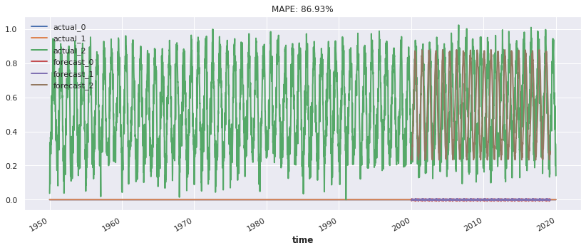
    


```python
best_model = RNNModel.load_from_checkpoint(model_name="temp_RNN", best=True)
eval_model(best_model)
```

    Predicting DataLoader 0: 100%|██████████| 1/1 [00:00<00:00,  6.70it/s]


    
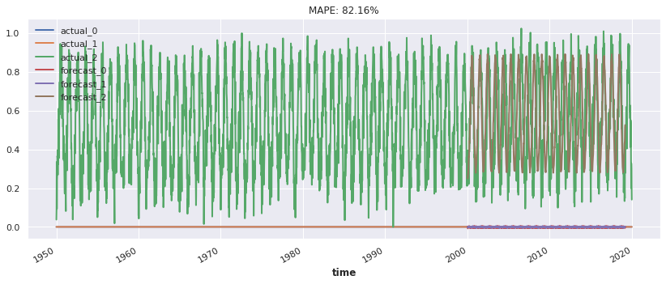
    


```python
!pip install nbconvert

```

    Defaulting to user installation because normal site-packages is not writeable
    Requirement already satisfied: nbconvert in /opt/conda/lib/python3.9/site-packages (6.5.2)
    Requirement already satisfied: bleach in /opt/conda/lib/python3.9/site-packages (from nbconvert) (5.0.1)
    Requirement already satisfied: defusedxml in /opt/conda/lib/python3.9/site-packages (from nbconvert) (0.7.1)
    Requirement already satisfied: lxml in /opt/conda/lib/python3.9/site-packages (from nbconvert) (4.9.1)
    Requirement already satisfied: mistune<2,>=0.8.1 in /opt/conda/lib/python3.9/site-packages (from nbconvert) (0.8.4)
    Requirement already satisfied: pandocfilters>=1.4.1 in /opt/conda/lib/python3.9/site-packages (from nbconvert) (1.5.0)
    Requirement already satisfied: jinja2>=3.0 in /opt/conda/lib/python3.9/site-packages (from nbconvert) (3.1.2)
    Requirement already satisfied: traitlets>=5.0 in /opt/conda/lib/python3.9/site-packages (from nbconvert) (5.3.0)
    Requirement already satisfied: tinycss2 in /opt/conda/lib/python3.9/site-packages (from nbconvert) (1.1.1)
    Requirement already satisfied: nbclient>=0.5.0 in /opt/conda/lib/python3.9/site-packages (from nbconvert) (0.6.6)
    Requirement already satisfied: entrypoints>=0.2.2 in /opt/conda/lib/python3.9/site-packages (from nbconvert) (0.4)
    Requirement already satisfied: MarkupSafe>=2.0 in /opt/conda/lib/python3.9/site-packages (from nbconvert) (2.1.1)
    Requirement already satisfied: jupyterlab-pygments in /opt/conda/lib/python3.9/site-packages (from nbconvert) (0.2.2)
    Requirement already satisfied: pygments>=2.4.1 in /opt/conda/lib/python3.9/site-packages (from nbconvert) (2.12.0)
    Requirement already satisfied: jupyter-core>=4.7 in /opt/conda/lib/python3.9/site-packages (from nbconvert) (4.11.1)
    Requirement already satisfied: beautifulsoup4 in /opt/conda/lib/python3.9/site-packages (from nbconvert) (4.11.1)
    Requirement already satisfied: packaging in /opt/conda/lib/python3.9/site-packages (from nbconvert) (21.3)
    Requirement already satisfied: nbformat>=5.1 in /opt/conda/lib/python3.9/site-packages (from nbconvert) (5.4.0)
    Requirement already satisfied: nest-asyncio in /opt/conda/lib/python3.9/site-packages (from nbclient>=0.5.0->nbconvert) (1.5.5)
    Requirement already satisfied: jupyter-client>=6.1.5 in /opt/conda/lib/python3.9/site-packages (from nbclient>=0.5.0->nbconvert) (7.3.4)
    Requirement already satisfied: fastjsonschema in /opt/conda/lib/python3.9/site-packages (from nbformat>=5.1->nbconvert) (2.16.1)
    Requirement already satisfied: jsonschema>=2.6 in /opt/conda/lib/python3.9/site-packages (from nbformat>=5.1->nbconvert) (4.9.1)
    Requirement already satisfied: soupsieve>1.2 in /opt/conda/lib/python3.9/site-packages (from beautifulsoup4->nbconvert) (2.3.2.post1)
    Requirement already satisfied: six>=1.9.0 in /opt/conda/lib/python3.9/site-packages (from bleach->nbconvert) (1.16.0)
    Requirement already satisfied: webencodings in /opt/conda/lib/python3.9/site-packages (from bleach->nbconvert) (0.5.1)
    Requirement already satisfied: pyparsing!=3.0.5,>=2.0.2 in /opt/conda/lib/python3.9/site-packages (from packaging->nbconvert) (3.0.9)
    Requirement already satisfied: pyrsistent!=0.17.0,!=0.17.1,!=0.17.2,>=0.14.0 in /opt/conda/lib/python3.9/site-packages (from jsonschema>=2.6->nbformat>=5.1->nbconvert) (0.18.1)
    Requirement already satisfied: attrs>=17.4.0 in /opt/conda/lib/python3.9/site-packages (from jsonschema>=2.6->nbformat>=5.1->nbconvert) (22.1.0)
    Requirement already satisfied: tornado>=6.0 in /opt/conda/lib/python3.9/site-packages (from jupyter-client>=6.1.5->nbclient>=0.5.0->nbconvert) (6.1)
    Requirement already satisfied: python-dateutil>=2.8.2 in /opt/conda/lib/python3.9/site-packages (from jupyter-client>=6.1.5->nbclient>=0.5.0->nbconvert) (2.8.2)
    Requirement already satisfied: pyzmq>=23.0 in /opt/conda/lib/python3.9/site-packages (from jupyter-client>=6.1.5->nbclient>=0.5.0->nbconvert) (23.2.0)

